# Laporan TCP
## Workshop Administrasi Jaringan
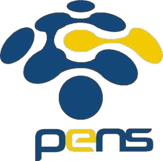

**Dosen Pengampu:**  
Dr. Ferry Astika Saputra, S.T., M.Sc.

**Oleh:**  
Muhammad Rafi Dhiyaulhaq 
NRP: 3123500004  
4 D3 Teknik Informatika A 

**PROGRAM STUDI D3 TEKNIK INFORMATIKA**  
**POLITEKNIK ELEKTRONIKA NEGERI SURABAYA**  
2024/2025

---

## Tugas
1. **Analisa file http.cap dengan Wireshark**:
   - Versi HTTP yang digunakan
   - IP address dari client maupun server
   - Waktu dari client mengirimkan HTTP request
   - Waktu dari server mengirimkan respon dan durasinya
2. **Deskripsi gambar pada slide**
3. **Rangkuman tahapan komunikasi menggunakan TCP**

## Jawaban
### 1. Analisa http.cap dengan Wireshark
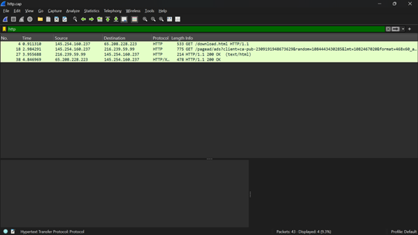 
 - Versi HTTP yang digunakan: HTTP/1.1   
  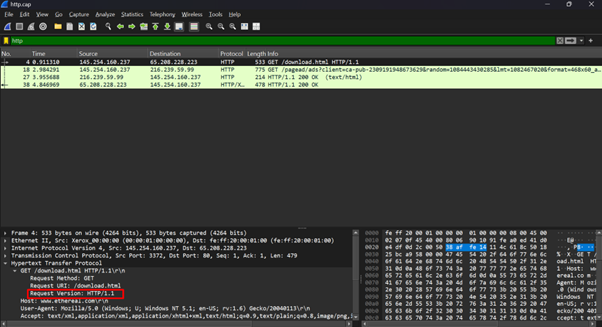

- IP Address dari Client yaitu 145.254.160.237  
  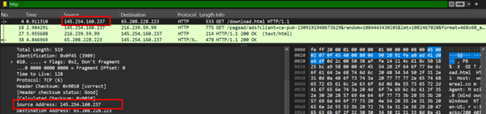
- IP Address dari Server yaitu 65.208.228.223  
  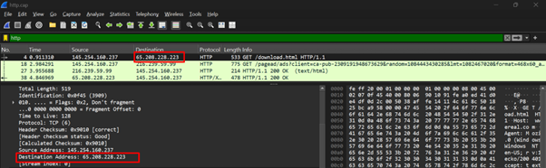 
  Untuk IP Address 216.239.59.99 merupakan server dari skrip iklan yang menyajikan iklan di halaman web yang dikunjungi client

**Waktu komunikasi:**
- Client mengirimkan HTTP request pada 0.91131 detik setelah mulai di-capture.  
  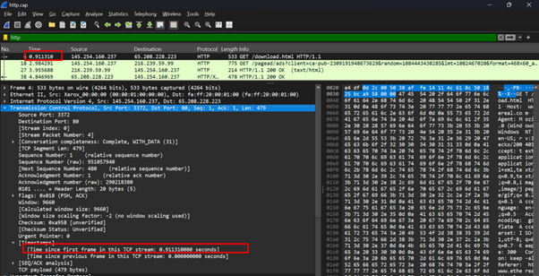
- Server mengirimkan respon pada 4.846969 detik setelah capture dimulai.  
  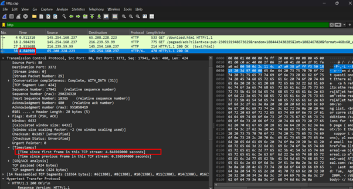
- Durasi client meminta request sampai server memberikan respon OK yaitu
  4.846969 - 0.91131 = **3.935659 detik**

### 2. Deskripsi Gambar
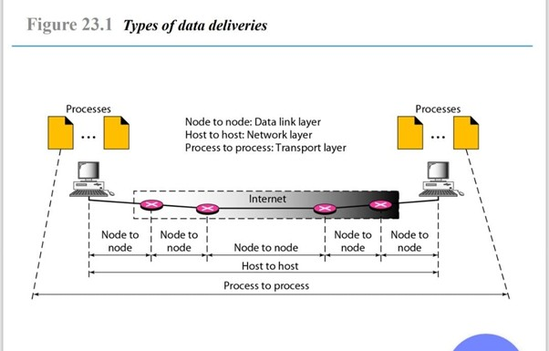   
Ini menunjukkan bagaimana data dikirimkan. 
- Data link layer memiliki MAC Address agar paket bisa berpindah di dalam jaringan lokal. Jika harus keluar dari jaringan lokal, maka Network layer yang akan membantu paket. 
- Di dalam network layer, ada Source IP Address dan Destination IP Address, dimana ini akan diisi alamat dari client dan server. Ketika paket keluar dari satu jaringan, MAC        Address akan diganti sesuai jaringan yang ada. Ini akan terus berubah sampai paket sampai ke tujuan. Ketika sampai di tujuan, Transport layer yang akan berperan mengarahkan      paket ke aplikasi yang memerlukan paket ini.
- Port number yang ada pada transport layer adalah bagian dari transport layer yang membantu paket harus kemana. Semisal saya membuka browser dan mencari dua hal di 2 tab yang     berbeda, maka transport layer yang memastikan bahwa paket akan terkirim ke tab yang berbeda, karena source port akan selalu berganti berkat adanya Dynamic Port.

### 3. Rangkuman Tahapan Komunikasi TCP
#### 1) **Three-Way Handshake** (Membangun Koneksi)
Ini adalah bagaiman TCP membangun koneksi di antara  client dan server, langkah-langkahnya:
   a. **SYN** → Klien meminta koneksi ke server.
   b. **SYN-ACK** → Server merespons dengan acknowledge.
   c. **ACK** → Klien mengonfirmasi koneksi dan siap berkomunikasi.

   Di bawah ini adalah contoh bagaimana three-way handshake berjalan
   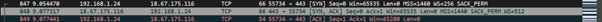    
Terlihat bahwa klien dengan IP Address 192.168.1.24 meminta koneksi dengan 18.67.175.116 yang merupakan IP Address server. Server mengembalikan respon dengan SYN, ACK dan klien membalas lagi dengan ACK

#### 2) **Data Transfer** (Pengiriman Data)
Data mulai dikirimkan dengan protokol TCP,  yang berarti data harus sampai sama persis dengan bagaimana data berada di pengirimnya. Data juga tidak bisa langsung  dikirim secara utuh,sehingga data akan disegmentasi dan diberi sequence number agar ketika sampai di klien, data akan diurutkan sekalipun tidak datang berurutan sehingga data akan tetap utuh.
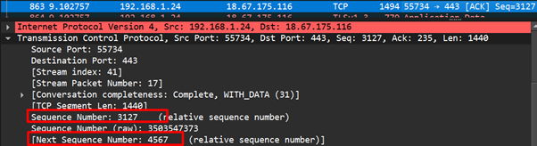   
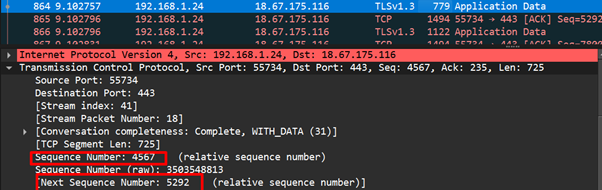   
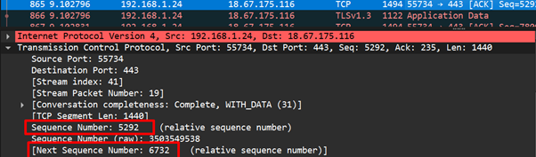   
Seperti terlihat pada 3 gambar di atas, tiap segmen punya sequence number dan sudah punya next sequence number sehingga urutannya dapat dipastikan ketika sudah diterima

## 3) Connection Termination

Ini adalah cara untuk mengakhiri koneksi yang biasanya menggunakan **four-way handshake**. Langkah-langkahnya:

1. **FIN** → Klien mengirim paket **FIN (Finish)** untuk meminta menutup koneksi.
2. **ACK** → Server mengakui permintaan dengan **ACK**.
3. **FIN** → Server mengirim **FIN** untuk menutup koneksi dari sisi mereka.
4. **ACK** → Klien mengonfirmasi dengan **ACK**, lalu koneksi benar-benar tertutup.

Dalam penerapannya, **FIN dan ACK bisa dikirim secara bersamaan** atau disebut **FIN + ACK**. Jadi, ketika klien meminta menutup koneksi, server langsung mengakui dan meminta penutupan koneksi dari klien.

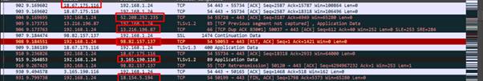   

Ini adalah contoh **connection termination**. Saya menutup tab dari browser secara paksa sehingga muncul permintaan **(RST, ACK)** dari klien. Namun, mungkin karena masih ada data yang belum terkirim, server mengirim kembali data tersebut dengan **IP yang berbeda** namun masih dalam satu jaringan, yaitu **Amazon**. Ini bisa terjadi karena server belum tahu klien sudah memutus koneksi. Akhirnya, klienlah yang mengirimkan **FIN, ACK** sebagai bagian dari **four-way handshake** agar koneksi bisa diputuskan dengan benar. Properti ini hanya bagian dari **four-way handshake yang dioptimasi** untuk mempercepat proses.

