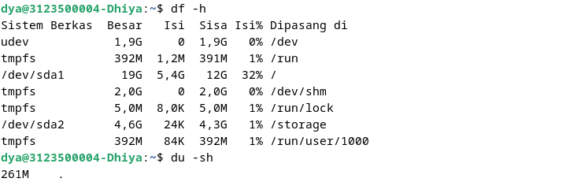
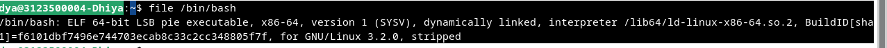

 ufadi# Daftar Isi
- [Chapter 4: Process Control](#chapter-4-process-control)
- [Chapter 5: Proses dan Thread](#chapter-5-proses-dan-thread)
- [Chapter 6: Manajemen dan Instalasi Perangkat Lunak](#chapter-6-manajemen-dan-instalasi-perangkat-lunak)


## Chapter 4: Process Control

# Komponen Proses

Sebuah proses terdiri dari **address space** dan **struktur data dalam kernel**.

## Address Space
Address space adalah sekumpulan halaman memori yang telah ditandai oleh kernel untuk digunakan oleh proses. (Halaman adalah unit pengelolaan memori, biasanya berukuran 4KB atau 8KB). Halaman ini digunakan untuk menyimpan kode, data, dan stack proses.

## Struktur Data dalam Kernel
Struktur data dalam kernel menyimpan informasi tentang status proses, prioritasnya, parameter penjadwalan, dan lainnya.

Misalnya, proses sebagai wadah yang berisi sumber daya yang dikelola oleh kernel untuk program yang sedang berjalan. Sumber daya ini meliputi:
- Halaman memori yang menyimpan kode dan data program.
- File descriptor yang merujuk ke file yang sedang dibuka.
- Atribut lain yang mendeskripsikan status proses.

Kernel menyimpan berbagai informasi tentang setiap proses, seperti:
- Peta ruang alamat proses.
- Status proses (running, sleeping, etc).
- Prioritas proses.
- Informasi sumber daya yang digunakan (CPU, memori, dll.).
- File dan port jaringan yang dibuka oleh proses.
- Signal mask (sinyal yang sedang diblokir).
- Process owner (UID pengguna yang menjalankan proses).

## Thread
**Thread** adalah konteks eksekusi dalam suatu proses. Sebuah proses dapat memiliki beberapa thread, yang semuanya berbagi address space dan sumber daya lainnya. Thread digunakan untuk menjalankan tugas secara paralel dalam suatu proses dan sering disebut sebagai **proses ringan (lightweight process)** karena lebih murah untuk dibuat dan dihancurkan dibandingkan proses utama (**heavyweight process**).

### Contoh Thread
Server web akan mendengarkan koneksi yang masuk. Untuk setiap request, server membuat thread baru untuk menanganinya. Setiap thread menangani satu permintaan, tetapi server secara keseluruhan bisa menangani banyak permintaan sekaligus karena memiliki banyak thread. Dalam kasus ini:
- **Server web adalah proses.**
- **Setiap thread adalah konteks eksekusi dalam proses tersebut.**

## PID: Process ID
Setiap proses memiliki **Process ID (PID)** unik, yang merupakan angka yang diberikan oleh kernel saat proses dibuat. PID digunakan dalam berbagai pemanggilan sistem, misalnya untuk mengirim sinyal ke proses.

### Namespaces & PID
Namespace proses memungkinkan proses yang berbeda memiliki PID yang sama, terutama dalam lingkungan container. Container adalah lingkungan terisolasi yang memiliki tampilan sistemnya sendiri, memungkinkan beberapa instance aplikasi berjalan dalam lingkungan terpisah pada sistem yang sama.

## PPID: Parent Process ID
Setiap proses memiliki proses induk (**parent process**) yang menciptakannya. **Parent Process ID (PPID)** adalah PID dari proses induk tersebut. PPID digunakan dalam berbagai pemanggilan sistem, misalnya untuk mengirim sinyal ke proses induk.

## UID & EUID: User ID & Effective User ID
- **User ID (UID)** → ID pengguna yang menjalankan proses.
- **Effective User ID (EUID)** → ID yang digunakan proses untuk menentukan hak akses terhadap sumber daya seperti file atau port jaringan.

EUID memungkinkan suatu proses berjalan dengan hak akses yang lebih tinggi (misalnya, program dengan setuid dapat dijalankan oleh pengguna biasa tetapi memiliki izin root).

## Siklus Hidup Proses
Untuk membuat proses baru, sebuah proses menyalin dirinya sendiri menggunakan pemanggilan sistem **fork()**.
- **fork()** membuat salinan dari proses asli yang hampir identik dengan induknya.
- Proses baru memiliki PID yang berbeda dan informasi akuntansi sendiri.

> **Note:** Di Linux, sistem sebenarnya menggunakan **clone()**, yang merupakan versi lebih canggih dari fork() dan mendukung pembuatan thread. Perintah **fork()** masih ada di kernel tetapi dipetakan ke **clone()** untuk kompatibilitas.

## Proses Utama Saat Booting
Saat sistem dinyalakan, kernel secara otomatis membuat beberapa proses, salah satunya adalah **init** atau **systemd**, yang selalu memiliki **PID 1**.
- **init/systemd** menjalankan skrip startup sistem dan menjadi induk dari semua proses lain di sistem.
- Semua proses yang tidak dibuat langsung oleh kernel adalah turunan dari **init/systemd**.

## Sinyal (Signals)
Sinyal adalah cara untuk mengirim notifikasi ke proses tentang suatu kejadian.

Terdapat sekitar **30 jenis sinyal**, yang digunakan dalam berbagai cara:
- **Proses ke proses** → Sebagai bentuk komunikasi antar proses.
- **Dari terminal** → Untuk menghentikan, membunuh, atau menunda proses saat pengguna menekan tombol tertentu (misalnya Ctrl+C).
- **Dari administrator** → Dengan perintah **kill** untuk menghentikan atau mengontrol proses.
- **Dari kernel** → Saat terjadi pelanggaran aturan, misalnya pembagian dengan nol (**SIGFPE**).
- **Dari kernel ke proses** → Untuk memberitahu kejadian seperti kematian proses anak atau tersedianya data pada saluran I/O.

Sinyal adalah metode utama untuk mengontrol dan mengelola proses dalam sistem operasi UNIX/Linux.


Sinyal **KILL, INT, TERM, HUP, dan QUIT** terdengar seolah-olah memiliki arti yang hampir sama, tetapi sebenarnya penggunaannya cukup berbeda.

KILL tidak bisa diblokir dan menghentikan proses di level kernel. Proses tidak dapat menerima atau menangani sinyal ini.

INT dikirim oleh terminal driver saat pengguna mengetik . Ini adalah permintaan untuk menghentikan operasi saat ini. Program sederhana seharusnya keluar (jika mereka menangkap sinyal) atau membiarkan dirinya dihentikan, yang merupakan default jika sinyal tidak ditangkap. Program yang memiliki antarmuka baris perintah interaktif (seperti shell) harus berhenti dari tugas yang sedang dijalankan, membersihkan sumber daya, dan menunggu input pengguna lagi.

TERM adalah permintaan untuk menghentikan eksekusi sepenuhnya. Diharapkan proses yang menerima sinyal ini akan membersihkan statusnya dan keluar.

HUP dikirim ke proses saat terminal pengontrolnya ditutup. Awalnya digunakan untuk menunjukkan "hang up" dari koneksi telepon, sekarang sering digunakan untuk memberi tahu daemon agar berhenti dan memulai ulang, seringkali untuk menerapkan konfigurasi baru. Perilaku pastinya tergantung pada proses yang menerima sinyal HUP.

QUIT mirip dengan TERM, kecuali bahwa secara default ia menghasilkan core dump jika tidak ditangkap. Beberapa program menggunakan sinyal ini untuk tujuan lain.

## kill: Mengirim Sinyal

Sesuai namanya, perintah kill paling sering digunakan untuk menghentikan suatu proses. kill dapat mengirim sinyal apa pun, tetapi secara default mengirimkan TERM. kill dapat digunakan oleh pengguna biasa pada proses mereka sendiri atau oleh root pada proses mana pun. Sintaksnya adalah:

```sh
kill [-signal] PID
```
contoh


di mana *signal* adalah nomor atau nama simbolik dari sinyal yang akan dikirim, dan *pid* adalah nomor identifikasi proses dari proses target.  

Perintah *kill* tanpa nomor sinyal tidak menjamin bahwa proses akan mati, karena sinyal *TERM* dapat ditangkap, diblokir, atau diabaikan. Perintah `kill -9 pid` dijamin akan membunuh proses karena sinyal *KILL* tidak dapat ditangkap, diblokir, atau diabaikan.  

*killall* membunuh proses berdasarkan nama, bukan berdasarkan ID proses. Ini tidak tersedia di semua sistem. Contoh:

```sh
killall firefox
```


Perintah *pkill* serupa dengan *kill* tapi menyediakan lebih banyak opsi

```sh
pkill -u abdoufermat # kill all processes owned by user abdoufermat
```


# PS: Memantau Proses  

Perintah `ps` adalah alat utama administrator sistem untuk memantau proses. Meskipun versi `ps` berbeda dalam argumen dan tampilan, semuanya memberikan informasi yang pada dasarnya sama.  

`ps` dapat menampilkan *PID*, *UID*, prioritas, dan terminal kontrol dari proses. Perintah ini juga memberi tahu seberapa banyak memori yang digunakan oleh suatu proses, berapa banyak waktu *CPU* yang telah dikonsumsi, serta status saat ini dari proses tersebut (berjalan, berhenti, tidur, dan sebagainya).  


Anda dapat memperoleh gambaran sistem yang berguna dengan menjalankan `ps aux`.  
- Opsi `a` memberi tahu `ps` untuk menampilkan proses dari semua pengguna.  
- Opsi `u` memberi tahu `ps` untuk memberikan informasi detail tentang setiap proses.  
- Opsi `x` memberi tahu `ps` untuk menampilkan proses yang tidak terkait dengan terminal.
Argumen lain yang berguna adalah `lax`, yang memberikan informasi teknis lebih lanjut tentang proses. `lax` sedikit lebih cepat daripada `aux` karena tidak perlu menyelesaikan nama grup dan user.


Untuk mencari proses tertentu, Anda dapat menggunakan `grep` untuk menyaring keluaran dari `ps`.


Kita dapat menentukan PID dari sebuah proses dengan menggunakan `pgrep`.


atau `pidof`


### Pemantauan Interaktif dengan `top`  

Perintah `top` menyediakan tampilan real-time yang dinamis dari sistem yang sedang berjalan. Ini dapat menampilkan ringkasan informasi sistem serta daftar proses atau thread yang saat ini dikelola oleh kernel Linux. Jenis informasi ringkasan sistem yang ditampilkan serta jenis, urutan, dan ukuran informasi yang ditampilkan untuk proses dapat dikonfigurasi oleh pengguna, dan konfigurasi tersebut dapat dibuat persisten di seluruh restart. Secara default, tampilan diperbarui setiap 1-2 detik, tergantung pada sistem.  


Ada juga perintah `htop`, yang merupakan penampil proses interaktif untuk sistem Unix. Ini adalah aplikasi mode teks (untuk konsol atau terminal X) dan memerlukan `ncurses`. Ini mirip dengan `top`, tetapi memungkinkan Anda untuk menggulir secara vertikal dan horizontal, sehingga Anda dapat melihat semua proses yang berjalan di sistem beserta perintah lengkapnya. `htop` juga memiliki antarmuka pengguna yang lebih baik dan lebih banyak opsi untuk operasi.    


### `nice` dan `renice`: Mengubah Prioritas Proses  

**Niceness** adalah petunjuk numerik kepada kernel tentang bagaimana suatu proses harus diperlakukan dalam kaitannya dengan proses lain yang bersaing untuk CPU.  

- Nilai niceness yang tinggi berarti prioritas rendah untuk proses Anda: Anda akan bersikap baik.  
- Nilai rendah atau negatif berarti prioritas tinggi: Anda tidak terlalu baik!  

Rentang nilai niceness yang diperbolehkan bervariasi di antara sistem. Di Linux, rentangnya adalah -20 hingga +19, sedangkan di FreeBSD adalah -20 hingga +20.  

- **Proses dengan prioritas rendah** adalah proses yang tidak terlalu penting dan akan mendapatkan lebih sedikit waktu CPU dibandingkan proses dengan prioritas tinggi.  
- **Proses dengan prioritas tinggi** adalah proses yang penting dan harus diberikan lebih banyak waktu CPU dibandingkan proses dengan prioritas rendah.  

Sebagai contoh, jika Anda menjalankan pekerjaan yang membutuhkan banyak CPU dan ingin menjalankannya di latar belakang, Anda dapat memulai dengan nilai niceness yang tinggi. Ini akan memungkinkan proses lain berjalan tanpa diperlambat oleh pekerjaan Anda.  

Perintah `nice` digunakan untuk memulai proses dengan nilai niceness tertentu. Sintaksnya adalah:  

```sh
nice -n nice_val [command]
```

**Contoh:**  
```sh
nice -n 10 sh infinite.sh &
```


Perintah `renice` digunakan untuk mengubah nilai niceness dari proses yang sedang berjalan. Sintaksnya adalah:  

```sh
renice -n nice_val -p pid
```

**Contoh:**  
```sh
renice -n 10 -p 1234
```


Nilai prioritas adalah prioritas aktual proses yang digunakan oleh kernel Linux untuk menjadwalkan tugas. Di sistem Linux, prioritas berkisar dari 0 hingga 139, dengan:  

- **0 hingga 99** untuk proses real-time  
- **100 hingga 139** untuk pengguna  

Hubungan antara nilai nice dan prioritas adalah sebagai berikut:  

```sh
priority_value = 20 + nice_value
```

Nilai nice default adalah 0. Semakin rendah nilai nice, semakin tinggi prioritas proses.  

### Sistem Berkas `/proc`  

Versi Linux dari `ps` dan `top` membaca informasi status proses mereka dari direktori `/proc`, sebuah sistem berkas semu di mana kernel mengekspos berbagai informasi menarik tentang status sistem.  

Meskipun namanya `/proc`, direktori ini berisi lebih dari sekadar informasi tentang proses (misalnya, statistik yang dihasilkan oleh sistem, dll.).  

Setiap proses direpresentasikan oleh direktori di dalam `/proc`, dan setiap proses memiliki direktori yang dinamai sesuai dengan *PID*-nya. Direktori `/proc` berisi berbagai berkas yang menyediakan informasi tentang proses, seperti perintah yang dijalankan, variabel lingkungan, deskriptor berkas, dan sebagainya.


### `strace` dan `truss`  

Untuk mengetahui apa yang dilakukan suatu proses, Anda dapat menggunakan `strace` di Linux atau `truss` di FreeBSD. Perintah ini melacak panggilan sistem (*system calls*) dan sinyal. Mereka dapat digunakan untuk men-debug program atau memahami apa yang dilakukan suatu program.  

Sebagai contoh, log berikut dihasilkan oleh `strace` yang dijalankan terhadap salinan aktif `top` (yang berjalan dengan PID 5810):  

```sh
$ strace -p 5810
```


### `top` dan `/proc`  

`top` memulai dengan memeriksa waktu saat ini. Kemudian, ia membuka dan memeriksa status (*stat*) direktori `/proc`, serta membaca berkas `/proc/1/stat` untuk mendapatkan informasi tentang proses `init`.  

### Proses Tidak Terkendali (*Runaway Processes*)  

Terkadang, sebuah proses berhenti merespons sistem dan berjalan tanpa kendali. Proses ini mengabaikan prioritas penjadwalannya dan mengambil 100% CPU. Karena proses lain hanya mendapatkan akses terbatas ke CPU, sistem mulai berjalan sangat lambat. Ini disebut sebagai *runaway process*.  

Perintah `kill` dapat digunakan untuk menghentikan proses yang tidak terkendali. Jika proses tidak merespons sinyal `TERM`, Anda dapat menggunakan sinyal `KILL` untuk mengakhiri proses:  

```sh
kill -9 pid
```
atau  
```sh
kill -KILL pid
```


Kita dapat menyelidiki penyebab proses tidak terkendali menggunakan `strace` atau `truss`. Proses tidak terkendali yang menghasilkan output dapat memenuhi seluruh sistem berkas.  

Anda dapat menjalankan perintah berikut untuk memeriksa penggunaan sistem berkas:  

```sh
df -h
```


Jika sistem berkas penuh, gunakan `du` untuk menemukan berkas dan direktori terbesar:  

```sh
du -sh *
```



Anda juga dapat menggunakan perintah `lsof` untuk mengetahui berkas apa saja yang sedang dibuka oleh proses tidak terkendali:  

```sh
lsof -p pid
```


### Proses Berkala  

#### `cron`: Menjadwalkan Perintah  

Daemon `cron` (`crond` pada RedHat) adalah alat tradisional untuk menjalankan perintah berdasarkan jadwal yang telah ditentukan. `cron` dimulai saat sistem melakukan *boot* dan terus berjalan selama sistem aktif.  

`cron` membaca berkas konfigurasi yang berisi daftar perintah dan waktu eksekusinya. Perintah-perintah ini dijalankan oleh `sh`, sehingga hampir semua yang bisa dilakukan secara manual melalui *shell* juga dapat dilakukan dengan `cron`.  

Berkas konfigurasi `cron` disebut **crontab** (*cron table*). Crontab untuk masing-masing pengguna disimpan di:  

- **Linux**: `/var/spool/cron`  
- **FreeBSD**: `/var/cron/tabs`  

### Format Crontab  

Berkas `crontab` memiliki lima kolom untuk menentukan hari, tanggal, dan waktu eksekusi, diikuti oleh perintah yang akan dijalankan pada interval tersebut.

```
*     *     *     *  command to be executed
-     -     -     -     -
|     |     |     |     |
|     |     |     |     +----- day of week (0 - 6) (Sunday=0)
|     |     |     +------- month (1 - 12)
|     |     +--------- day of month (1 - 31)
|     +----------- hour (0 - 23)
+------------- min (0 - 59)
`  
```
Contohnya:

```sh
# Menjalankan perintah setiap hari pukul 2:30 pagi
30 2 * * * command

# Menjalankan perintah pada pukul 10:30 malam setiap tanggal 1 setiap bulan
30 22 1 * * command

# Menjalankan skrip Python setiap tanggal 1 setiap bulan pada pukul 2:30 pagi
30 2 1 * * /usr/bin/python3 /path/to/script.py
```

Jadwal berikut: `0,30 * 13 * 5` berarti perintah akan dieksekusi pada menit ke-0 dan ke-30 dari jam ke-13 setiap hari Jumat.
Jika Anda ingin menjalankan perintah setiap 30 menit, Anda bisa menggunakan:
```sh
*/30 * * * * command
```

## Manajemen Crontab
Perintah `crontab` digunakan untuk membuat, memodifikasi, dan menghapus crontab:
- `crontab -e` untuk mengedit crontab.
- `crontab -l` untuk melihat daftar crontab.
- `crontab -r` untuk menghapus crontab.


## Timer Systemd
Systemd timer adalah file konfigurasi unit yang memiliki akhiran `.timer`. Systemd timers bisa digunakan sebagai alternatif cron jobs dan lebih fleksibel.

Unit timer diaktifkan oleh unit layanan yang sesuai. Unit layanan akan dipicu oleh unit timer pada waktu yang ditentukan dalam unit timer. Timer juga bisa diaktifkan oleh sistem saat boot atau oleh suatu event.

Perintah `systemctl` digunakan untuk mengelola unit systemd. Opsi `list-timers` digunakan untuk melihat timer yang aktif:
```sh
$ systemctl list-timers

NEXT                         LEFT          LAST                         PASSED       UNIT                         ACTIVATES
Fri 2021-10-15 00:00:00 UTC  1h 1min left Thu 2021-10-14 00:00:00 UTC  22h ago      logrotate.timer              logrotate.service
```

Dalam contoh di atas, unit `logrotate.timer` dijadwalkan untuk mengaktifkan unit `logrotate.service` setiap tengah malam.

### Contoh Konfigurasi Timer
```ini
$ cat /usr/lib/systemd/system/logrotate.timer

[Unit]
Description=Daily rotation of log files
Documentation=man:logrotate(8) man:logrotate.conf(5)

[Timer]
OnCalendar=daily
AccuracySec=1h
Persistent=true

[Install]
WantedBy=timers.target
```

- **OnCalendar**: Menentukan kapan timer harus mengaktifkan layanan.
- **AccuracySec**: Menentukan akurasi timer.
- **Persistent**: Menentukan apakah timer harus mengejar eksekusi yang terlewat.

## Penggunaan Umum Tugas Terjadwal

### Mengirim Email
Anda dapat mengirim email secara otomatis dengan hasil laporan harian atau hasil eksekusi perintah menggunakan cron atau systemd timer:
```sh
30 4 25 * * /usr/bin/mail -s "Laporan Bulanan" abdou@admin.com <<< "Terima laporan bulanan untuk bulan Juli!\n\nHormat,\nCron"
```

### Membersihkan Filesystem
Gunakan cron atau systemd timer untuk menjalankan skrip yang membersihkan filesystem, misalnya menghapus file sampah setiap hari tengah malam:
```sh
0 0 * * * /usr/bin/find /home/abdou/.local/share/Trash/files -mtime +30 -exec /bin/rm -f {} \;
```

### Rotasi Log
Rotasi log berarti membagi log menjadi segmen berdasarkan ukuran atau tanggal, serta menyimpan beberapa versi log lama.

### Menjalankan Batch Job
Beberapa perhitungan yang memerlukan waktu lama lebih baik dijalankan sebagai batch job, misalnya memproses pesan yang tertunda dalam antrian atau database dengan ETL (Extract, Transform, Load) ke lokasi lain seperti data warehouse.

### Backup dan Mirroring
Anda dapat menggunakan tugas terjadwal untuk melakukan backup dan mirroring secara otomatis.


## Chapter 5: Proses dan Thread

## Tujuan Dasar dari Sistem Berkas

Tujuan dasar dari sistem berkas adalah untuk merepresentasikan dan mengorganisasi sumber daya penyimpanan sistem.

Sistem berkas dapat dianggap terdiri dari empat komponen utama:

- **Namespace** - cara untuk memberi nama dan mengorganisir dalam hierarki.
- **API** - sekumpulan sistem panggilan untuk menavigasi dan memanipulasi objek.
- **Model Keamanan** - skema untuk melindungi, menyembunyikan, dan berbagi sumber daya.
- **Implementasi** - perangkat lunak yang menghubungkan model logis ke perangkat keras.

Sistem berkas berbasis disk yang dominan adalah **ext4**, **XFS**, dan **UFS**, serta **ZFS** dari Oracle dan **Btrfs**. Ada juga sistem berkas lain seperti **VxFS** dari Veritas dan **JFS** dari IBM.

Selain itu, terdapat sistem berkas asing seperti **FAT** dan **NTFS** yang digunakan oleh Windows, serta **ISO 9660** yang digunakan oleh CD dan DVD.

Sebagian besar sistem berkas modern berusaha meningkatkan fungsionalitas sistem berkas tradisional dengan cara yang lebih cepat dan lebih andal, atau menambahkan fitur tambahan di atas semantik sistem berkas standar.

## Nama Path

Kata "folder" hanyalah kebocoran linguistik dari dunia Windows dan macOS. Ini memiliki arti yang sama dengan **direktori**, yang lebih teknis. **Jangan** gunakan "folder" dalam konteks teknis kecuali Anda siap menerima tatapan aneh!

Daftar direktori yang mengarah ke sebuah file disebut **nama path**. Nama path adalah string yang menggambarkan lokasi file dalam hierarki sistem berkas. Nama path bisa berupa:

- **Absolut** (misalnya, `/home/username/file.txt`)
- **Relatif** (misalnya, `./file.txt`)

## Mounting dan Unmounting Sistem Berkas

Sistem berkas terdiri dari bagian-bagian yang lebih kecil—juga disebut **sistem berkas**—masing-masing terdiri dari satu direktori dan subdirektori serta file-file di dalamnya. Kita menggunakan istilah **pohon berkas** untuk merujuk pada tata letak keseluruhan dan menggunakan kata **sistem berkas** untuk cabang yang terpasang pada pohon tersebut.

Dalam kebanyakan situasi, sistem berkas dipasang ke pohon menggunakan perintah `mount`. Perintah `mount` memetakan sebuah direktori dalam pohon berkas yang ada, yang disebut **titik kait (mount point)**, ke akar sistem berkas baru.

### Contoh:
```sh
# Pasang sistem berkas pada /dev/sda4 ke /users
mount /dev/sda4 /users
```

Linux memiliki opsi **lazy unmount** (`umount -l`) yang menghapus sistem berkas dari hierarki penamaan tetapi tidak benar-benar melepaskannya sampai tidak lagi digunakan.

```sh
umount -l /users
```

Perintah `umount -f` adalah **unmount paksa**, yang berguna ketika sistem berkas sedang digunakan.

```sh
umount -f /users
```

Daripada menggunakan `umount -f`, Anda dapat menggunakan `lsof` atau `fuser` untuk mengetahui proses mana yang sedang menggunakan sistem berkas, lalu menghentikannya.

### Contoh:
```sh
# Temukan proses yang menggunakan sistem berkas
lsof /home/abdou
```

#### Contoh Output:
```
COMMAND   PID USER   FD   TYPE DEVICE SIZE/OFF   NODE NAME
bash     1000 abdou  cwd    DIR    8,1     4096  131073 /home/abdou
bash     1000 abdou  rtd    DIR    8,1     4096  131073 /home/abdou
bash     1000 abdou  txt    REG    8,1   103752  131072 /bin/bash
bash     1000 abdou  mem    REG    8,1  1848400  131074 /lib/x86_64-linux-gnu/libc-2.28.so
bash     1000 abdou  mem    REG    8,1   170864  131075 /lib/x86_64-linux-gnu/ld-2.28.so
code     1234 abdou  cwd    DIR    8,1     4096  131073 /home/abdou
msedge   5678 abdou  cwd    DIR    8,1     4096  131073 /home/abdou
```

Untuk menyelidiki proses yang menggunakan sistem berkas, gunakan perintah `ps`.

### Contoh:
```sh
# Menyelidiki proses yang menggunakan sistem berkas
ps up "1234 5678 91011"
```

#### Contoh Output:
```
USER       PID %CPU %MEM    VSZ   RSS TTY      STAT START   TIME COMMAND
abdou     1234  0.0  0.0  12345  1234 ?        Ssl  00:00   0:00 code
abdou     5678  0.0  0.0  12345  1234 ?        Ssl  00:00   0:00 msedge
abdou     91011  0.0  0.0  12345  1234 ?        Ssl  00:00   0:00 chrome
```


## Organisasi Pohon Berkas

Sistem UNIX tidak pernah benar-benar terorganisir dengan baik! Berbagai konvensi penamaan yang tidak kompatibel digunakan secara bersamaan, dan berbagai jenis file tersebar secara acak di dalam namespace. Ini membuat peningkatan sistem operasi menjadi sulit.

**Sistem berkas root** mencakup setidaknya direktori root dan sekumpulan file serta subdirektori minimal. File yang berisi kernel OS biasanya berada di dalam `/boot`, meskipun lokasi dan namanya bisa bervariasi. Dalam BSD dan beberapa sistem UNIX lainnya, kernel bukan satu file tunggal melainkan kumpulan komponen.

- **`/etc`** menyimpan file sistem dan konfigurasi yang penting.
- **`/sbin`** dan **`/bin`** menyimpan utilitas penting.
- **`/tmp`** digunakan untuk file sementara.
- **`/dev`** dulunya merupakan bagian dari sistem berkas root, tetapi sekarang biasanya merupakan sistem berkas virtual yang dipasang secara terpisah.

Beberapa sistem menyimpan file pustaka bersama dan beberapa komponen lainnya di dalam **`/lib`** atau **`/lib64`**, sementara yang lain memindahkannya ke **`/usr/lib`**, kadang-kadang meninggalkan **`/lib`** sebagai tautan simbolis.

Direktori **`/usr`** dan **`/var`** juga sangat penting:

- **`/usr`** menyimpan sebagian besar program standar yang tidak kritis untuk sistem, bersama dengan berbagai sumber daya seperti manual daring dan pustaka. FreeBSD menyimpan banyak konfigurasi lokal di dalam **`/usr/local`**.
- **`/var`** menyimpan direktori spool, file log, informasi akuntansi, dan berbagai item lain yang sering berubah dan bervariasi di setiap host.

Baik **`/usr`** maupun **`/var`** harus tersedia agar sistem dapat melakukan booting ke mode multiuser.


## Jenis File

Sebagian besar implementasi sistem file mendefinisikan tujuh jenis file:

- **File reguler** (Regular files)
- **Direktori** (Directories)
- **File perangkat karakter** (Character devices files)
- **File perangkat blok** (Block devices files)
- **Socket domain lokal** (Local domain sockets)
- **Pipa bernama (FIFO)** (Named pipes/FIFOs)
- **Tautan simbolis** (Symbolic links)

Anda dapat menentukan jenis file dengan menggunakan perintah `file` (ketik `man file` untuk informasi lebih lanjut).



Anda juga dapat menggunakan perintah `ls -ld`. Opsi `-d` memaksa `ls` untuk menampilkan informasi tentang direktori itu sendiri, bukan isinya.


## Jenis File  

### File Reguler  
File reguler terdiri dari serangkaian byte; sistem file tidak memaksakan struktur apa pun pada isinya. File teks, file data, program yang dapat dieksekusi, dan pustaka bersama semuanya disimpan sebagai file reguler.  

### Direktori  
Direktori adalah referensi bernama ke file lain.  

### Hard Link  
Hard link adalah cara untuk memberikan satu file beberapa nama. Perintah `ln` membuat hard link baru ke file yang sudah ada. Opsi `-i` pada `ls` membuatnya menampilkan jumlah hard link ke setiap file.  

**Contoh:**  
```sh
$ ln /etc/passwd /tmp/passwd
```


### File Perangkat Karakter dan Blok  
File perangkat memungkinkan program berkomunikasi dengan perangkat keras dan periferal sistem. Kernel mencakup (atau memuat) perangkat lunak driver untuk setiap perangkat sistem. Perangkat lunak ini menangani detail manajemen perangkat sehingga kernel tetap relatif abstrak dan independen dari perangkat keras.  

Perbedaan antara perangkat karakter dan blok bersifat halus dan tidak perlu ditinjau secara mendetail.  

File perangkat dicirikan oleh nomor perangkat utama dan minor. Nomor utama mengidentifikasi driver yang mengontrol perangkat, dan nomor minor biasanya memberi tahu driver unit fisik mana yang harus diakses.  

**Contoh:**  
Di sistem Linux, nomor perangkat utama `4` menunjukkan driver serial.  
- Port serial pertama (`/dev/tty0`) memiliki nomor perangkat utama `4` dan nomor perangkat minor `0`.  
- Port serial kedua (`/dev/tty1`) memiliki nomor perangkat utama `4` dan nomor perangkat minor `1`.  

Dulu, `/dev` adalah direktori umum, dan perangkat dibuat dengan `mknod` serta dihapus dengan `rm`. Namun, sistem ini tidak cocok untuk menangani banyaknya driver dan jenis perangkat baru. Hal ini juga menyebabkan ketidaksesuaian konfigurasi, seperti file perangkat yang tidak memiliki perangkat aktual atau perangkat yang tidak dapat diakses karena tidak memiliki file perangkat.  

Saat ini, direktori `/dev` biasanya dimuat sebagai jenis sistem file khusus, dan isinya dikelola secara otomatis oleh kernel bersama dengan daemon tingkat pengguna.  

### Socket Domain Lokal  
Socket domain lokal adalah cara bagi proses untuk berkomunikasi satu sama lain. Mereka mirip dengan socket jaringan, tetapi terbatas pada host lokal.  

**Contoh:**  
- Syslog  
- X Window System  

### Pipa Bernama (FIFO)  
Seperti socket domain lokal, pipa bernama memungkinkan proses yang berjalan untuk berkomunikasi dalam host yang sama.  

### Tautan Simbolis  
Tautan simbolis atau soft link menunjuk ke file berdasarkan nama. Ini adalah cara untuk memberikan beberapa nama ke satu file, tetapi lebih fleksibel daripada hard link. Mereka dapat menunjuk ke file di sistem file yang berbeda dan juga dapat menunjuk ke direktori.  

**Contoh:**  
Direktori `/usr/bin` sering kali merupakan tautan simbolis ke `/bin` untuk menjaga agar sistem file root tetap kecil dan mempermudah berbagi perangkat lunak yang sama di beberapa host.  

```sh
$ ln -s /bin /usr/bin
$ ls -l /usr/bin
lrwxrwxrwx 1 root root 4 Mar  1  2020 /usr/bin -> /bin
```

### Atribut File  
Dalam model sistem file Unix dan Linux, setiap file memiliki satu set sembilan bit izin yang menentukan siapa yang dapat membaca, menulis, dan mengeksekusi file. Bersama dengan tiga bit lain yang terutama memengaruhi operasi program yang dapat dieksekusi, bit-bit ini membentuk mode file.  

Kedua belas bit mode ini disimpan bersama dengan empat bit informasi tipe file. Empat bit tipe file ditetapkan saat file dibuat dan tidak dapat diubah, tetapi pemilik file dan superuser dapat memodifikasi kedua belas bit mode dengan perintah `chmod`.  
gambar


## Bit Izin  

Bit izin dibagi menjadi tiga kelompok, masing-masing terdiri dari tiga bit.  
- Kelompok pertama adalah untuk pemilik file.  
- Kelompok kedua adalah untuk grup file.  
- Kelompok ketiga adalah untuk semua pengguna lainnya.  

Anda dapat menggunakan nama **Hugo** sebagai mnemonik untuk mengingat urutan kelompok ini:  
- **u** untuk **owner** (pemilik)  
- **g** untuk **group** (grup)  
- **o** untuk **others** (lainnya)  

Dimungkinkan juga untuk menggunakan notasi oktal (basis 8), karena setiap digit dalam notasi oktal mewakili tiga bit:  
- Tiga bit teratas (nilai oktal `400`, `200`, dan `100`) mewakili pemilik file.  
- Tiga bit tengah (nilai oktal `40`, `20`, dan `10`) mewakili grup file.  
- Tiga bit bawah (nilai oktal `4`, `2`, dan `1`) mewakili pengguna lainnya.  

### Izin pada File Reguler  
- **Bit baca (read)** memungkinkan file dibaca.  
- **Bit tulis (write)** memungkinkan file dimodifikasi atau dipangkas.  
- **Bit eksekusi (execute)** memungkinkan file dijalankan sebagai program.  

Namun, kemampuan untuk menghapus atau mengganti nama file (atau menghapus dan membuat ulang) dikendalikan oleh izin pada direktori induknya, tempat pemetaan nama ke ruang data dipertahankan.  

Ada dua jenis file yang dapat dieksekusi:  
1. **Biner** – langsung dijalankan oleh CPU.  
2. **Skrip** – harus ditafsirkan oleh program seperti shell atau Python.  

Konvensinya adalah bahwa skrip dimulai dengan **shebang (`#!`)**, yang memberi tahu kernel interpreter mana yang harus digunakan.  

Contoh skrip Perl:  
```sh
#!/usr/bin/perl
```


Jika skrip yang dapat dieksekusi non-biner tidak menentukan interpreter, maka secara default akan dianggap sebagai skrip shell (`sh`).  

Kernel memahami sintaks `#!` dan akan menjalankannya langsung. Jika interpreter tidak ditentukan dengan benar, kernel akan menolak file tersebut, dan shell akan mencoba menafsirkannya sebagai skrip shell.  

### Izin pada Direktori  
- **Bit eksekusi (execute/search/scan bit)** memungkinkan direktori dimasuki atau dilewati saat mengevaluasi jalur, tetapi tidak memungkinkan daftar isi direktori ditampilkan.  
- Kombinasi **bit baca dan eksekusi** memungkinkan isi direktori dibaca dan ditampilkan.  
- Kombinasi **bit tulis dan eksekusi** memungkinkan pembuatan, penghapusan, dan penggantian nama file dalam direktori.  

---

## Bit Setuid dan Setgid  
- **Setuid (`4000` oktal)**: Jika diatur pada file, pemilik proses sementara berubah menjadi pemilik file saat file dieksekusi.  
- **Setgid (`2000` oktal)**: Jika diatur pada file, grup proses sementara berubah menjadi grup file saat file dieksekusi.  

Jika diatur pada direktori, **setgid** menyebabkan file yang dibuat di dalamnya mewarisi kepemilikan grup dari direktori tersebut, bukan grup default pengguna yang membuat file. Ini memudahkan berbagi file di antara anggota grup.  

---

## Bit Sticky  
- **Sticky bit (`1000` oktal)**: Jika diatur pada direktori, mencegah pengguna lain menghapus atau mengganti nama file yang bukan milik mereka.  

Bit ini berguna untuk direktori seperti `/tmp`, yang digunakan bersama oleh banyak pengguna.  

---

## `ls`: Menampilkan dan Memeriksa File  
Perintah `ls` digunakan untuk menampilkan daftar file dan direktori serta memeriksa atributnya.  

- Opsi `-l` menampilkan format panjang yang mencakup mode file, jumlah hard link, pemilik file, grup file, ukuran file dalam byte, waktu modifikasi, dan nama file.  
- Semua direktori memiliki setidaknya dua hard link:  
  - Satu dari direktori itu sendiri (`.`).  
  - Satu dari direktori induknya (`..`).  

Jika digunakan pada file perangkat, output `ls` sedikit berbeda.  

**Contoh:**  
```sh
$ ls -l /dev/tty0
crw--w---- 1 root tty 4, 0 Mar  1  2020 /dev/tty0
```  
Huruf **"c"** di awal baris menunjukkan bahwa file tersebut adalah **file perangkat karakter**.  
Angka **"4, 0"** di akhir menunjukkan **nomor perangkat utama dan minor**.  

---

## `chmod`: Mengubah Izin  
Perintah `chmod` digunakan untuk mengubah mode file. Izin dapat diatur menggunakan:  
- **Notasi oktal** (misalnya, `chmod 755 file`).  
- **Notasi simbolik** (misalnya, `chmod u+rwx,g+rx,o+rx file`).
## Sintaks Mnemonik `chmod`  

| Spesifikasi | Makna |
|-------------|--------|
| `u+w` | Tambahkan izin tulis untuk pemilik file |
| `ug=rw,o=r` | Berikan izin baca/tulis kepada pemilik dan grup, serta izin baca kepada pengguna lainnya |
| `a-x` | Hapus izin eksekusi untuk semua pengguna |
| `ug=srx, o=` | Atur bit setuid, setgid, dan sticky untuk pemilik dan grup (r/x) |
| `g=u` | Samakan izin grup dengan izin pemilik |

**Tips:**  
Anda juga dapat menetapkan mode dengan menyalin mode dari file lain menggunakan opsi `--reference`.  

**Contoh:**  
```sh
chmod --reference=sourcefile targetfile
```  


## `chown`: Mengubah Kepemilikan  

Perintah `chown` digunakan untuk mengubah pemilik dan grup file.  
- Opsi `-R` membuat perubahan diterapkan secara **rekursif** ke seluruh isi direktori.  

**Contoh:**  
```sh
chown -R abdou:users /home/abdou
```  


## `chgrp`: Mengubah Grup  

Perintah `chgrp` digunakan untuk mengubah grup file.  
- Opsi `-R` membuat perubahan diterapkan secara **rekursif** ke seluruh isi direktori.  

**Contoh:**  
```sh
chgrp -R users /home/abdou
```  

---


## `umask`: Menetapkan Izin Default  

Perintah `umask` menetapkan izin default untuk file dan direktori baru.  
Nilai `umask` adalah **mask bit** yang dikurangkan dari izin default untuk menentukan izin akhir.  

**Contoh:**  
```sh
umask 022
```  


| Oktal | Biner | Izin | Oktal | Biner | Izin |
|-------|-------|------|-------|-------|------|
| 0     | 000   | rwx  | 4     | 100   | -wx  |
| 1     | 001   | rw-  | 5     | 101   | -w-  |
| 2     | 010   | r-x  | 6     | 110   | --x  |
| 3     | 011   | r--  | 7     | 111   | ---  |


## Daftar Kontrol Akses (ACL)  

Model izin Unix tradisional sederhana dan efektif, tetapi memiliki keterbatasan, misalnya:  
- Tidak memungkinkan satu file memiliki beberapa pemilik.  
- Tidak memungkinkan satu grup pengguna memiliki izin berbeda pada file yang sama.  

**ACL (Access Control Lists)** memperluas model ini dengan memungkinkan:  
- Satu file memiliki beberapa pemilik.  
- Satu grup pengguna memiliki izin berbeda pada berbagai file.  

Setiap aturan dalam ACL disebut **Access Control Entry (ACE)**, yang terdiri dari:  
- **Spesifikasi pengguna atau grup** (misalnya `user`, `group`, `owner`, atau `other`).  
- **Masker izin** (misalnya `rw-` untuk baca/tulis).  
- **Jenis izin** (`allow` atau `deny`).  

Untuk menampilkan dan mengatur ACL:  
```sh
getfacl /etc/passwd
setfacl -m u:abdou:rw /etc/passwd
```  

---


## Implementasi ACL  

Secara teori, ACL dapat diterapkan di beberapa komponen sistem:  
- Oleh **kernel**, untuk semua sistem file.  
- Oleh **sistem file individual**.  
- Oleh **perangkat lunak tingkat tinggi** seperti server NFS dan SMB.  

---

## POSIX ACL  

**POSIX ACL** adalah sistem ACL tradisional dalam Unix, didukung oleh Linux, FreeBSD, dan Solaris.  

**Format Entri POSIX ACL:**  

| Format | Contoh | Mengatur izin untuk |
|--------|--------|---------------------|
| `user::perms` | `user:rw-` | Pemilik file |
| `user:username:perms` | `user:abdou:rw-` | Pengguna tertentu |
| `group::perms` | `group:r-x` | Grup file |
| `group:groupname:perms` | `group:users:r-x` | Grup tertentu |
| `mask::perms` | `mask::rwx` | Izin maksimum |
| `other::perms` | `other::r--` | Semua pengguna lain |

**Contoh:**  
```sh
setfacl -m user:abdou:rwx,group:users:rwx,other::r /home/abdou
getfacl --omit-header /home/abdou
```  

**Output:**  
```
user::rwx
user:abdou:rwx
group::r-x
group:users:r-x
mask::rwx
other::r--
```  

---
nyoba

## NFSv4 ACL  

**NFSv4 ACL** adalah sistem ACL yang lebih kuat dan fleksibel, didukung oleh beberapa sistem Unix seperti Linux dan FreeBSD.  

Fitur tambahan dari NFSv4 ACL dibandingkan POSIX ACL:  
- **ACL Default** – digunakan untuk menetapkan izin default pada file dan direktori baru.  

## Chapter 6: Manajemen dan Instalasi Perangkat Lunak

## Instalasi Sistem Operasi  

Distribusi Linux dan FreeBSD memiliki prosedur yang cukup sederhana untuk instalasi dasar.  
- Pada **mesin fisik**, Anda dapat melakukan boot dari **CD, DVD, atau USB drive**.  
- Pada **mesin virtual**, Anda dapat melakukan boot dari **file ISO**.  

Menginstal sistem operasi dasar dari media lokal cukup mudah berkat aplikasi GUI yang memandu Anda melalui prosesnya.  

---

## Instalasi dari Jaringan  

Jika Anda perlu menginstal sistem operasi di lebih dari satu komputer, pendekatan menggunakan media lokal memiliki keterbatasan. Proses ini **memakan waktu, rentan terhadap kesalahan, dan membosankan** karena harus mengulangi langkah yang sama berulang kali.  

**Solusi:** Menginstal OS dari **server jaringan**, yang merupakan praktik umum di **pusat data** dan **lingkungan cloud**.  

Metode yang paling umum menggunakan:  
1. **DHCP dan TFTP** → untuk melakukan boot sistem tanpa media fisik.  
2. **HTTP, FTP, atau NFS** → untuk mengambil file instalasi OS dari server jaringan.  

File instalasi bisa berada di **server yang sama** atau **server yang berbeda**.  

---

## Instalasi Otomatis dengan PXE  

Kita dapat mengatur **instalasi otomatis sepenuhnya** menggunakan **PXE (Preboot eXecution Environment)**.  

PXE adalah standar dari **Intel** yang memungkinkan sistem melakukan boot melalui **antarmuka jaringan** tanpa memerlukan media fisik.  

- PXE berfungsi seperti sistem operasi mini yang tertanam dalam **ROM kartu jaringan**.  
- PXE menyediakan **API standar** yang dapat digunakan oleh **BIOS** sistem untuk melakukan boot melalui jaringan.  
- Dengan PXE, **satu boot loader dapat digunakan untuk melakukan boot melalui jaringan pada semua PC yang mendukung PXE**, tanpa memerlukan driver khusus untuk setiap kartu jaringan.  
gambar
# Sistem Manajemen Paket Linux  

## Format Paket di Linux  

Dua format paket yang umum digunakan pada sistem Linux:  
- **RPM** digunakan oleh Red Hat, CentOS, SUSE, Amazon Linux, dan beberapa distribusi lainnya.  
- **DEB** digunakan oleh Debian dan Ubuntu.  

Kedua format ini memiliki fungsi yang mirip.  

---

## Sistem Manajemen Paket Berlapis  

Sistem manajemen paket modern berfungsi sebagai alat konfigurasi lengkap dengan dua lapisan utama:  
1. **Alat dasar** untuk menginstal, menghapus, dan menanyakan paket:  
   - `rpm` untuk sistem berbasis RPM.  
   - `dpkg` untuk sistem berbasis DEB.  
2. **Sistem tingkat tinggi** yang dapat menemukan dan mengunduh paket dari internet, menganalisis dependensi antar paket, dan memperbarui semua paket dalam sistem:  
   - `yum` (Yellowdog Updater, Modified) untuk sistem berbasis RPM.  
   - `APT` (Advanced Package Tool) untuk sistem berbasis DEB dan juga dapat digunakan untuk RPM.  

---

## Manajemen Paket Tingkat Tinggi  

Alat manajemen paket tingkat tinggi paling sering digunakan untuk:  
- **Menginstal, menghapus, dan memperbarui** paket.  
- **Mencari dan menampilkan** daftar paket yang terinstal.  

---

## Repositori Paket  

Distributor Linux menyediakan **repositori perangkat lunak** yang bekerja bersama sistem manajemen paket mereka.  
- Konfigurasi default sistem paket biasanya menunjuk ke **server web atau FTP resmi** distributor.  

Istilah dalam repositori:  
- **Rilis:** Kumpulan paket yang konsisten dalam suatu versi sistem operasi.  
- **Komponen:** Subset perangkat lunak dalam sebuah rilis.  
- **Arsitektur:** Kelas perangkat keras yang dapat menjalankan biner yang sama (misalnya, Fedora 20 dengan arsitektur i386).  

---

## **APT: Advanced Package Tool**  

APT adalah sistem manajemen paket untuk **Debian dan turunannya** seperti Ubuntu.  

**Alat dalam APT:**  
- `apt-get` → Alat baris perintah utama untuk instalasi, penghapusan, dan pembaruan paket.  
- `apt-cache` → Untuk mencari dan menanyakan cache paket APT.  
- `apt-file` → Untuk mencari file dalam paket.  
- `apt-show-versions` → Untuk menampilkan versi paket.  
- `aptitude` → Antarmuka tingkat tinggi untuk manajemen paket, dengan lebih banyak fitur dibandingkan `apt-get`.  
- `apt-mirror` → Untuk mencerminkan (mirror) repositori paket.  

**Catatan:** Pada sistem berbasis Ubuntu, **hindari penggunaan `dselect`** sebagai frontend untuk sistem paket Debian.  

---

## **YUM: Yellowdog Updater, Modified**  

YUM adalah manajer paket untuk **sistem berbasis RPM**.  
- **Menyelesaikan dependensi otomatis** saat menginstal, memperbarui, dan menghapus paket.  
- **Mengelola repositori paket** dan mendukung operasi baris perintah pada paket individu.  

---

## **Lokalisasi dan Konfigurasi Perangkat Lunak**  

Menyesuaikan sistem dengan lingkungan lokal (atau cloud) adalah aspek penting dalam administrasi sistem.  
- **Pendekatan yang terstruktur** dalam lokalisasi dapat mencegah terciptanya **sistem yang sulit dipulihkan setelah insiden besar**.
