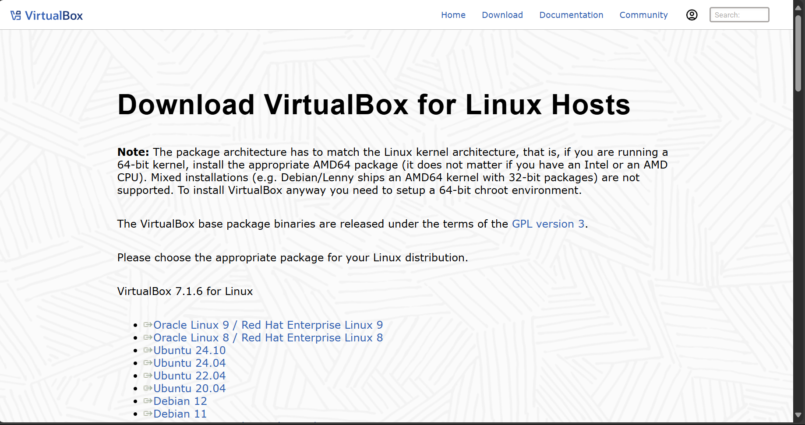
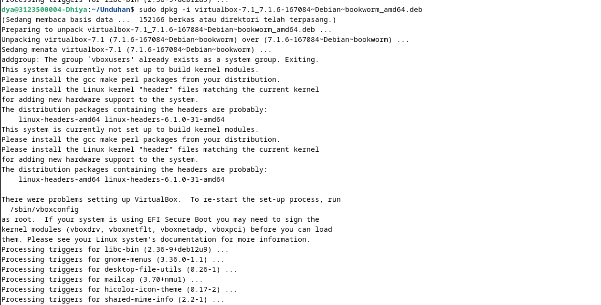
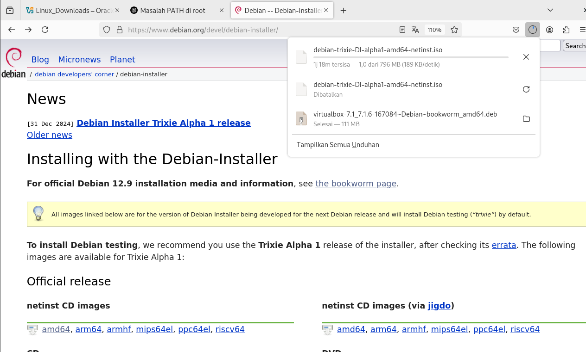
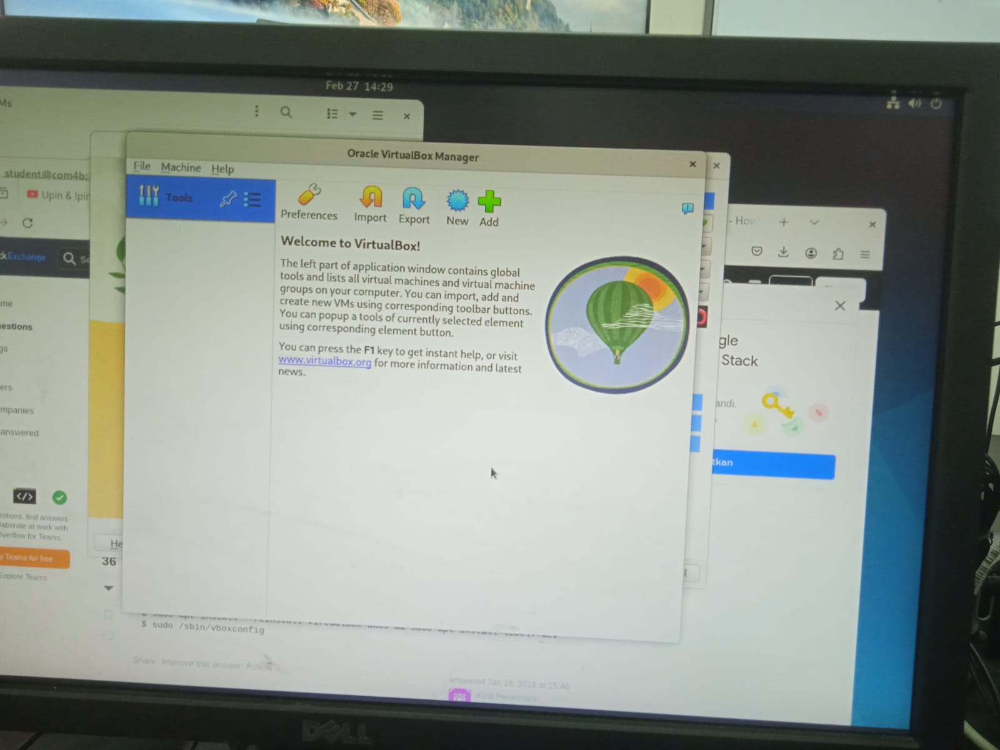
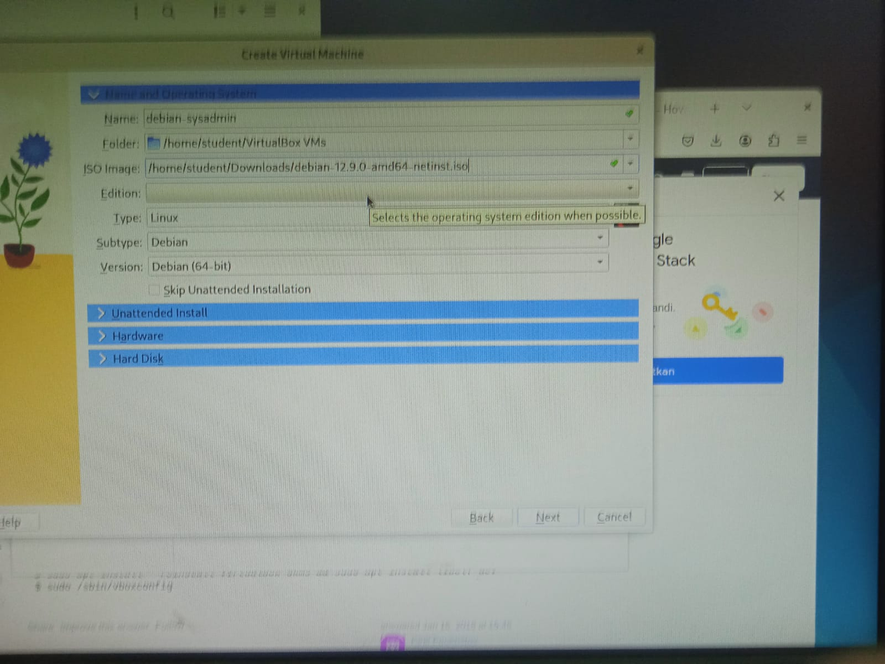
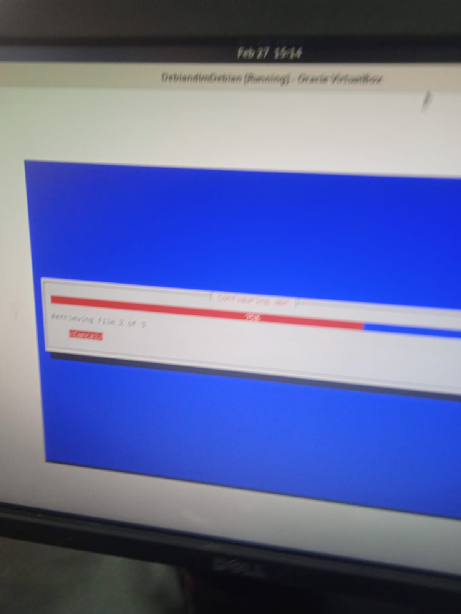
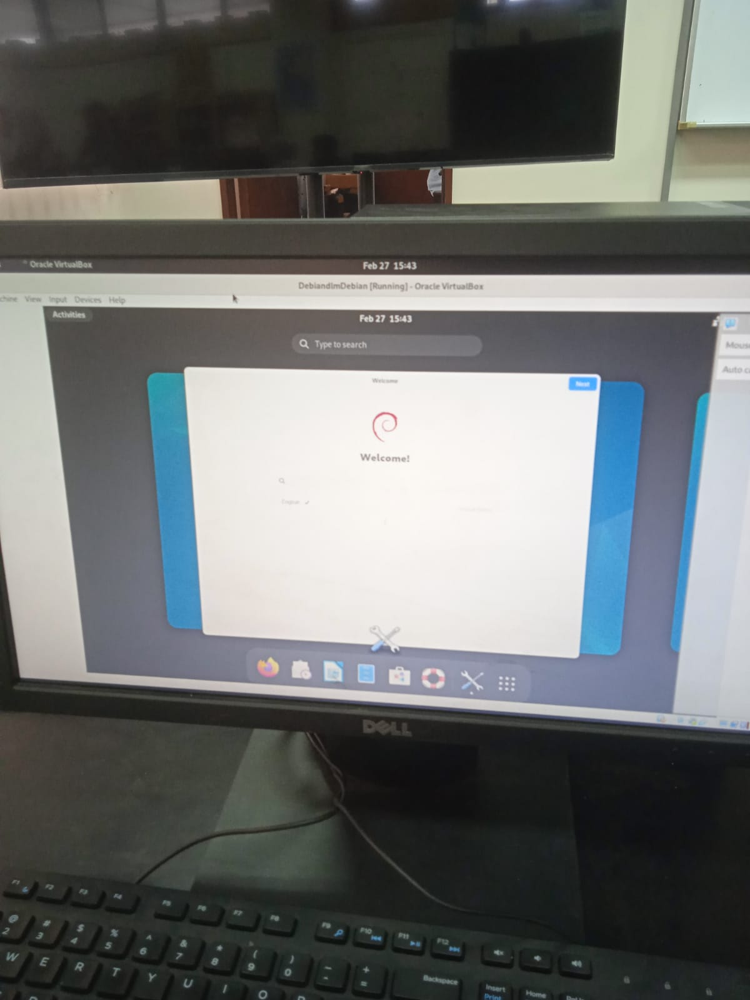

  <h1 style="text-align: center;font-weight: bold">Laporan Resmi Workshop Admnistrasi Jaringan</h1>
  <h4 style="text-align: center;">Dosen Pengampu : Dr. Ferry Astika Saputra, S.T., M.Sc.</h4>

 

  
  <h3 style="text-align: center;">Disusun Oleh : </h3>
  

    <strong>Muhammad Rafi Dhiyaulhaq (3123500004) </strong> 
  

<h3 style="text-align: center;line-height: 1.5">Politeknik Elektronika Negeri Surabaya Departemen Teknik Informatika Dan Komputer Program Studi Teknik Informatika 2024/2025</h3>
  

## Instalasi Virtual Box 

> **Note:** Karena banyak dokumentasi saya yang tidak ada, beberapa proses akan saya ulangi sendiri dengan PC saya di rumah.

1. Mengunduh VirtualBox package. Pilih distro linux yang sedang digunakan, dalam hal ini, yaitu debian 12.
 

2. buka terminal dan masuk ke dalam directory `Unduhan`. Jalankan command `sudo dpkg -i [nama-paket-VirtualBox]` untuk memulai instalasi VirtualBox dengan keterangan `sudo` untuk mendapatkan hak akses administrator, `dpgk` untuk instalasi paket berjenis `.deb`, dan `-i` untuk opsi instalasi.
 

3. Setelah instalasi berhasil dan dapat membuka VirtualBox, unduh file image disk di situs resmi debian.
 

4. Ini adalah halaman Virtual Box ketika baru dibuka
   
   
6. Ini adalah bagian pemasangan virtualbox. Dengan rincian 4096 MB RAM, 2 core, dan 20 GB untuk penyimpanan
   
   
8. Proses instalasi sedang berjalan
   
   
10. Virtualbox bisa digunakan
    
