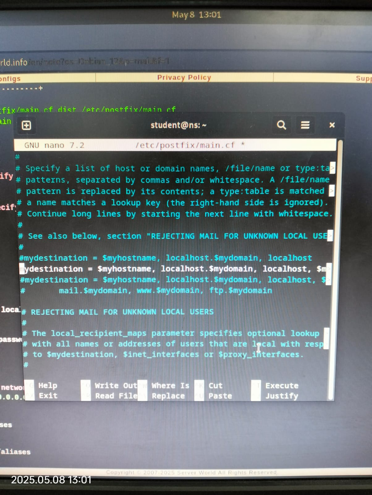

<div align="center">
  <h1 style="text-align: center;font-weight: bold">Laporan Resmi<br>Workshop Admnistrasi Jaringan</h1>
  <h4 style="text-align: center;">Dosen Pengampu : Dr. Ferry Astika Saputra, S.T., M.Sc.</h4>
</div>
<br />
<div align="center">
  
  <h3 style="text-align: center;">Disusun Oleh : </h3>
  <p style="text-align: center;">
    <strong>Muhammad Rafi Dhiyaulhaq (3123500004) </strong><br>
  </p>
<h3 style="text-align: center;line-height: 1.5">Politeknik Elektronika Negeri Surabaya<br>Departemen Teknik Informatika Dan Komputer<br>Program Studi Teknik Informatika<br>2024/2025</h3>
  <hr><hr>
</div>


# Laporan Instalasi dan Konfigurasi Mail Server (Postfix, Dovecot, Mailutils)


### Pengantar ke Surat Elektronik (Email)


Surat elektronik, yang sering disebut email, adalah metode pertukaran pesan melalui internet. Berikut adalah dasar-dasar email:

* **Alamat email**: Ini adalah pengenal unik untuk setiap pengguna, biasanya dengan format [nama@domain.com](mailto:nama@domain.com).
* **Email client**: Ini adalah program perangkat lunak yang digunakan untuk mengirim, menerima, dan mengelola email, seperti Gmail, Outlook, atau Apple Mail.
* **Email server**: Ini adalah sistem komputer yang bertanggung jawab untuk menyimpan dan meneruskan email ke penerima yang dimaksud.

#### Cara mengirim email:

1. Membuat pesan baru di email client kamu.
2. Masukkan alamat email penerima di kolom "To".
3. Tambahkan baris subjek untuk merangkum isi pesan.
4. Tulis isi pesan.
5. Lampirkan file relevan jika diperlukan.
6. Klik "Kirim" untuk mengirim pesan ke server email penerima.

Email juga dapat mencakup fitur seperti **cc (carbon copy)** dan **bcc (blind carbon copy)** untuk mengirim salinan pesan ke banyak penerima, serta opsi **reply**, **reply all**, dan **forward** untuk mengelola percakapan.

#### Surat Elektronik (Email) adalah salah satu layanan yang paling banyak digunakan di Internet. Layanan ini memungkinkan pengguna internet untuk mengirim pesan dalam format tertentu (surat) ke pengguna internet lain di mana pun di dunia. Pesan dalam surat tidak hanya berisi teks, tetapi juga dapat berisi gambar, audio, dan video. Orang yang mengirim surat disebut pengirim, dan orang yang menerima surat disebut penerima. Email ini mirip dengan layanan pos tradisional.

### Komponen Sistem Email:

Komponen dasar dari sistem email adalah:

* **User Agent (UA)**: UA adalah program yang digunakan untuk mengirim dan menerima email. Kadang-kadang juga disebut pembaca email (mail reader). UA menerima berbagai perintah untuk menyusun, menerima, dan membalas pesan, serta untuk manipulasi kotak surat.

* **Message Transfer Agent (MTA)**: MTA bertanggung jawab untuk memindahkan email dari satu sistem ke sistem lain. Untuk mengirim email, sebuah sistem harus memiliki MTA klien dan MTA sistem. MTA mengirimkan email ke kotak surat penerima jika berada di mesin yang sama. MTA mengirim email ke MTA rekan jika kotak surat tujuan berada di mesin lain. Pengiriman antar MTA dilakukan melalui **Simple Mail Transfer Protocol (SMTP)**.

* **Mailbox**: Ini adalah file di hard drive lokal untuk mengumpulkan email. Email yang diterima disimpan dalam file ini, dan pengguna dapat membacanya atau menghapusnya sesuai kebutuhan. Untuk menggunakan sistem email, setiap pengguna harus memiliki mailbox. Akses ke mailbox hanya diberikan kepada pemiliknya.

* **Spool File**: File ini berisi email yang akan dikirim. User agent menambahkan email yang keluar ke dalam file ini menggunakan SMTP. MTA mengambil email yang tertunda dari spool file untuk disampaikan.

Email memungkinkan satu nama alias untuk mewakili beberapa alamat email yang berbeda. Ini dikenal sebagai **mailing list**. Setiap kali pengguna mengirim pesan, sistem memeriksa nama penerima dalam database alias. Jika mailing list ada untuk alias yang dimaksud, maka pesan terpisah disiapkan dan dikirimkan ke MTA.

Jika tidak ada mailing list yang ditemukan untuk alias tersebut, nama tersebut menjadi alamat pengiriman dan pesan tunggal akan dikirimkan ke MTA.

### Layanan yang Diberikan oleh Sistem Email:

* **Komposisi**: Komposisi mengacu pada proses pembuatan pesan dan jawabannya. Untuk komposisi, editor teks apapun dapat digunakan.
* **Transfer**: Transfer berarti prosedur pengiriman email, yaitu dari pengirim ke penerima.
* **Pelaporan**: Pelaporan mengacu pada konfirmasi pengiriman email. Ini membantu pengguna memeriksa apakah email mereka terkirim, hilang, atau ditolak.
* **Tampilan**: Mengacu pada penyajian email dalam format yang dapat dipahami oleh pengguna.
* **Disposition**: Langkah ini berkaitan dengan penerima dan apa yang akan dilakukan setelah menerima email, misalnya menyimpan email, menghapus sebelum membaca, atau menghapus setelah membaca.

### Keuntungan dan Kerugian Email:

#### Keuntungan email:

* Komunikasi yang cepat dan nyaman dengan individu atau kelompok secara global.
* Mudah untuk menyimpan dan mencari pesan lama.
* Dapat mengirim dan menerima lampiran seperti dokumen, gambar, dan video.
* Lebih murah dibandingkan dengan surat tradisional dan faks.
* Tersedia 24 jam sehari 7 hari sepekan.

#### Kerugian email:

* Risiko spam dan serangan phishing.
* Banyaknya email yang masuk dapat menyebabkan informasi overload.
* Dapat menyebabkan berkurangnya komunikasi tatap muka dan kehilangan sentuhan pribadi.
* Potensi kesalahpahaman karena kurangnya nada dan bahasa tubuh dalam pesan tertulis.
* Masalah teknis, seperti gangguan server, dapat mengganggu layanan email.


---

## Daftar Isi

1. [Konfigurasi Postfix (SMTP Server)](#1-konfigurasi-postfix-smtp-server)  
2. [Konfigurasi Dovecot (IMAP, POP3, dan SMTP Auth)](#2-konfigurasi-dovecot-imap-pop3-dan-smtp-auth)  
3. [Pengujian dengan Mailutils (Mail Client)](#3-pengujian-dengan-mailutils-mail-client)  

---

## 1) Konfigurasi Postfix (SMTP Server)

### a) Instalasi Postfix dan SASL

```bash
apt -y install postfix sasl2-bin
````


> Pada saat instalasi, pilih **"No Configuration"**


---

### b) Salin konfigurasi default 

```bash
cp /usr/share/postfix/main.cf.dist /etc/postfix/main.cf
```


---

### c) Konfigurasi `main.cf` default

```bash
nano /etc/postfix/main.cf
```


Edit dan tambahkan konfigurasi berikut:

```conf
mail_owner = postfix
myhostname = mail.srv.world
mydomain = srv.world
myorigin = $mydomain
inet_interfaces = all
mydestination = $myhostname, localhost.$mydomain, localhost, $mydomain
local_recipient_maps = unix:passwd.byname $alias_maps
mynetworks_style = subnet
mynetworks = 127.0.0.0/8, 10.0.0.0/24
alias_maps = hash:/etc/aliases
alias_database = hash:/etc/aliases
home_mailbox = Maildir/
smtpd_banner = $myhostname ESMTP
sendmail_path = /usr/sbin/postfix
newaliases_path = /usr/bin/newaliases
mailq_path = /usr/bin/mailq
setgid_group = postdrop
inet_protocols = ipv4

disable_vrfy_command = yes
smtpd_helo_required = yes
message_size_limit = 10240000

# SMTP Auth
smtpd_sasl_type = dovecot
smtpd_sasl_path = private/auth
smtpd_sasl_auth_enable = yes
smtpd_sasl_security_options = noanonymous
smtpd_sasl_local_domain = $myhostname
smtpd_recipient_restrictions = 
  permit_mynetworks,
  permit_sasl_authenticated,
  reject_unauth_destination
```





---

### c) Buat alias dan restart Postfix

```bash
newaliases
systemctl restart postfix
```


---

## 2) Konfigurasi Dovecot (IMAP, POP3, dan SMTP Auth)

### a) Instalasi Dovecot

```bash
apt -y install dovecot-core dovecot-pop3d dovecot-imapd
```


---

### b) Edit `dovecot.conf`

```bash
nano /etc/dovecot/dovecot.conf
```


Ubah:

```conf
listen = *, ::
```


---

### c) Konfigurasi Otorisasi (10-auth.conf)

```bash
nano /etc/dovecot/conf.d/10-auth.conf
```


Ubah:

```conf
disable_plaintext_auth = no
auth_mechanisms = plain login
```


---

### d) Konfigurasi Mailbox (10-mail.conf)

```bash
nano /etc/dovecot/conf.d/10-mail.conf
```


Ubah:

```conf
mail_location = maildir:~/Maildir
```


---

### e) Konfigurasi Listener SMTP Auth (10-master.conf)

```bash
nano /etc/dovecot/conf.d/10-master.conf
```


Uncomment dan ubah bagian ini:

```conf
service auth {
  unix_listener /var/spool/postfix/private/auth {
    mode = 0666
    user = postfix
    group = postfix
  }
}
```


---

### f) Restart Dovecot

```bash
systemctl restart dovecot
```


---

## 3) Pengujian dengan Mailutils (Mail Client)

### a) Instalasi Mailutils

```bash
apt -y install mailutils
```


---

### b) Atur Environment dan Tambahkan User

```bash
echo 'export MAIL=$HOME/Maildir/' >> /etc/profile.d/mail.sh
```


---

### c) Kirim dan Baca Email

Login sebagai user `root`:

```bash
su - 
```


### d) Baca Email

```bash
mail
```

* Ketik `1` untuk membuka pesan
* Ketik `q` untuk keluar


---

### e) Cek Maildir

```bash
ls /var/mail
```


---
