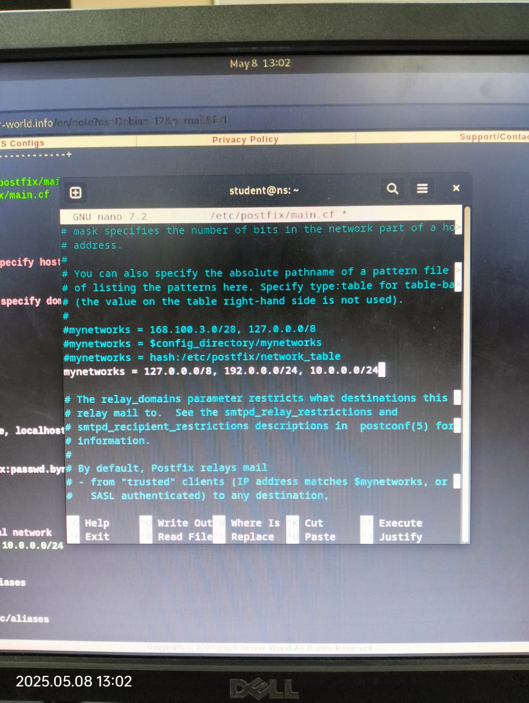

<div align="center">
  <h1 style="text-align: center;font-weight: bold">Laporan Resmi<br>Workshop Admnistrasi Jaringan</h1>
  <h4 style="text-align: center;">Dosen Pengampu : Dr. Ferry Astika Saputra, S.T., M.Sc.</h4>
</div>
<br />
<div align="center">
  
  <h3 style="text-align: center;">Disusun Oleh : </h3>
  <p style="text-align: center;">
    <strong>Muhammad Rafi Dhiyaulhaq (3123500004) </strong><br>
  </p>
<h3 style="text-align: center;line-height: 1.5">Politeknik Elektronika Negeri Surabaya<br>Departemen Teknik Informatika Dan Komputer<br>Program Studi Teknik Informatika<br>2024/2025</h3>
  <hr><hr>
</div>


# Laporan Instalasi dan Konfigurasi Mail Server (Postfix, Dovecot, Mailutils)

Mail server adalah sistem yang digunakan untuk mengirim, menerima, dan menyimpan email. Dalam laporan ini, kita akan menginstal dan mengonfigurasi tiga komponen utama:

- **Postfix**
  Postfix adalah protokol untuk menyediakan layanan SMTP (Simple Mail Transfer Protocol), yaitu protokol utama yang digunakan untuk mengirim email antar server. Postfix menangani proses pengiriman dan penerimaan email antar server
- **Dovecot**: 
  Dovecot adalah MDA (Mail Delivery Agent) dan server IMAP/POP3 yang digunakan untuk menyimpan serta memberikan akses email kepada pengguna. Dovecot juga menyediakan layanan autentikasi (SASL) yang dapat digunakan oleh Postfix untuk otentikasi SMTP.
- **Mailutils**: 
  Mailutils adalah mail client berbasis terminal (CLI) yang digunakan untuk mengirim dan membaca email langsung dari shell Linux. Paket ini digunakan dalam percobaan untuk menguji fungsionalitas mail server yang telah dikonfigurasi, seperti mengirim email dari user lokal dan memverifikasi penerimaannya melalui Dovecot.

  Cara kerjanya, 
  1. Mailutils adalah CLI untuk membaca dan menulis surat. Mail ini akan disimpan ke direktori lokal atau dalam kasusnya, Maildir.
  2. Postfix akan menjadi alat untuk mengirim surat, memvalidasi alamat, dan mengirimkan ke Maildir mmilik usser yang dituju
  3. Untuk mengakses Maildir, Dovecot menyediakan akses via IMAP atau POP3.
  4. Setelah diizinkan, baru penerima bisa membaca isi email, salah satunya via terminal.
---

## Daftar Isi

1. [Konfigurasi Postfix (SMTP Server)](#1-konfigurasi-postfix-smtp-server)  
2. [Konfigurasi Dovecot (IMAP, POP3, dan SMTP Auth)](#2-konfigurasi-dovecot-imap-pop3-dan-smtp-auth)  
3. [Pengujian dengan Mailutils (Mail Client)](#3-pengujian-dengan-mailutils-mail-client)  

---

## 1) Konfigurasi Postfix (SMTP Server)

### a) Instalasi Postfix dan SASL

```bash
apt -y install postfix sasl2-bin
````


> Pada saat instalasi, pilih **"No Configuration"**


---

### b) Salin konfigurasi default 

```bash
cp /usr/share/postfix/main.cf.dist /etc/postfix/main.cf
```


---

### c) Konfigurasi `main.cf` default

```bash
nano /etc/postfix/main.cf
```


Edit dan tambahkan konfigurasi berikut:

```conf
mail_owner = postfix
myhostname = mail.srv.world
mydomain = srv.world
myorigin = $mydomain
inet_interfaces = all
mydestination = $myhostname, localhost.$mydomain, localhost, $mydomain
local_recipient_maps = unix:passwd.byname $alias_maps
mynetworks_style = subnet
mynetworks = 127.0.0.0/8, 10.0.0.0/24
alias_maps = hash:/etc/aliases
alias_database = hash:/etc/aliases
home_mailbox = Maildir/
smtpd_banner = $myhostname ESMTP
sendmail_path = /usr/sbin/postfix
newaliases_path = /usr/bin/newaliases
mailq_path = /usr/bin/mailq
setgid_group = postdrop
inet_protocols = ipv4

disable_vrfy_command = yes
smtpd_helo_required = yes
message_size_limit = 10240000

# SMTP Auth
smtpd_sasl_type = dovecot
smtpd_sasl_path = private/auth
smtpd_sasl_auth_enable = yes
smtpd_sasl_security_options = noanonymous
smtpd_sasl_local_domain = $myhostname
smtpd_recipient_restrictions = 
  permit_mynetworks,
  permit_sasl_authenticated,
  reject_unauth_destination
```





---

### c) Buat alias dan restart Postfix

```bash
newaliases
systemctl restart postfix
```


---

## 2) Konfigurasi Dovecot (IMAP, POP3, dan SMTP Auth)

### a) Instalasi Dovecot

```bash
apt -y install dovecot-core dovecot-pop3d dovecot-imapd
```


---

### b) Edit `dovecot.conf`

```bash
nano /etc/dovecot/dovecot.conf
```


Ubah:

```conf
listen = *, ::
```


---

### c) Konfigurasi Otorisasi (10-auth.conf)

```bash
nano /etc/dovecot/conf.d/10-auth.conf
```


Ubah:

```conf
disable_plaintext_auth = no
auth_mechanisms = plain login
```


---

### d) Konfigurasi Mailbox (10-mail.conf)

```bash
nano /etc/dovecot/conf.d/10-mail.conf
```


Ubah:

```conf
mail_location = maildir:~/Maildir
```


---

### e) Konfigurasi Listener SMTP Auth (10-master.conf)

```bash
nano /etc/dovecot/conf.d/10-master.conf
```


Uncomment dan ubah bagian ini:

```conf
service auth {
  unix_listener /var/spool/postfix/private/auth {
    mode = 0666
    user = postfix
    group = postfix
  }
}
```


---

### f) Restart Dovecot

```bash
systemctl restart dovecot
```


---

## 3) Pengujian dengan Mailutils (Mail Client)

### a) Instalasi Mailutils

```bash
apt -y install mailutils
```


---

### b) Atur Environment dan Tambahkan User

```bash
echo 'export MAIL=$HOME/Maildir/' >> /etc/profile.d/mail.sh
```


---

### c) Kirim dan Baca Email

Login sebagai user `root`:

```bash
su - 
```


### d) Baca Email

```bash
mail
```

* Ketik `1` untuk membuka pesan
* Ketik `q` untuk keluar


---

### e) Cek Maildir

```bash
ls /var/mail
```


---
