

  <h1 style="text-align: center;font-weight: bold">Laporan Resmi Workshop Admnistrasi Jaringan</h1>
  <h4 style="text-align: center;">Dosen Pengampu : Dr. Ferry Astika Saputra, S.T., M.Sc.</h4>

 

  
  <h3 style="text-align: center;">Disusun Oleh : </h3>
  

    <strong>Muhammad Rafi Dhiyaulhaq (3123500004) </strong> 
  

<h3 style="text-align: center;line-height: 1.5">Politeknik Elektronika Negeri Surabaya Departemen Teknik Informatika Dan Komputer Program Studi Teknik Informatika 2024/2025</h3>
  

# Dokumentasi Konfigurasi Email Client Evolution

## Daftar Isi

- [1. Penjelasan Evolution](#1-penjelasan-evolution)
- [2. Konfigurasi Evolution](#2-konfigurasi-evolution)
- [3. Testing](#3-testing)

---

## 1. Penjelasan Evolution

### Apa itu Evolution?

**Evolution** adalah klien email dan groupware terintegrasi untuk lingkungan desktop **GNOME**, dirancang sebagai alternatif kuat bagi **Microsoft Outlook** di sistem operasi Linux. Evolution tidak hanya menangani email, tetapi juga menggabungkan fitur **kalender**, **daftar tugas (to-do)**, **manajemen kontak**, dan **memo** dalam satu aplikasi terpadu.

#### Fitur Utama Evolution:

- **Dukungan Email Lengkap**: Mendukung berbagai protokol seperti **POP**, **IMAP**, **Microsoft Exchange**, **Office 365**, dan akun email lokal.
- **Integrasi Groupware**: Email, kalender, kontak, tugas, dan memo dalam satu aplikasi—ideal untuk kebutuhan bisnis.
- **Folder Virtual & Filter Fleksibel**: Mengorganisasi email secara otomatis berdasarkan kriteria tertentu, mirip fitur smart folders.
- **Dukungan HTML Canggih**: Termasuk template HTML kecil untuk membuat tampilan email lebih menarik.
- **Keamanan**: Mendukung **OpenPGP** dan **S/MIME** untuk enkripsi dan tanda tangan digital.
- **Spam Filtering**: Terintegrasi dengan **SpamAssassin**, termasuk pelatihan filter Bayesian untuk deteksi spam yang lebih akurat.
- **Privasi**: Mampu memblokir konten jarak jauh untuk mencegah pelacakan (seperti web bugs).
- **Penandaan & Kode Warna**: Email dapat diberi tanda (flag) dan warna untuk pengorganisasian yang lebih baik.

#### Kelebihan Evolution:

- **All-in-One**: Tidak memerlukan plugin tambahan untuk fungsi dasar seperti kalender dan tugas.
- **Kompatibilitas Korporat**: Salah satu dari sedikit klien email Linux yang mendukung Exchange dan Office365 secara langsung.
- **Antarmuka Mirip Outlook**: Sangat cocok untuk pengguna yang terbiasa dengan Microsoft Outlook.
- **Stabil dan Matang**: Telah digunakan selama bertahun-tahun, termasuk pernah menjadi email client default Ubuntu.

#### Kekurangan:

- **Aplikasi Berat**: Karena fitur yang lengkap, Evolution bisa terasa "berat" dan kompleks bagi pengguna yang hanya membutuhkan fungsi email sederhana.
- **Antarmuka Padat**: Banyak fitur berarti UI bisa terasa penuh/cluttered.
- **Tidak Mendukung Format-Flowed**: Sebuah fitur kecil dalam pengaturan tampilan teks yang mungkin penting bagi sebagian pengguna.

## 2. Konfigurasi Evolution

Berikut adalah langkah-langkah dan pengaturan konfigurasi yang dilakukan untuk mengaktifkan akun email lokal menggunakan server `ns.kelompok2.home`.

### 1. Default

Bagian ini mengatur perilaku standar saat mengirim dan membaca email.

- Sent messages folder berfungsi agar salinan email terkirim otomatis disimpan di folder "Sent", sehingga bisa dilihat kembali jika diperlukan.

- Mark messages as read when opened in preview diaktifkan supaya email langsung ditandai sebagai sudah dibaca saat dilihat di panel pratinjau, menjaga inbox tetap rapi dan mudah dilacak.

**Gambar:**
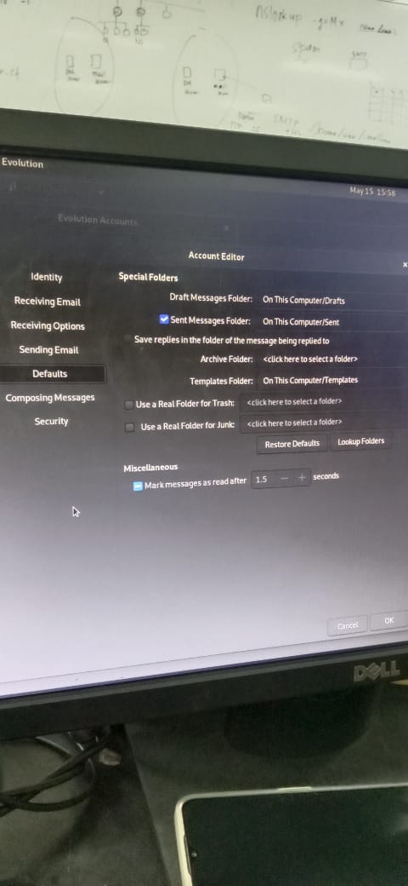

---

### 2. Penulisan E-mail

Bagian ini menentukan bagaimana tampilan saat membalas atau menulis email baru.

- Start typing at the bottom of the message
Agar saat membalas email, kursor otomatis berada di bawah email lama.
Ini penting supaya balasan mengikuti urutan percakapan (bottom-posting) yang umum di lingkungan formal atau teknis.

- Keep signature above the original message on replying
Supaya tanda tangan muncul di atas kutipan email lama, membuat identitas pengirim tetap terlihat jelas di bagian atas saat membalas.

**Gambar:**
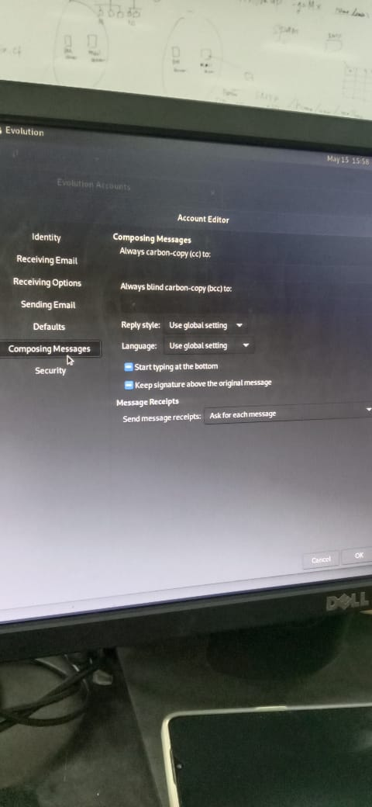

---

### 3. Pengaturan Server SMTP

**Deskripsi:**
Mengatur server untuk mengirim email melalui protokol SMTP.

**Pengaturan:**
- **Server:** `ns.kelompok2.home`
- **Port:** `25`
- **Authentication:** PLAIN
- **Encryption:** No encryption
- **Username:** `student`

**Gambar:**
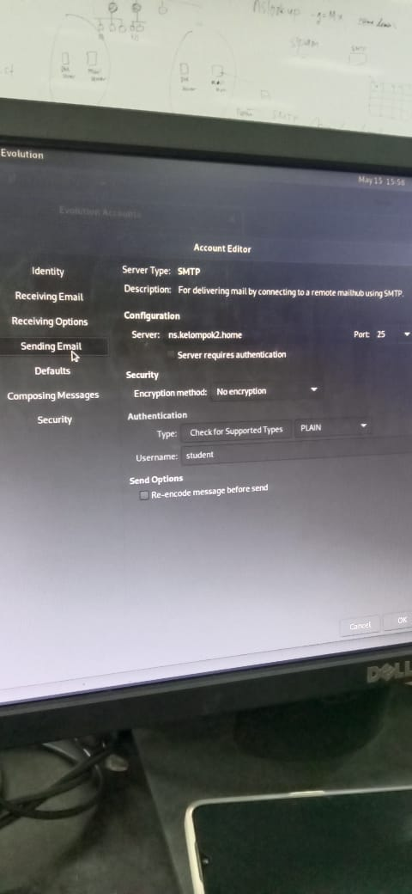

---

### 4. Opsi Penerimaan Email

**Deskripsi:**
Menentukan perilaku aplikasi dalam memeriksa dan menyinkronkan email masuk.

**Pengaturan:**
- Cek email baru setiap 60 menit
- Sinkronisasi email lokal di semua folder
- Terapkan filter untuk pesan masuk
- Hanya sinkronisasi email lokal yang berumur kurang dari 1 tahun

**Gambar:**
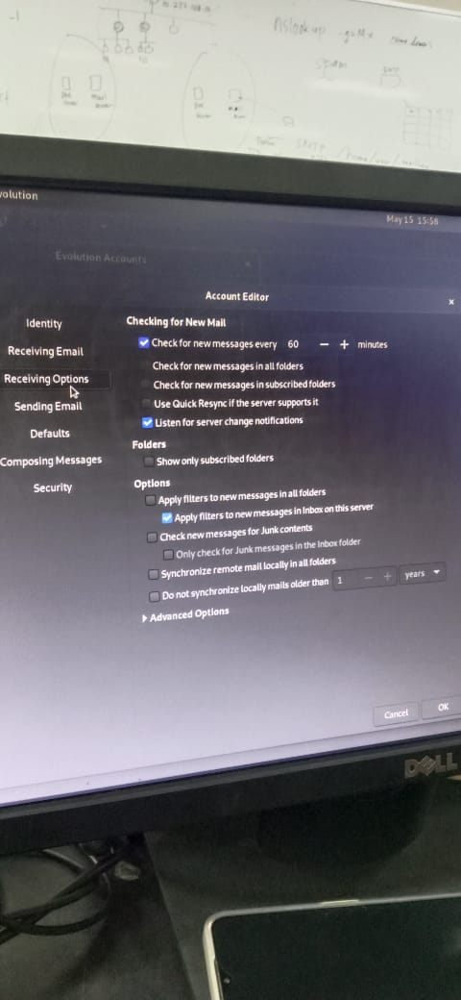

---

### 5. Pengaturan Penerimaan Email (Receiving Email)

Bagian ini digunakan untuk mengatur **server penerima (IMAP)** agar Evolution bisa mengambil email yang masuk dari server.

**Pengaturan:**

* Server Type: IMAP
* Server Address: `ns.kelompok2.home`
* Port: `143`
* Authentication Type: Password
* Encryption: None
* Username: `student`

**Gambar:**
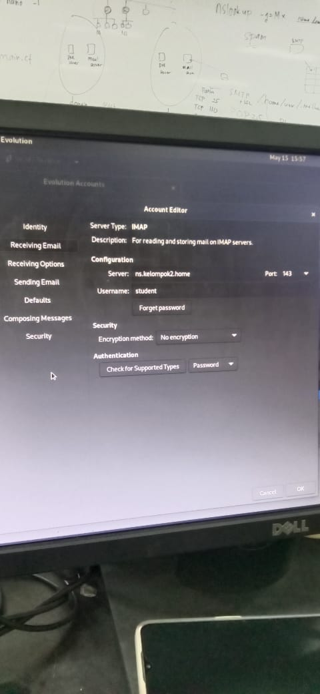

---

### 6 Pengaturan Keamanan (Security)

Bagian ini mengatur metode enkripsi dan tanda tangan digital saat mengirim dan menerima email.

**Opsi yang dicentang:**

*  **Always encrypt to myself when sending**
  Agar salinan email yang dikirim ke orang lain juga bisa dibuka oleh pengirim sendiri (karena dienkripsi dengan kunci publik milik sendiri).

*  **Look up key in encryption key server when sending**
  Evolution akan otomatis mencari kunci publik milik penerima di server keyring saat mengirim email terenkripsi.

**Gambar:**
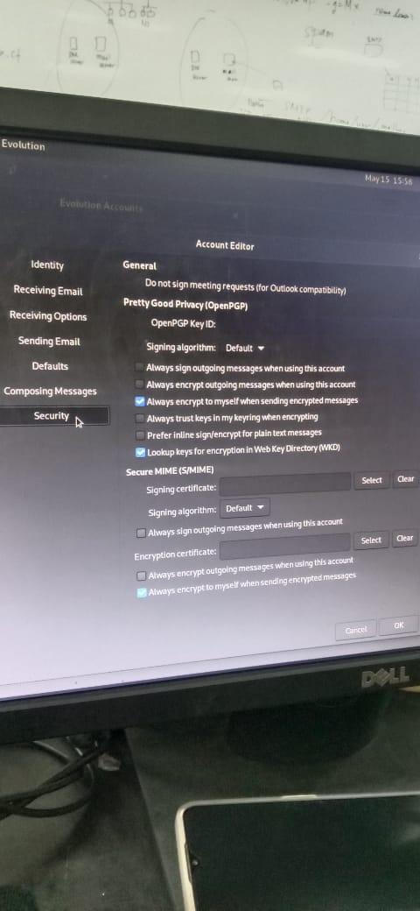

---

### 6. Konfigurasi Jaringan

**Deskripsi:**
Menentukan alamat IP statis dan DNS resolver untuk koneksi ke jaringan lokal.

**Pengaturan:**
- **IP Address:** `192.168.2.10`
- **Netmask:** `255.255.255.0`
- **Gateway:** `192.168.2.1`
- **DNS:**  
  `10.252.108.10, 192.168.2.10, 10.10.10.1, 202.9.85.3, 1.1.1.1`

**Gambar:**
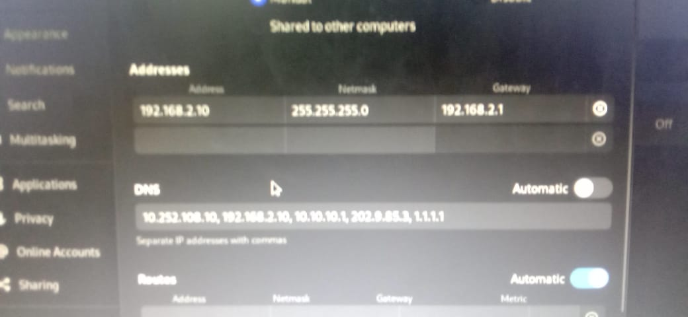

---

## 3. Testing

### Testing Pengiriman Email di Evolution Mail Client

- **Tujuan:** Kirim email ke diri sendiri dan ke PC lain dalam satu jaringan.
- **Hasil:** Pengiriman email berhasil tanpa kendala.

Mencoba mengirim ke diri sendiri
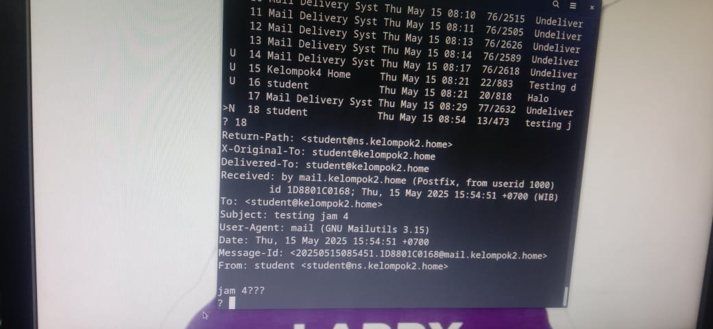 

Mail dari sisi pengirim
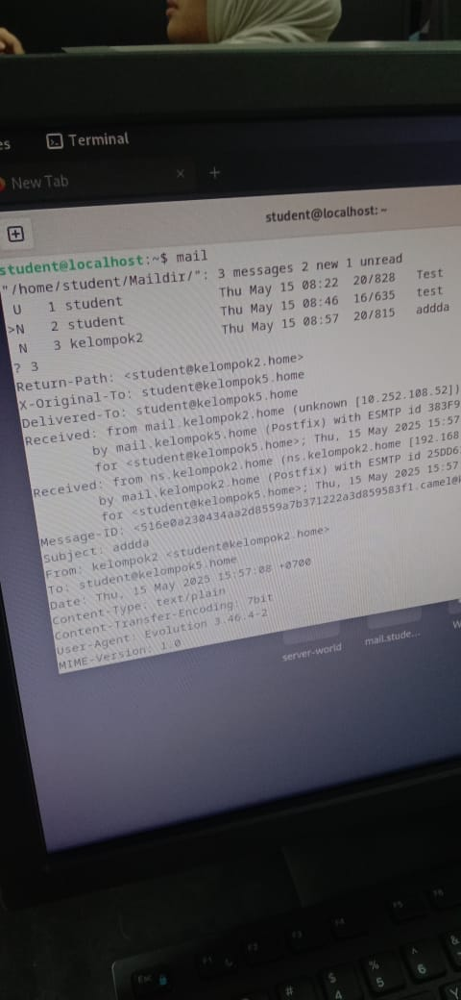 

Bukti mail terkirim dari Evolution Web Client
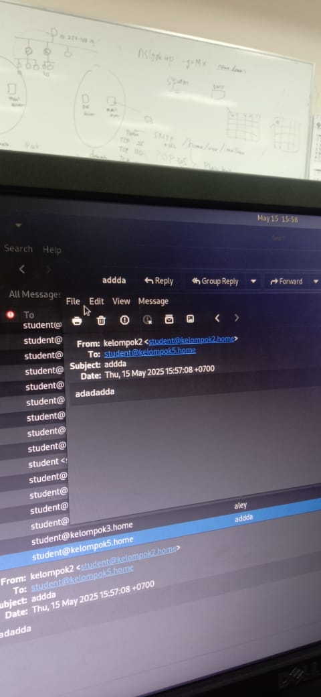

PC Penerima
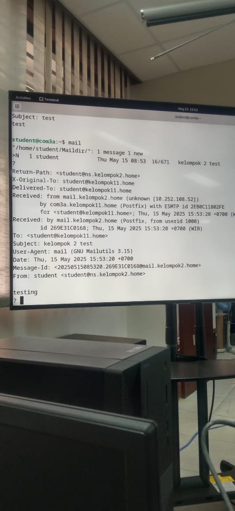

---

**Kesimpulan:**  
Evolution Mail Client berhasil mengirim dan menerima email antar PC dalam jaringan lokal.

## Penutup
