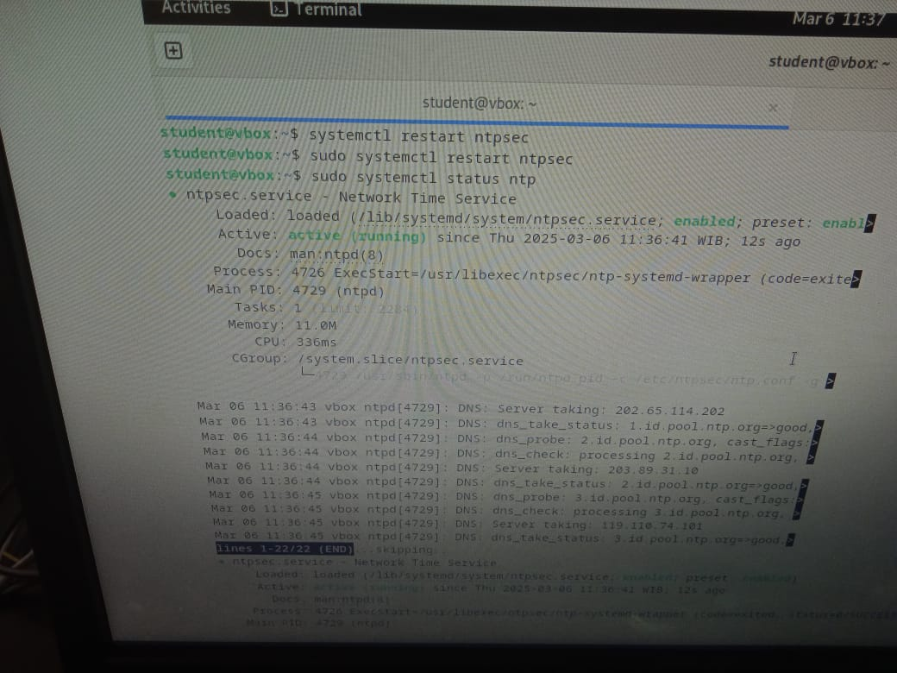
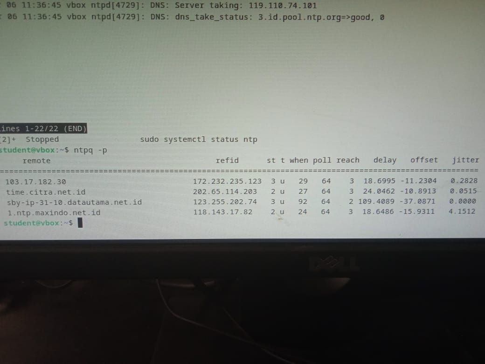
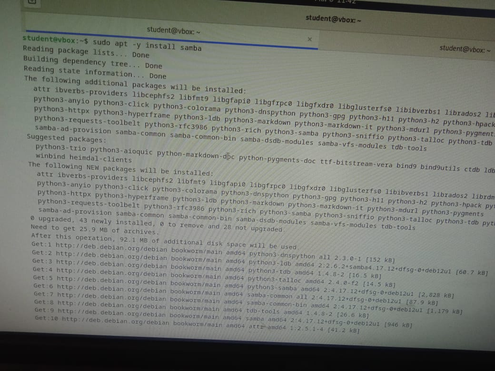
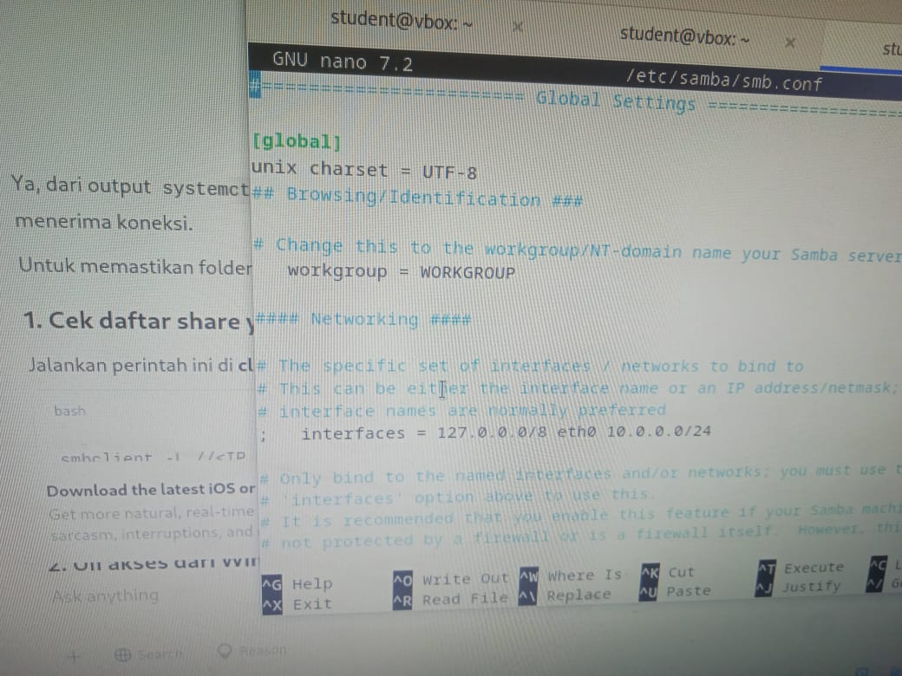
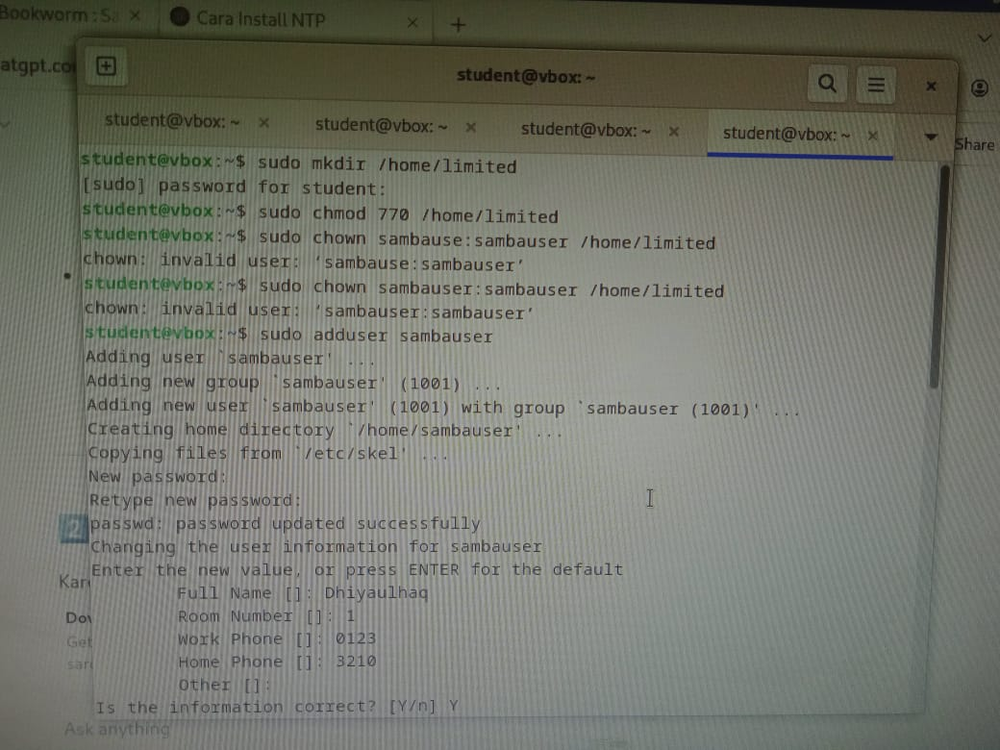
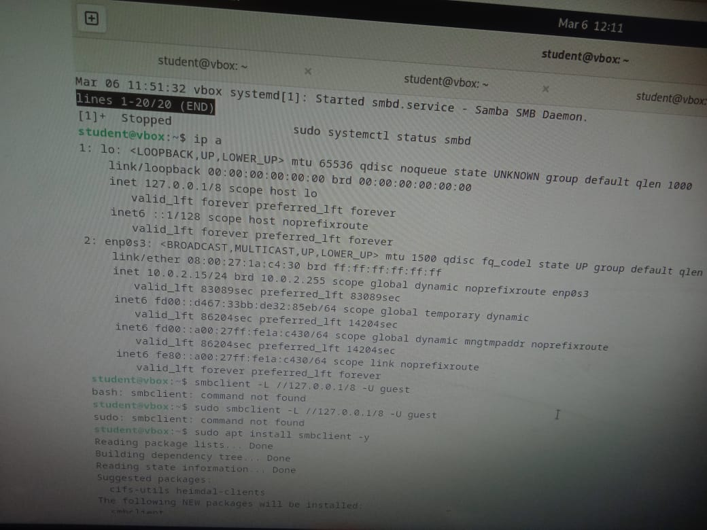
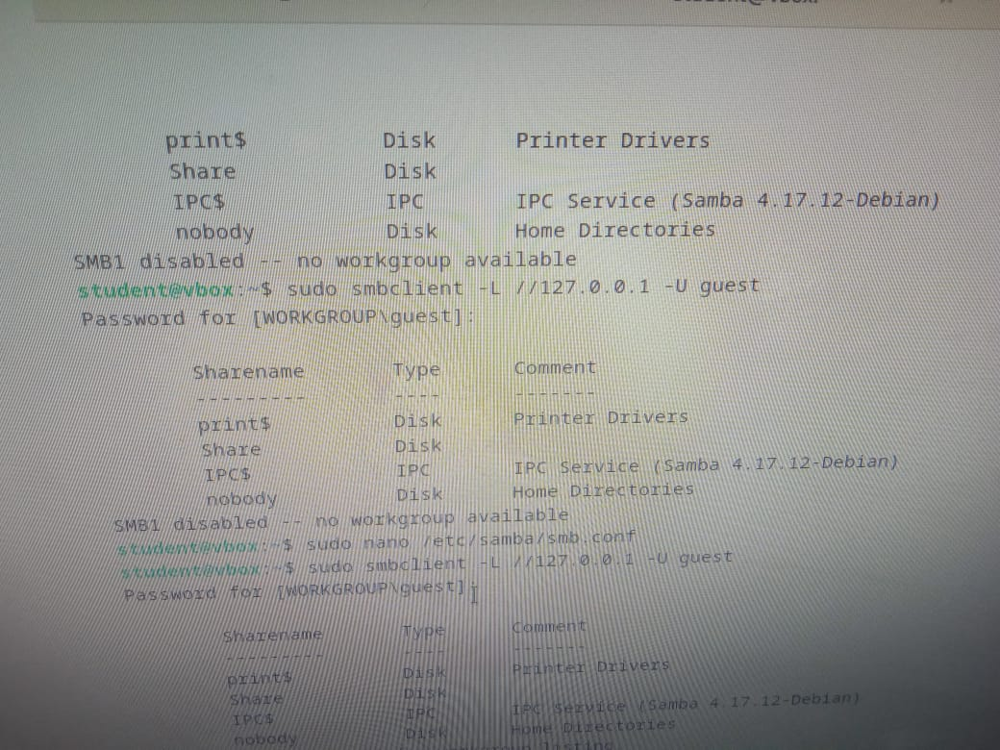

<div align="center">
  <h1 style="text-align: center;font-weight: bold">Laporan Resmi<br>Workshop Admnistrasi Jaringan</h1>
  <h4 style="text-align: center;">Dosen Pengampu : Dr. Ferry Astika Saputra, S.T., M.Sc.</h4>
</div>
<br />
<div align="center">
  
  <h3 style="text-align: center;">Disusun Oleh : </h3>
  <p style="text-align: center;">
    <strong>Muhammad Rafi Dhiyaulhaq (3123500004) </strong><br>
  </p>
<h3 style="text-align: center;line-height: 1.5">Politeknik Elektronika Negeri Surabaya<br>Departemen Teknik Informatika Dan Komputer<br>Program Studi Teknik Informatika<br>2024/2025</h3>
  <hr><hr>
</div>


 # Daftar Isi
- [Bagiana 1: Instalasi NTP](#chapter-1-ntp)
- [Bagian 2: Instalasi Samba](#chapter-2-samba)
- [Bagian 3: Package Management](#chapter-3-package)

# Bagiana 1: Instalasi NTP

#" NTP (**Network Time Protocol**) adalah protokol yang digunakan untuk menyinkronkan waktu antara komputer dalam suatu jaringan. NTP bekerja dengan menghubungkan perangkat ke server yang kredibel, biasanya berbasis UTC (Coordinated Universal Time), untuk memastikan keseragaman waktu di seluruh sistem.

### **Fungsi NTP:**  
NTP memiliki beberapa fungsi, contohnya
- Menjaga akurasi waktu pada perangkat dalam jaringan.  
- Mengurangi perbedaan waktu (drift) antar perangkat.  
- Memastikan sinkronisasi waktu untuk aplikasi yang memerlukan ketepatan tinggi, seperti server dan database.
- Membantu admin dalam  melakukan pengecekan  sehingga jika sewaktu-waktu ada serangan, data waktu yang diberikan akan sinkron dan terurut secara kronlogis sehingga mudah untuk  dilacak

  


## Instalasi
Untuk menginstal NTP di sistem Anda, jalankan perintah berikut:
```sh
sudo apt install ntp -y
```


## Konfigurasi
Edit file konfigurasi NTP untuk menggunakan server NTP Indonesia:
```sh
sudo nano /etc/ntp.conf
```


Ganti server default dengan server NTP Indonesia berikut:
```sh
server id.pool.ntp.org iburst
```


Sebenarnya tiga saja sudah cukup, karena sudaah  dapat digunakan untuk menynkronkan waktu secara andal kalau salah satunya mati. NTP juga nantinya akan memilih server dengan latensi terbaik. Justru terlalu banyak server akan menambah beban berlebih tanpa profit yang signifikan.
Simpan dan keluar dari file (tekan `CTRL + X`, lalu `Y`, dan tekan `Enter`).

## Restart Layanan NTP
Setelah melakukan perubahan, restart layanan NTP dengan perintah berikut:
```sh
sudo systemctl restart ntp
```



## Verifikasi Status NTP
Periksa apakah NTP berfungsi dengan baik menggunakan perintah berikut:
```sh
ntpq -p
```



NTP sudah berhasil diubah ke server Indonesia.

#Bagian 2: Instalasi Samba

## Definisi
Samba atau yang awalnya disebut SMB(Server Message Block adalah perangkat lunak open-source yang memungkinkan komunikasi dan berbagi file melalui protokol SMB/CIFS. Samba mendapatkan atensii besar karena ia bisa menghubungkan Linux/Unix dengan Windows sehingga banyak digunakan.

#Fungsi Samba
Sesuai definisinya, komunikasi dengan berbagai perangkat ini memberikan beberapa kegunaan, salah satunya:
1. **File Sharing** – Memungkinkan berbagi file dan direktori antara sistem yang berbeda.  
2. **Printer Sharing** – Mengizinkan pengguna Windows mencetak melalui server Linux.  
3. **Domain Controller** – Bisa bertindak sebagai pengontrol domain dalam jaringan.  
4. **Autentikasi User** – Mengelola akses berdasarkan izin pengguna.

## Panduan Instalasi dan Konfigurasi Samba

## 1. Instalasi Samba
Untuk menginstal Samba, jalankan perintah berikut:
```sh
sudo apt -y install samba 
```


## 2. Membuat Direktori untuk Share
Sebelum mengedit konfigurasi, buat direktori yang akan digunakan untuk berbagi file:
```sh
mkdir /home/share
chmod 777 /home/share
```


## 3. Edit Konfigurasi Samba (`smb.conf`)
Buka file konfigurasi Samba untuk diedit:
```sh
sudo vi /etc/samba/smb.conf
```


## 4. Ubah Pengaturan Jaringan
Tambahkan atau ubah baris berikut dalam file `smb.conf`:
```sh
interfaces = eth0 10.0.0.0/24
bind interfaces only = yes
```


## 5. Konfigurasi Guest Access
Ubah opsi berikut untuk mengatur akses guest:
```sh
map to guest = bad user
```


## 6. Konfigurasi Share Folder
Tambahkan konfigurasi share di bagian paling bawah file `smb.conf`:
```sh
[Share]
   path = /home/share
   writable = yes
   read only = no
   guest ok = yes
   guest only = yes
   force create mode = 777
   force directory mode = 777

```


Tambahkan konfigurasi untuk folder **limited**:
```sh
[limited]
   path = /home/limited
   browseable = yes
   read only = no
   valid users = sambauser
   force user = sambauser
```

## 7. Restart Layanan Samba
Setelah melakukan perubahan, restart layanan Samba:
```sh
sudo systemctl restart smbd
```


## 8. Menambahkan Pengguna Samba
Proses ini diperlukan kalau ingin membuat dan mengakses folder limited
```sh
sudo adduser sambauser
```


Atur kepemilikan folder agar sesuai:
```sh
sudo chown sambauser:sambauser /home/limited
```

Verifikasi pengguna Samba:
```sh
cat /etc/passwd | grep sambauser
```


## 9. Cek Koneksi dan Akses Samba
Cek IP untuk koneksi:
```sh
ip a
```

Jika `smbclient` belum terinstal:
```sh
sudo apt install smbclient -y
```



Cek  direktori

  


Jika user masih terdeteksi sebagai `nobody`, perbaiki dengan menambahkan konfigurasi berikut di `smb.conf`:
```sh
unix charset = UTF-8
client min protocol = NT1
server min protocol = NT1
```

## 10. Manajemen Database Pengguna Samba
Hapus file database password jika perlu:
```sh
rm -f /var/lib/samba/passdb.tdb
```
Lakukan backup jika diperlukan:
```sh
tdbbackup /var/lib/samba/passdb.tdb
```
Cek daftar pengguna Samba:
```sh
pdbedit -L
```

## 11. Akses dan Pengujian Samba dari Luar VirtualBox
1. Ubah jaringan ke **Bridged Adapter** di pengaturan VirtualBox.
2. Cek share Samba dari komputer lain:
   ```sh
   smbclient -L //<IP-TEMAN> -U sambauser
   ```
3. Coba akses folder **limited**:
   ```sh
   smbclient //localhost/limited -U sambauser
   ```
4. Pastikan bisa membuka file dari sistem luar VirtualBox.
5. Gunakan perintah `ls -l` untuk mengecek hak akses file:
   ```sh
   ls -l /home/limited
   ```
6. Ubah kepemilikan file agar hanya bisa diakses oleh root:
   ```sh
   sudo chown root:root /home/limited
   ```
7. Atur izin file agar hanya root dan pemilik yang bisa membaca:
   ```sh
   chmod 640 /home/limited
   ```

Sekarang Samba sudah dikonfigurasi dengan **guest access**, **pengguna terbatas**, dan bisa diakses dari luar VirtualBox.

