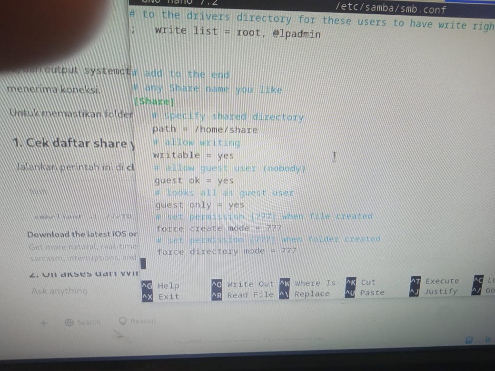
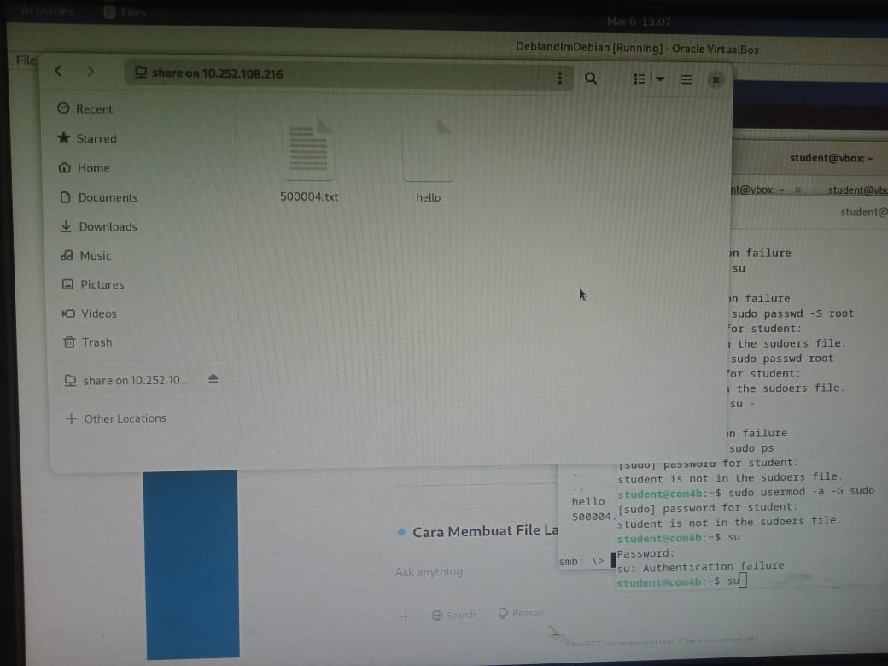
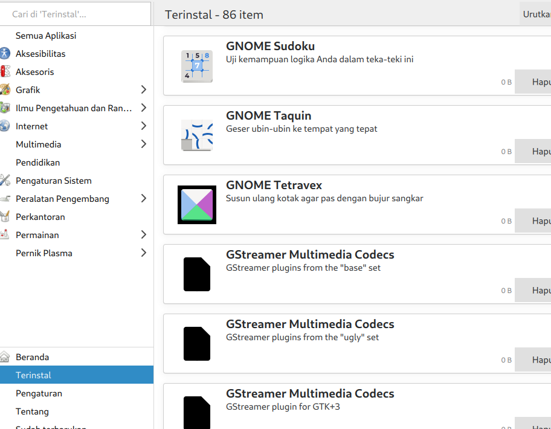
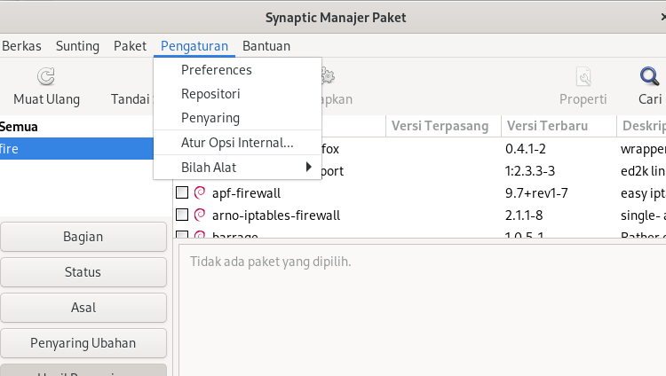
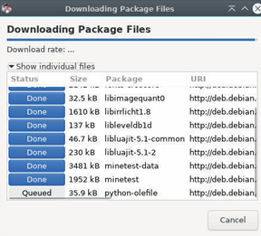

<div align="center">
  <h1 style="text-align: center;font-weight: bold">Laporan Resmi<br>Workshop Admnistrasi Jaringan</h1>
  <h4 style="text-align: center;">Dosen Pengampu : Dr. Ferry Astika Saputra, S.T., M.Sc.</h4>
</div>
<br />
<div align="center">
  
  <h3 style="text-align: center;">Disusun Oleh : </h3>
  <p style="text-align: center;">
    <strong>Muhammad Rafi Dhiyaulhaq (3123500004) </strong><br>
  </p>
<h3 style="text-align: center;line-height: 1.5">Politeknik Elektronika Negeri Surabaya<br>Departemen Teknik Informatika Dan Komputer<br>Program Studi Teknik Informatika<br>2024/2025</h3>
  <hr><hr>
</div>


 # Daftar Isi
- [Bagiana 1: Instalasi NTP](#chapter-1-ntp)
- [Bagian 2: Instalasi Samba](#chapter-2-samba)
- [Bagian 3: Package Management](#chapter-3-package)

# Bagiana 1: Instalasi NTP

#" NTP (**Network Time Protocol**) adalah protokol yang digunakan untuk menyinkronkan waktu antara komputer dalam suatu jaringan. NTP bekerja dengan menghubungkan perangkat ke server yang kredibel, biasanya berbasis UTC (Coordinated Universal Time), untuk memastikan keseragaman waktu di seluruh sistem.

### **Fungsi NTP:**  
NTP memiliki beberapa fungsi, contohnya
- Menjaga akurasi waktu pada perangkat dalam jaringan.  
- Mengurangi perbedaan waktu (drift) antar perangkat.  
- Memastikan sinkronisasi waktu untuk aplikasi yang memerlukan ketepatan tinggi, seperti server dan database.
- Membantu admin dalam  melakukan pengecekan  sehingga jika sewaktu-waktu ada serangan, data waktu yang diberikan akan sinkron dan terurut secara kronlogis sehingga mudah untuk  dilacak

  


## Instalasi
Untuk menginstal NTP di sistem Anda, jalankan perintah berikut:
```sh
sudo apt install ntp -y
```


## Konfigurasi
Edit file konfigurasi NTP untuk menggunakan server NTP Indonesia:
```sh
sudo nano /etc/ntp.conf
```


Ganti server default dengan server NTP Indonesia berikut:
```sh
server id.pool.ntp.org iburst
```


Sebenarnya tiga saja sudah cukup, karena sudaah  dapat digunakan untuk menynkronkan waktu secara andal kalau salah satunya mati. NTP juga nantinya akan memilih server dengan latensi terbaik. Justru terlalu banyak server akan menambah beban berlebih tanpa profit yang signifikan.
Simpan dan keluar dari file (tekan `CTRL + X`, lalu `Y`, dan tekan `Enter`).

## Restart Layanan NTP
Setelah melakukan perubahan, restart layanan NTP dengan perintah berikut:
```sh
sudo systemctl restart ntp
```


## Verifikasi Status NTP
Periksa apakah NTP berfungsi dengan baik menggunakan perintah berikut:
```sh
ntpq -p
```


NTP sudah berhasil diubah ke server Indonesia.

#Bagian 2: Instalasi Samba

## Definisi
Samba atau yang awalnya disebut SMB(Server Message Block adalah perangkat lunak open-source yang memungkinkan komunikasi dan berbagi file melalui protokol SMB/CIFS. Samba mendapatkan atensii besar karena ia bisa menghubungkan Linux/Unix dengan Windows sehingga banyak digunakan.

#Fungsi Samba
Sesuai definisinya, komunikasi dengan berbagai perangkat ini memberikan beberapa kegunaan, salah satunya:
1. **File Sharing** – Memungkinkan berbagi file dan direktori antara sistem yang berbeda.  
2. **Printer Sharing** – Mengizinkan pengguna Windows mencetak melalui server Linux.  
3. **Domain Controller** – Bisa bertindak sebagai pengontrol domain dalam jaringan.  
4. **Autentikasi User** – Mengelola akses berdasarkan izin pengguna.

## Panduan Instalasi dan Konfigurasi Samba

## 1. Instalasi Samba
Untuk menginstal Samba, jalankan perintah berikut:
```sh
sudo apt -y install samba 
```


## 2. Membuat Direktori untuk Share
Sebelum mengedit konfigurasi, buat direktori yang akan digunakan untuk berbagi file:
```sh
mkdir /home/share
chmod 777 /home/share
```


## 3. Edit Konfigurasi Samba (`smb.conf`)
Buka file konfigurasi Samba untuk diedit:
```sh
sudo vi /etc/samba/smb.conf
```


## 4. Ubah Pengaturan Jaringan
Tambahkan atau ubah baris berikut dalam file `smb.conf`:
```sh
interfaces = eth0 10.0.0.0/24
bind interfaces only = yes
```


## 5. Konfigurasi Guest Access
Ubah opsi berikut untuk mengatur akses guest:
```sh
map to guest = bad user
```


## 6. Konfigurasi Share Folder
Tambahkan konfigurasi share di bagian paling bawah file `smb.conf`:
```sh
[Share]
   path = /home/share
   writable = yes
   read only = no
   guest ok = yes
   guest only = yes
   force create mode = 777
   force directory mode = 777

```



## 7. Restart Layanan Samba
Setelah melakukan perubahan, restart layanan Samba:
```sh
sudo systemctl restart smbd
```


## 8. Menambahkan Pengguna Samba
Proses ini diperlukan kalau ingin membuat dan mengakses folder limited
```sh
sudo adduser sambauser
```


Atur kepemilikan folder agar sesuai:
```sh
sudo chown sambauser:sambauser /home/limited
```

Verifikasi pengguna Samba:
```sh
cat /etc/passwd | grep sambauser
```


## 9. Buat direktori limited
Buat direktori limited pada CLI
```sh
sudo mkdir /home/limited
sudo chown 770 /home/limited
```

`
Tambahkan konfigurasi untuk folder **limited**:
```sh
[limited]
   path = /home/limited
   browseable = yes
   read only = no
   valid users = sambauser
   force user = sambauser
```


Akses dengan `smbclient` harusnya sudah terdaftar


      
## 10. Cek Koneksi dan Akses Samba
  Cek IP untuk koneksi:
```sh
ip a
```

  Jika `smbclient` belum terinstal:
```sh
sudo apt install smbclient -y
```


  Cek direktori

  


Jika user masih terdeteksi sebagai `nobody`, perbaiki dengan menambahkan konfigurasi berikut di `smb.conf`:
```sh
unix charset = UTF-8
client min protocol = NT1
server min protocol = NT1
```


## 11.  Akses File Sharing
1. Coba akses file sharing di CLI
  ```sh
  sudo smbclient //127.0.0.1/Share -U Guest
  ```


perintah `ls` digunakan untuk mengecek isi file dalam folder Share. Untuk memasukkan file dari komputer, gunakan perintah `put`


2. Ubah jaringan ke **Bridged Adapter** di pengaturan VirtualBox.


3. Cek share Samba dari komputer lain
   ```sh
   smbclient -L //<IP-TEMAN> -U sambauser
   ```
   


  Coba akses dari file manager


4. Coba akses folder **limited**:
   ```sh
   smbclient //localhost/limited -U sambauser
   ```
  

   
5. Pastikan bisa membuka file dari sistem luar VirtualBox.
Untuk mengakses folderlimited, nanti hanya ada user yang diijinkan yang bisa mengakses. User nanti juga harus memasukkan password.   


#Bagian 3: Package Management
- `deb`: repositori biner (perangkat lunak yang sudah dikompilasi)  
- `deb-src`: repositori sumber (kode program yang digunakan untuk mengompilasi perangkat lunak)  
- `http:...` / `https:...`: alamat internet dari server repositori  
- `bookworm` / `bookworm-security`: cabang dalam struktur repositori  
- `main` / `non-free-firmware`: bagian atau komponen repositori  

---  

### Mengapa "bookworm" dan bukan "stable", padahal sistem ini berbasis Debian Stable?  
"bookworm" adalah nama versi spesifik dari sistem Debian yang terpasang. Ia menetapkan versi pasti dari setiap paket di repositori “bookworm” (misalnya versi kernel). “stable” adalah nama generik dari versi stabil Debian saat ini. Saat ini, Debian 12 "bookworm" adalah versi "stable", jadi kamu bisa menggunakan keduanya. Namun, ketika versi "stable" berganti ke Debian 13 "Trixie", maka Debian 12 "bookworm" akan berubah menjadi "oldstable".  
Dengan menggunakan nama versi spesifik seperti “bookworm”, kamu bisa mengontrol kapan sistem di-upgrade, tidak seperti sistem lain yang memaksa upgrade otomatis. Info lengkap: [https://www.debian.org/releases/index.html](https://www.debian.org/releases/index.html)  

---  

## Tentang Repositori, Cabang, dan Komponen  
Debian mengorganisir paket-paket perangkat lunak dalam repositori, yang dibagi menjadi:  

- Cabang (branches)  
- Komponen (sections/components)  

### Komponen dalam Repositori Resmi Debian  

- `main`: sesuai dengan DFSG, tanpa dependensi non-free  
- `non-free-firmware`: firmware non-free, disertakan secara default sejak Debian 12  
- `contrib`: sesuai DFSG, tetapi memiliki beberapa dependensi non-free  
- `non-free`: tidak sesuai dengan DFSG  

### Apa itu DFSG?  

**DFSG (Debian Free Software Guidelines)** adalah prinsip-prinsip filosofi perangkat lunak bebas menurut Debian.  
[https://www.debian.org/social_contract.html#guidelines](https://www.debian.org/social_contract.html#guidelines)  

Hanya paket dalam komponen `main` yang didukung resmi oleh proyek Debian dan benar-benar bebas.  
Komponen `contrib`, `non-free`, dan `non-free-firmware` bisa berisi perangkat lunak yang sebagian atau sepenuhnya tidak bebas.  

Tergantung perangkat keras kamu, mungkin ada layanan yang tidak berjalan dengan baik tanpa driver khusus (proprietary). Dalam kasus ini, kamu perlu mengedit file:  
```bash
/etc/apt/sources.list
```  
---  

### Sumber Tambahan  

- Versi Debian: [https://wiki.debian.org/DebianReleases](https://wiki.debian.org/DebianReleases)  
- Tentang `sources.list`: [https://wiki.debian.org/SourcesList](https://wiki.debian.org/SourcesList)  
- Dokumentasi manajemen paket Debian: [https://www.debian.org/doc/manuals/debian-reference/ch02.html](https://www.debian.org/doc/manuals/debian-reference/ch02.html)  

---  

## Paket Backport  

Debian juga menyediakan repositori backports, yang berisi versi terbaru dari aplikasi tertentu.  

Repositori ini tidak aktif secara default, tetapi aman digunakan: repositori reguler tetap menjadi prioritas utama dalam proses update. Hanya aplikasi yang diinstal dari backports yang akan mengambil dari repositori tersebut.  

### "Backports" tidak ada hubungannya dengan “backdoors”.  
**Backport** adalah mekanisme untuk membawa kembali (porting) aplikasi versi terbaru dari repositori pengembangan Debian ke versi “stable”.  

Contoh: Debian mengambil versi terbaru dari LibreOffice, lalu mengompilasinya ulang agar cocok dengan dependensi yang tersedia di versi stable.  

Info lengkap tentang Backports: [https://wiki.debian.org/Backports](https://wiki.debian.org/Backports)  

Cara mencari aplikasi di backports:  
- [Cari berdasarkan nama paket](https://backports.debian.org/Packages/)  
- [Cari berdasarkan kategori](https://packages.debian.org/bookworm-backports/)  

---  

## Mengubah Repositori  

Sebelum kamu mengubah sumber perangkat lunak (repositori) dalam sistem, pastikan kamu menyadari risiko menggunakan komponen `contrib` atau `non-free`, terutama dari cabang arsip.  

### Risiko yang mungkin terjadi, yaitu:
- Kehilangan kebebasan perangkat lunak: kamu mungkin menggunakan perangkat lunak yang bukan open-source.  
- Tidak mendapat dukungan resmi dari proyek Debian: karena tidak memiliki akses ke source code, Debian tidak dapat memelihara/memperbaiki perangkat lunak tersebut.  
- Kontaminasi sistem Debian kamu yang seharusnya 100% bebas: mencampur sistem bebas dengan komponen non-free bisa bertentangan dengan filosofi Debian.  

Berikut versi tanpa emoji:  

# 8.2 Mengelola Paket Debian dengan APT

APT (**Advanced Package Tool**) adalah alat utama untuk mengelola paket di Debian melalui terminal.

> Debian juga mendukung *aptitude*, manajer paket lain dengan sintaks dan perilaku yang berbeda.  
> Karena panduan ini ditujukan untuk pemula, kita tidak bahas *aptitude* di sini.  
> Pelajari lebih lanjut di: [https://wiki.debian.org/Aptitude](https://wiki.debian.org/Aptitude)

---

## 8.2.1 Perintah untuk Pengguna (User)

Perintah-perintah ini **tidak memengaruhi sistem**, jadi bisa dijalankan sebagai pengguna biasa (tanpa sudo/root).

- `apt search [nama-paket]`: mencari paket
- `apt show [nama-paket]`: menampilkan informasi detail tentang suatu paket

---

## 8.2.2 Perintah dalam Mode Administrator (Root)

Perintah-perintah ini **mempengaruhi sistem**, jadi harus dijalankan dengan hak akses administrator (root).  
Untuk masuk ke mode root dari terminal, ketik:

```bash
su -
```

Lalu masukkan password administrator.

### Daftar Perintah APT Umum:

| Perintah | Fungsi |
|----------|--------|
| `apt full-upgrade` | Memperbarui semua paket, menambah/menghapus paket jika diperlukan |
| `apt remove foo` | Menghapus paket `foo`, tetapi menyimpan file konfigurasinya |
| `apt autoremove` | Menghapus paket-paket tidak diperlukan secara otomatis |
| `apt purge foo` | Menghapus paket `foo` beserta file konfigurasi |
| `apt clean` | Membersihkan cache lokal dari paket terinstal |
| `apt autoclean` | Membersihkan cache lokal dari paket yang sudah usang |
| `apt-mark showmanual` | Menampilkan paket yang diinstal secara manual |

Untuk informasi lebih lengkap dan perbandingan dengan *aptitude*, kunjungi:

[https://www.debian.org/doc/manuals/debian-reference/ch02.html](https://www.debian.org/doc/manuals/debian-reference/ch02.html)

---

## Satu Baris Perintah All-in-One

Perintah gabungan (harus dalam mode root) untuk:

1. Memperbarui informasi repositori
2. Memperbarui sistem
3. Membersihkan cache paket

```bash
apt update && apt full-upgrade && apt autoclean && apt autoremove
```


untuk menghapus package, dependans,atau onfigurasi yang tidak terpaka, gunakan
`apt autoremove --purge`


8.3 Software: Pengelola Paket yang Disimplifikasi

Sotware adalah pengelola aplikasi Debian yang dibuat lebih sederhana. Ini memungkinkan Anda mencari, menginstal, menghapus, atau memperbarui paket yang berisi aplikasi Anda. Anda dapat menemukannya di kategori "Sistem" pada menu atau langsung dari kotak pencarian Gnome dengan mengetik "Software".

8.3.1 Mencari Aplikasi
Langsung klik tombol pencarian (ikon kaca pembesar) atau pilih salah satu kategori yang ditampilkan.

8.3.2 Menginstal Aplikasi

Anda dapat menginstal aplikasi dengan mengklik area deskripsinya lalu menekan tombol "Install". Kata sandi administrator akan diminta. Anda dapat mengikuti proses instalasi di jendela utama dan langsung meluncurkan aplikasi yang baru diunduh. Dalam proses mengotak-atik aplikasi, anda akan selalu diminta password sebagai administrator

8.3.3 Menghapus Aplikasi

Untuk menghapus aplikasi, kunjungi kategori "Installed" (Terinstal) di bagian atas antarmuka, lalu klik tombol "Remove" (Hapus). Konfirmasi akan diminta.


8.3.4 Memperbarui Aplikasi

Anda dapat memperbarui sistem dari bagian "Updates" (Pembaruan) yang akan menunjukkan pembaruan yang tersedia. Jika tidak ada pembaruan, Anda bisa memeriksa repositori dengan tombol khusus di kiri atas.Dalam kasus saya, semua pembaruan sudah dipasang sehingga tidak ada yang bisa diperbaharui lewat Software


8.3.5 Mengubah Repositori Paket

Dari menu "Software", pilih "Repositories" untuk menambah sumber non-free atau mengatur frekuensi pembaruan repositori. Informasi alamat repositori diambil dari file sources.list.


Setelah ini, jangan lupa reload

8.3.6 Pembaruan Otomatis

Anda bisa mengaktifkan pembaruan otomatis dari menu "Software" di bagian "Update Preference".

8.4 Discover: Pengelola Paket KDE

KDE memiliki Discover, program intuitif yang memungkinkan Anda mencari, menginstal, menghapus, atau memperbarui aplikasi dari satu antarmuka. Discover bisa dibuka dari menu KDE > Aplikasi > Sistem > Pusat Perangkat Lunak.

8.4.1 Mencari dan Menginstal dengan Discover

Untuk menemukan aplikasi, ketik namanya di kolom pencarian atau jelajahi kategori yang tersedia. Cukup klik tombol "Install" dan masukkan kata sandi administrator saat diminta.

8.4.1.1 Menambah Widget dan Addon Plasma

Discover memungkinkan Anda menambah komponen tambahan ke lingkungan Plasma melalui bagian "Plasma add-ons".

8.4.2 Menghapus Aplikasi dengan Discover

Kunjungi kategori "Installed" lalu klik "Remove" untuk menghapus aplikasi.

8.4.3 Memperbarui Aplikasi dengan Discover

Saat KDE memberi tahu ada pembaruan, Discover yang akan menjalankannya. Untuk memeriksa manual, klik tombol khusus, lalu "Update all" dan masukkan kata sandi administrator. Dalam kasus saya, semuanya sudah terupdate, sehingga tidak perlu diperbaharui lagi.

8.4.4 Mengelola Repositori dengan Discover

Di bagian "Settings" Discover, Anda dapat mengubah sumber aplikasi tanpa terminal. Informasi diambil dari file sources.list.

8.5 Synaptic: Pengelola Paket Lengkap

Synaptic adalah antarmuka grafis lengkap untuk pengelola paket Debian. Ini menampilkan semua paket yang tersedia (termasuk pustaka) dengan detail lebih banyak daripada Software atau Discover.

8.5.1 Antarmuka Utama Synaptic

Jendela Synaptic terbagi dalam 4 area: toolbar, panel kiri untuk memilih paket, panel tengah menampilkan daftar paket, dan panel bawah berisi deskripsi paket yang dipilih.

8.5.2 Mengelola Repositori dengan Synaptic

Buka Synaptic dari menu Sistem > Synaptic package manager. Klik "Settings" lalu "Repositories" untuk mengelola sumber paket.

8.5.3 Memperbarui Sistem dengan Synaptic

Klik "Reload" untuk memperbarui daftar paket. Lalu pilih "Mark All Upgrades". Jika ada pembaruan tersedia, klik "Apply" untuk memulai proses.

8.5.4 Mencari Perangkat Lunak

Klik tombol pencarian dan masukkan kata kunci. Jika tidak tahu nama paket, Anda bisa menyaring berdasarkan kategori, status, atau asal.

8.5.5 Menginstal Paket dengan Synaptic

Klik kanan kotak di depan nama paket lalu pilih "Mark for Installation". Jika ada dependensi, Synaptic akan menambahkannya secara otomatis. Klik "Apply" untuk melanjutkan.




8.5.5.1 Menginstal Ulang Paket

Untuk menginstal ulang paket yang sudah terinstal, pilih "Mark for Reinstall".


8.5.6 Menghapus Paket dengan Synaptic

Klik kanan kotak di depan nama paket dan pilih "Mark for Removal". Untuk menghapus juga file konfigurasi, pilih "Mark for Complete Removal".


8.5.6.1 Membersihkan Paket Tak Berguna

Klik "Status" di panel kiri dan pilih "Installed (Auto removable)". Klik kanan paket lalu "Mark for Complete Removal".


8.5.6.2 Menghapus Sisa Konfigurasi

Pilih "Not installed (residual config)" di bagian "Status" lalu tandai dan hapus sisa file konfigurasi.

Chapter ini saya lewati  karena tidak ada di pc saya.

8.5.7 Melihat Informasi Paket

Klik paket untuk melihat deskripsi di panel bawah. Untuk detail lebih lanjut, klik kanan lalu "Properties".

8.5.8 Preferensi Synaptic

Buka "Settings > Preferences" untuk mengatur opsi umum, tampilan, warna, cache, jaringan, dan distribusi paket.


8.6 Membersihkan Sistem

Meskipun kapasitas hard disk semakin besar, kadang kita butuh ruang kosong. Beberapa skrip bisa membantu, tapi lebih baik periksa dulu sebelum menjalankan perintah 'rm'.

8.6.1 Informasi Ruang Disk

Hal pertama yang harus dilakukan adalah memeriksa ruang yang digunakan di disk Anda. Beberapa alat tersedia, dimulai dari terminal:

- **Ruang disk di terminal**
  Ringkasan penggunaan ruang disk untuk setiap titik mount sistem (disk dan partisi) menggunakan perintah `df`:
  ```bash
  df -h
  ```


- **Daftar direktori berdasarkan ukuran**
  Lihat direktori yang memakan ruang besar dengan `du` dan `sort` (output dalam megabyte):
  ```bash
  du -ms * | sort -nr
  ```


- **Ncdu**
  Penganalisis ruang disk berbasis terminal. Untuk menginstal dan menjalankan:
  ```bash
  apt update && apt install ncdu
  ncdu
  ```


- **Baobab**
  Penganalisis ruang disk grafis (bagian dari Gnome tetapi tersedia untuk lingkungan lain):
  ```bash
  apt update && apt install baobab
  baobab
  ```


8.6.2 Membersihkan Paket

Untuk membersihkan file paket yang tidak diperlukan:

- **Bersihkan cache apt:**
  ```bash
  sudo apt clean
  ```


- **Hapus  paket usang:**
  ```bash
  sudo apt autoremove --purge
  ```


Untuk mengecek pacage bsolete yang sudah tidak ada di repo baruu, gunakan:
```sh
apt list '?obsolete'
apt remove '?obsolete'
```


Untuk mendata dan mem-purge file config yang tersisa setelah penghapusan aplikasi, gunakan
```sh
dpkg --list |awk /'^rc/ {print $2}' | xargs sudo apt purge -y
```


- **Identifikasi paket yatim piatu:**
  ```bash
  sudo apt install deborphan
  echo $(deborphan)
  apt autoremove --purge $(deborphan)
  ```


8.6.3 Mengosongkan Tempat Sampah

- **Tempat sampah pengguna:**
  ```bash
  rm -rf ~/.local/share/Trash/*
  ```


- **Tempat sampah root:**
  ```bash
  sudo rm -rf /root/.local/share/Trash/*
  ```

8.6.4 Membersihkan Cache Aplikasi

Untuk menghapus cache aplikasi:
```bash
rm -Rf ~/.cache/*
```


Untuk menghapus thumbnail usang
```sh
rm 0Rf ~/.thumbnails
```


Folder ini akan dibuat ulang saat dibutuhkan.

8.7 Menginstal Paket “.deb” Eksternal

Debian menggunakan paket `.deb`. Untuk menginstalnya:

8.7.1 Instalasi dengan GDebi (GUI):
Debian Linux menggunakan sistem repo package untuk manajemen software yang lebih baik dan meningkatkan kemanan sistem. Tapi kamu akan perlu external package `deb` format. GDebi merupakan alat yang mengizinkan instalasi `.deb` format. Caranya
```bash
apt update && apt install gdebi
```

Buka GDebi, open, lalu arahkan ke area dimana fle deb berada


 Klik,instal package
 


Loading


Package sudah terpasang. Kita bisa memasang ulang atau menghapusnya


  
8.7.2 Instalasi dengan Dpkg (CLI):
```bash
sudo dpkg -i nama_paket.deb
```
Kalau ada dependansi yang perlu diinstall, akan muncul
`apt install dependancy-1, etc`

Jalankan lagi
`dpkg -i nama_paket.deb`


 
Kalau ingin menghapus
```sh
dpkg --purge package.name
```


 

8.8 Menginstal Aplikasi Flatpak

Flatpak adalah sistem paket dan sandboxing yang memungkinkan aplikasi berjalan secara terisolasi dari sistem utama. Ini mempermudah instalasi aplikasi lintas distribusi Linux (seperti Debian, Fedora, dan lainnya) dan menjaga aplikasi tetap up-to-date tanpa bergantung pada repositori sistem. Flatpak juga meningkatkan keamanan karena aplikasi dijalankan dalam lingkungan terpisah (sandbox).

8.8.1 Instal Flatpak:
```bash
sudo apt install flatpak
```


 
8.8.2 Tambahkan repositori Flathub:
```bash
sudo flatpak remote-add --if-not-exists flathub https://flathub.org/repo/flathub.flatpakrepo
```


 
8.8.3 Kelola Flatpak di Gnome Software:
```bash
sudo apt install gnome-software-plugin-flatpak
```


Sekarang bisa mengontrol flatpak seperti aplikasi lain dimana source softwarenya nanti aan terlihat


 
 
8.8.4 Kelola Flatpak di KDE Discover:
```bash
sudo apt install plasma-discover-backend-flatpak
```


 
8.8.5 Perintah terminal Flatpak:
```bash
flatpak search nama_aplikasi
flatpak install flathub nama_aplikasi
flatpak run nama_aplikasi
flatpak uninstall nama_aplikasi
flatpak update
flatpak uninstall --unused
```

Misal
```sh
flatpak install flathub org.libreoffice.LibreOffice
flatpak run org.libreoffice.LibreOffice
```


 

8.8.6 Hapus aplikasi Flatpak:
```bash
flatpak uninstall --unused
```

 
 
8.8.7 Repositori Flatpak yang berguna:
- **Flathub:** https://flathub.org/repo/flathub.flatpak.repo
- **KDE Flatpak:** https://distriibute.kde.org/kdeapss.flatrepo
- **Gnome-nightly:** https://nightly.gnome.org/repo/gnome--nightly.flatpakrepo

  

 

 


 Untuk KDE, sudah saya coba perintahnya hanya saja menunggu lama sekali dan akhiirnya timeout. Sesudahnya saya coba kunjungi langsung dan tidak dapat tersambung

8.9 Siapa Itu Sid?


**Pertama-tama, seseorang harus tahu bahwa beberapa cabang distribusi Debian ada secara paralel.**  
Yaitu distribusi **oldstable**, **stable**, **testing**, dan **unstable**, serta cabang **experimental**.  

- **Distribusi Stable** adalah distribusi resmi Debian, yang dirilis pada saat ini, yang dikelola dan diperbarui oleh tim Debian. Satu-satunya perubahan yang dibuat hanya terkait pembaruan keamanan dan perbaikan bug. Disarankan untuk menggunakan versi ini.  

- **Distribusi Oldstable** adalah versi stabil sebelumnya. Ini biasanya didukung oleh tim Debian selama satu tahun setelah rilis versi stabil baru. Namun, bisa bertahan lebih lama jika individu atau perusahaan terus memastikan pemeliharaannya. Ini kemudian disebut sebagai distribusi **LTS (Long Term Support)**: masa pakainya diperpanjang.  

- **Distribusi Testing** adalah calon versi stabil di masa depan. Ini digunakan untuk mempersiapkan versi stabil berikutnya. Ketika semuanya berjalan dengan baik, saat semua bagian dan fitur yang ditargetkan oleh tim Debian sudah berfungsi bersama dengan baik, serta setelah periode **pembekuan perangkat lunak (software freeze)** dan **pemburuan bug (bug hunting)**, maka distribusi Testing akan menjadi distribusi Stable resmi berikutnya.  

- **Distribusi Unstable**, dengan nama panggilan **Sid**, adalah versi yang menerima semua versi paket terbaru dan berada di ujung tombak inovasi, tetapi tidak terlalu stabil: ini adalah laboratorium riset. Meskipun begitu, beberapa petualang pemberani menggunakannya setiap hari.  

- **Distribusi Experimental** bukanlah distribusi Debian dalam arti sebenarnya, melainkan repositori tempat versi perangkat lunak alpha atau beta diuji.  

---

**Semua distribusi ini diberi nama julukan yang diambil dari karakter kartun Toy Story®.**  
Saat ini, **nama versi stable adalah Bookworm**, **nama versi testing adalah Trixie**, **nama versi oldstable adalah Bullseye**, dan **Experimental tidak memiliki julukan**.  

---


