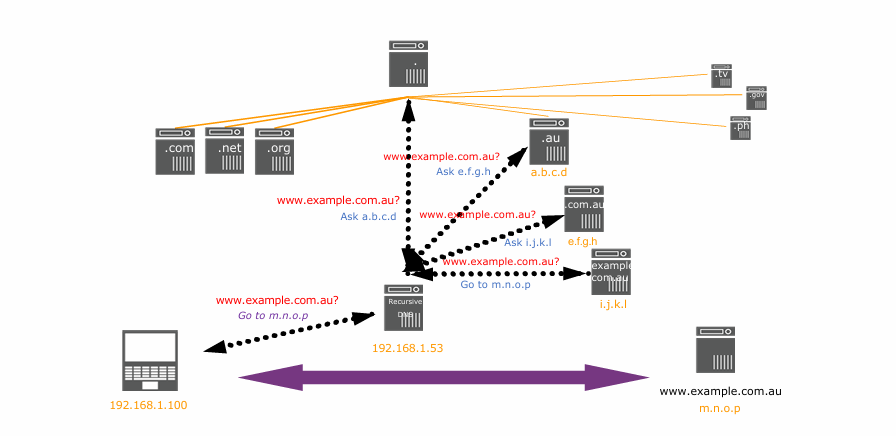
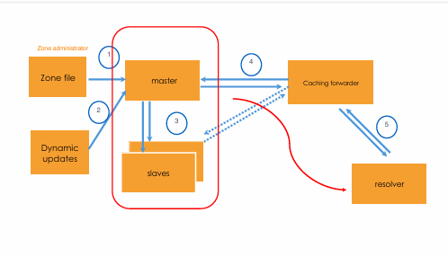

<div align="center">
  <h1 style="text-align: center;font-weight: bold">Laporan Resmi<br>Workshop Admnistrasi Jaringan</h1>
  <h4 style="text-align: center;">Dosen Pengampu : Dr. Ferry Astika Saputra, S.T., M.Sc.</h4>
</div>
<br />
<div align="center">
  
  <h3 style="text-align: center;">Disusun Oleh : </h3>
  <p style="text-align: center;">
    <strong>Muhammad Rafi Dhiyaulhaq (3123500004) </strong><br>
  </p>
<h3 style="text-align: center;line-height: 1.5">Politeknik Elektronika Negeri Surabaya<br>Departemen Teknik Informatika Dan Komputer<br>Program Studi Teknik Informatika<br>2024/2025</h3>
  <hr><hr>
</div>

# Sistem Nama Domain (DNS)

## **Apa itu DNS?**
DNS (Domain Name System) adalah punya prinsip yang sama dengan buku kuning telepon pada zaman dahulu. Bedanya, sekarang perangkat mencari nama domain di DNS untuk mendapatkan alamat IP. Bedanya, DNS bekerja secara otomatis dan sangat cepat, tanpa perlu dicari secara manual seperti buku kuning dulu.Manusia mengakses informasi online menggunakan **nama domain** (contoh: `nytimes.com` atau `espn.com`). Namun, peramban web berkomunikasi menggunakan **alamat IP**. DNS menerjemahkan nama domain menjadi alamat IP agar peramban dapat memuat sumber daya Internet. Setiap perangkat yang terhubung ke Internet memiliki **alamat IP unik**, yang digunakan oleh mesin lain untuk menemukannya. DNS memungkinkan pengguna **tidak perlu menghafal alamat IP**, seperti `192.168.1.1` (IPv4) atau `2400:cb00:2048:1::c629:d7a2` (IPv6).

---

## **Bagaimana DNS Bekerja?**
Proses **resolusi DNS** mengubah **hostname** (contoh: `www.example.com`) menjadi **alamat IP** (`192.168.1.1`). Ini seperti mencocokkan alamat rumah dengan nama pemiliknya. Saat pengguna mengakses sebuah situs web, terjadi proses pencarian alamat IP dari nama domain yang dimasukkan.
Pencarian DNS terjadi "di balik layar" dan melibatkan beberapa **komponen utama** dalam sistem DNS.
Gampangnya, nanti klien akan memasukkan domain yang ingin dikunjungi. DNS akan meemberikan IP dari domain tersebut sehingga klien bisa memulai komunikasi dengan server yang dituju.
---

## **Komponen Utama dalam DNS**

### 1. **DNS Recursor**
- Berperan seperti **pustakawan** yang mencari buku dalam perpustakaan.
- Bertugas menerima permintaan dari klien (misalnya, peramban web).
- Melakukan permintaan tambahan untuk mendapatkan alamat IP yang dicari.

### 2. **Root Nameserver**
- Langkah pertama dalam menerjemahkan nama domain ke alamat IP.
- Berfungsi seperti **indeks perpustakaan**, yang mengarahkan pencarian ke bagian lebih spesifik.

### 3. **TLD Nameserver (Top-Level Domain)**
- Bertanggung jawab atas ekstensi domain tertentu, misalnya:
  - `.com`, `.org`, `.net` (domain umum)
  - `.id`, `.jp`, `.uk` (domain berdasarkan negara)
- Berfungsi seperti **rak buku** yang hanya berisi kategori tertentu.

### 4. **Authoritative Nameserver**
- Langkah terakhir dalam pencarian DNS.
- Bisa dianggap seperti **kamus**, yang memberikan definisi atau informasi final.
- Jika memiliki catatan DNS yang dicari, server ini akan mengembalikan alamat IP ke **DNS Recursor**.

---

# Fitur DNS

DNS memiliki beberapa fitur, di antaranya:

- **Globally distributed**  
  DNS terdiri dari banyak server yang dikelola oleh berbagai operator di seluruh dunia, memastikan ketersediaan dan kecepatan akses.

- **Loosely coherent**  
  Meskipun terdistribusi, semua server tetap menjadi bagian dari satu sistem DNS global yang bekerja secara bersamaan.

- **Scalable**  
  Sistem ini dapat ditingkatkan dengan menambahkan lebih banyak server untuk menangani peningkatan jumlah permintaan pengguna.

- **Handal**  
  DNS adalah bagian penting dari infrastruktur internet, sehingga harus dirancang agar tetap berfungsi meskipun ada kegagalan pada beberapa server.

- **Dinamis**  
  Siapa pun dapat menambahkan domain dan catatan DNS tanpa menyebabkan gangguan pada sistem secara keseluruhan.

  ---
  # DNS sebagai Aplikasi Client-Server

- **DNS adalah Aplikasi Client-Server**  
  Artinya, klien (resolver) harus mengirim permintaan, dan server DNS akan merespons dengan informasi terkait catatan DNS.
- **Permintaan dan respons biasanya dikirim melalui **UDP port 53**.**
- **TCP port 53** digunakan dalam beberapa kasus untuk permintaan berukuran besar, seperti **Zone Transfer**.

  
  Ini adalah contoh bagaimana DNS bekerja.
  - Klien akan menghubungi DNS rekursif sebagai  perantara.
  - DNS ini akan menanyakan kepada root server dimana alamat ini
  - Root tidak akan langsung memberikan fullnya, melainkan akan mengecek Top Level Domain (TLD)nya. Apakah itu TLD atau ccTLD (Country Code), seperti `.id`, `.au`, `.jp`, dan lainnya.
  - Kalau ccTLD, maka akan diarahkan ke Second Level Domain (SLD). SLD memiliki beberapa keuntungan, seperti:
    a. Organisasi yang lebih rapi → Memudahkan pengelolaan domain di suatu negara.
    b. Kontrol administratif → Setiap SLD bisa memiliki aturan pendaftaran berbeda.
  - Kalau itu Generic TLD, seperti `.com`, `.org`,  `.net`, akan langsung diarahkan ke bagian authoritative
    Ya, authoritative DNS selalu ada, karena setiap domain memerlukan setidaknya satu authoritative nameserver yang menyimpan catatan DNS-nya.
    Namun, authoritative server bisa berbeda-beda:  
    1. Ada yang dikelola sendiri → Misal, bbc.com punya authoritative DNS sendiri.
    2. Ada juga yang menggunakan layanan pihak ketiga → Misal, banyak domain menggunakan Cloudflare, AWS Route 53, atau Google DNS sebagai authoritative DNS.
  # Komponen DNS

## 1. Namespace
DNS Namespace adalah struktur hierarkis yang digunakan untuk mengorganisir domain dan subdomain. Namespace ini terdiri dari root domain, top-level domain (TLD), second-level domain (SLD), dan subdomain lainnya.

## 2. Nameserver
Nameserver adalah server yang menyimpan informasi mengenai domain dan menerjemahkan nama domain ke alamat IP. Ada beberapa jenis nameserver, seperti:
- **Root Nameserver**: Server pertama yang dikontak dalam proses resolusi DNS.
- **TLD Nameserver**: Menyimpan informasi tentang domain dalam kategori TLD tertentu (.com, .org, .id, dll.).
- **Authoritative Nameserver**: Menyimpan informasi spesifik mengenai suatu domain dan memberikan jawaban final terhadap query DNS.

## 3. Resolver or Client
DNS Resolver adalah klien yang meminta informasi DNS dari nameserver. Ada dua jenis resolver:
- **Recursive Resolver**: Bertanggung jawab untuk mencari informasi DNS dari berbagai nameserver hingga menemukan jawaban yang valid.
- **Stub Resolver**: Biasanya dijalankan pada perangkat pengguna dan meneruskan permintaan DNS ke resolver yang lebih besar.

Ini merupakan penjelasan dari Namespaces pada domain.

## Root
- **Root** merupakan level tertinggi dalam hierarki DNS.
- Dilambangkan dengan tanda titik (**.**) dan berfungsi sebagai referensi utama dalam sistem DNS.


## Top-Level Domain (TLD)
- **TLD** adalah domain tingkat atas yang berada tepat di bawah root.
- Contoh TLD yang ditampilkan dalam gambar:
  - `.net`
  - `.org`
  - `.com`
  - `.arpa`
  - `.au` (Country Code TLD - ccTLD untuk Australia)

## Second-Level Domain (SLD)
- **SLD** berada tepat di bawah TLD.
- Contoh dalam gambar:
  - **`apnic.net`**
  - **`iana.org`**
  - **`def.edu.au`**

## Subdomain
- Subdomain adalah bagian dari domain yang berada di bawah SLD.
- Contoh dalam gambar:
  - **`whois.apnic.net`**
  - **`training.apnic.net`**
  - **`www.def.edu.au`**

## Hierarki Pencarian DNS
1. Permintaan dimulai dari **Root Server**.
2. Jika domain yang dicari memiliki ccTLD seperti **.au**, permintaan diteruskan ke server TLD terkait.
3. Setelah itu, permintaan dikirim ke **SLD** yang sesuai, misalnya **edu.au**.
4. Dari SLD, pencarian akan diteruskan ke domain yang lebih spesifik seperti **def.edu.au**.
5. Jika masih terdapat subdomain seperti **www.def.edu.au**, server yang menangani subdomain tersebut akan memberikan jawaban akhir.

# Delegasi dalam DNS

- Administrator dapat membuat subdomain untuk mengelompokkan host.
- Administrator dapat mendelegasikan tanggung jawab pengelolaan subdomain kepada pihak lain.
- Domain induk tetap mempertahankan tautan ke subdomain yang didelegasikan.

# Zona

- Zona adalah "ruang administratif" dalam sistem DNS.
- Administrator zona bertanggung jawab atas sebagian ruang nama dalam sebuah domain.
- Wewenang didelegasikan dari domain induk ke domain anak.

## Top-Level Domain (TLD)

- TLD adalah level tertinggi dalam hierarki DNS, misalnya **.com, .org, .net**.
- Dibagi menjadi dua kategori utama:
  - **Generic TLD (gTLD)**: Contoh **.com, .org, .net**, digunakan secara umum.
  - **Country Code TLD (ccTLD)**: Contoh **.id, .uk, .jp**, digunakan berdasarkan negara.

## Second-Level Domain (SLD)

- Terletak tepat di bawah TLD, misalnya **example** dalam **example.com**.
- Biasanya mencerminkan nama organisasi, bisnis, atau individu.
- Dapat memiliki subdomain di bawahnya, misalnya **[www.example.com](http://www.example.com)**.

## Nameserver Autoritatif

- Nameserver yang berwenang memberikan jawaban untuk domain tertentu.
- Bisa terdapat lebih dari satu nameserver autoritatif.
- Berdasarkan metode pengelolaannya, ada dua jenis:
  - **Primary (Master)**: Satu-satunya server utama yang menyimpan dan mengelola perubahan zona.
  - **Secondary (Slave)**: Mengambil file zona dari server utama dan memperbaruinya secara berkala.
- Server utama dapat mengirim pemberitahuan ke server sekunder saat terjadi perubahan.

## Nameserver Rekursif

- Bertugas mencari nameserver autoritatif dan mendapatkan jawaban yang benar.
- Proses ini bersifat iteratif, dimulai dari root.
- Nameserver rekursif biasanya juga berfungsi sebagai server cache.
- Lebih mengutamakan cache terdekat untuk:
  - Meminimalkan latensi.
  - Mengurangi lalu lintas pada koneksi eksternal.

## Root Servers


- Root server adalah bagian teratas dalam hierarki DNS yang menangani permintaan dari recursive resolver.
- Terdapat **13 root server utama** di seluruh dunia, diidentifikasi dengan nama **[a-m].root-servers.net**.
- Namun, ada lebih dari 13 **instance fisik** root server karena menggunakan **anycast routing**.

### Mengapa di satu kota bisa ada banyak root server yang sama?

1. **Redundansi & Keandalan**
   - Jika satu instance gagal, yang lain bisa tetap melayani permintaan, memastikan layanan tetap berjalan.
2. **Mengurangi Latensi**
   - Semakin dekat lokasi server dengan pengguna, semakin cepat proses resolusi DNS.
3. **Menangani Volume Trafik Tinggi**
   - Kota besar memiliki banyak pengguna internet, sehingga beberapa instance root server membantu menangani beban permintaan.
4. **Mitigasi Serangan DDoS**
   - Dengan banyak instance di lokasi berbeda, serangan ke satu server tidak akan melumpuhkan seluruh sistem.

Jadi, meskipun satu kota memiliki **dua atau lebih instance root server yang sama**, mereka tetap bagian dari sistem **satu root server global** yang bekerja bersama untuk mempercepat dan mengamankan DNS di internet.

# Sejarah dan Timeline Root Server Deployment

## Sejarah Root Server

Root server adalah bagian teratas dalam hierarki DNS yang bertanggung jawab untuk menangani permintaan dari recursive resolver. Root server pertama kali diimplementasikan pada **1984** sebagai bagian dari sistem DNS yang dikembangkan oleh **Paul Mockapetris**. 

Pada awalnya, hanya ada **satu root server (A-Root)** yang dikelola oleh **USC Information Sciences Institute (ISI)**. Namun, seiring bertambahnya kebutuhan internet global, jumlah root server bertambah menjadi **13 server utama**, dioperasikan oleh berbagai organisasi di seluruh dunia. 

### Daftar Root Server Awal:
- **A-Root** – 1984, dikelola oleh Verisign (awalnya USC-ISI)
- **B-Root** – 1987, dikelola oleh USC-ISI
- **C-Root** – 1987, dikelola oleh Cogent Communications
- **D-Root** – 1987, dikelola oleh University of Maryland
- **E-Root** – 1987, dikelola oleh NASA Ames Research Center
- **F-Root** – 1994, dikelola oleh Internet Systems Consortium (ISC)
- **G-Root** – 1991, dikelola oleh U.S. Department of Defense
- **H-Root** – 1991, dikelola oleh U.S. Army Research Lab
- **I-Root** – 1991, dikelola oleh Netnod (Swedia)
- **J-Root** – 1997, dikelola oleh Verisign
- **K-Root** – 1997, dikelola oleh RIPE NCC (Eropa)
- **L-Root** – 1997, dikelola oleh ICANN
- **M-Root** – 1997, dikelola oleh WIDE Project (Jepang)

Seiring meningkatnya penggunaan internet, root server tidak lagi hanya ditempatkan di satu lokasi. Teknologi **anycast routing** memungkinkan setiap root server memiliki banyak instance fisik di berbagai negara, sehingga meningkatkan kecepatan akses dan ketahanan terhadap serangan siber.
## APNIC dan Root Server Deployment

### Sejarah APNIC dalam Penyebaran Root Server
APNIC (**Asia-Pacific Network Information Centre**) mulai aktif dalam **membangun dan mendistribusikan root server** di wilayah Asia-Pasifik sejak **2002**. Langkah ini diambil untuk meningkatkan **keandalan dan efisiensi sistem DNS** di kawasan tersebut.

### Tujuan Penyebaran Root Server oleh APNIC
1. **Memperkuat Infrastruktur DNS**  
   - Dengan mendistribusikan lebih banyak root server, DNS menjadi lebih stabil dan tangguh terhadap gangguan.
2. **Mengurangi Latensi**  
   - Dengan menempatkan root server lebih dekat ke pengguna, waktu pencarian DNS dapat dipercepat.
3. **Menangani Pertumbuhan Lalu Lintas Internet**  
   - Seiring dengan meningkatnya jumlah pengguna internet, kapasitas DNS perlu ditingkatkan.
4. **Meningkatkan Ketahanan terhadap Serangan DDoS**  
   - Distribusi yang lebih luas membantu mencegah satu titik kegagalan dalam sistem DNS global.

### Timeline Penyebaran Root Server oleh APNIC
Berikut adalah beberapa contoh pemasangan root server yang dilakukan oleh APNIC di wilayah Asia-Pasifik:

- **2020**
  - **Desember**: M-Root nameserver dipasang di Brisbane.
- **2019**
  - **Januari**: K-Root nameserver dipasang di Thimphu.
  - **Desember**: K-Root nameserver dipasang di Yangon.
- **2018**
  - **Juli**: F-Root nameserver dipasang di Port Moresby.
  - **Desember**: K-Root nameserver dipasang di Taipei.
- **2017**
  - **Januari**: J-Root nameserver dipasang di Kathmandu.

APNIC terus bekerja sama dengan operator jaringan di wilayah Asia-Pasifik untuk menambah dan mengoptimalkan distribusi root server demi mendukung internet yang lebih stabil dan cepat.

---

## Resource Record

| Komponen | Deskripsi |
|-----------|------------|
| **Label** | Pengganti nama untuk FQDN |
| **TTL** | Parameter waktu, batas kedaluwarsa |
| **Class** | IN untuk Internet, CH untuk Chaos |
| **Type** | Jenis RR (A, AAAA, MX, PTR) untuk berbagai keperluan |
| **RDATA** | Apa pun setelah pengidentifikasi Tipe; Data tambahan |


## Tipe-Tipe Resource Record Umum

| RR Tipe | Nama | Fungsi |
|---------|------|--------|
| **A** | Address record | Memetakan nama domain ke alamat IP |
| **AAAA** | IPv6 address record | Memetakan nama domain ke alamat IPv6 |
| **NS** | Name server record | Digunakan untuk mendelegasikan zona ke server nama |
| **PTR** | Pointer record | Memetakan alamat IP ke nama domain |
| **CNAME** | Canonical name | Memetakan alias ke nama host |
| **MX** | Mail Exchanger | Menentukan tujuan pengiriman email untuk pengguna @ domain |

## Alur Data dalam DNS

Diagram ini menunjukkan alur data dalam sistem DNS yang melibatkan beberapa komponen utama:

1. **Zone File**:
   - Dikelola oleh administrator zona.
   - Berisi catatan sumber daya (resource records) untuk zona tertentu.

2. **Master Server**:
   - Bertanggung jawab untuk menyimpan dan mengelola data DNS utama.
   - Menerima pembaruan dari file zona atau pembaruan dinamis.

3. **Slave Server**:
   - Menerima dan menyinkronkan data dari master server.
   - Digunakan untuk redundansi dan meningkatkan kinerja DNS.

4. **Caching Forwarder**:
   - Menerima permintaan dari resolver.
   - Menyimpan hasil pencarian DNS untuk meningkatkan efisiensi dan mengurangi beban pada server utama.

5. **Resolver**:
   - Mengirimkan permintaan pencarian nama domain ke caching forwarder atau langsung ke authoritative DNS server.
   - Bertanggung jawab untuk mendapatkan jawaban dari hierarki DNS.

Alur kerja:
- Zone file atau pembaruan dinamis diperbarui oleh administrator zona (1).
- Master server membaca data dari zone file dan mengelola perubahan (2).
- Slave server disinkronkan dengan master server (3).
- Caching forwarder menerima data dari master atau slave server untuk disimpan sementara (4).
- Resolver mengambil data dari caching forwarder untuk memproses permintaan pengguna akhir (5).


## Delegasi Zona (Delegating a Zone)
Delegasi zona dilakukan dengan menambahkan catatan NS (Name Server). Contohnya, zona `apnic.net` mendelegasikan subdomain `academy.apnic.net` ke dua nameserver berikut:

```
; Dari zona apnic.net, tambahkan catatan berikut:
academy.apnic.net. IN NS ns1.academy.apnic.net.
academy.apnic.net. IN NS ns2.academy.apnic.net.
```

Untuk melakukan kueri terhadap subdomain ini, klien harus menuju `ns1.academy.apnic.net` atau `ns2.academy.apnic.net`. Agar nameserver dapat dijangkau, perlu ditambahkan **Glue Record**.

## Glue Record
Glue record adalah data non-otoritatif berupa catatan A yang memetakan alamat subdomain nameserver. Hanya catatan berikut yang memerlukan glue record:

```
academy.apnic.net. IN NS ns1.academy.apnic.net.
academy.apnic.net. IN NS ns2.academy.apnic.net.
ns1.academy.apnic.net. IN A 10.0.0.1
ns2.academy.apnic.net. IN A 10.0.0.2
```

### Contoh Delegasi
#### Pada `ns.apnic.net`:
1. Tambahkan catatan NS dan glue record.
2. Pastikan tidak ada data lain dari `academy.apnic.net.` di dalam file zona.

#### Pada `ns.academy.apnic.net`:
1. Siapkan minimal dua server.
2. Buat file zona dengan catatan NS.
3. Tambahkan semua data `academy.apnic.net` di dalam file zona yang sesuai.

## Resolver
Resolver adalah perangkat lunak yang membentuk permintaan DNS ke dalam paket UDP.

- **Stub resolver** adalah resolver minimal yang meneruskan semua permintaan ke nameserver rekursif lokal.
- Setiap host memerlukan resolver.
- Pada Linux, konfigurasi berada di `/etc/resolv.conf`.
- Disarankan untuk menggunakan lebih dari satu server DNS.

## Kueri DNS dengan `dig`
Misalnya, untuk mencari alamat IP dari `academy.apnic.net`, gunakan perintah:

```
dig academy.apnic.net
```

Contoh hasil:
```
; <<>> DiG 9.14.10 <<>> academy.apnic.net
;; Got answer:
;; ->>HEADER<<- opcode: QUERY, status: NOERROR, id: 60912
;; QUESTION SECTION:
;academy.apnic.net. IN A

;; ANSWER SECTION:
academy.apnic.net. 86400 IN A 203.119.101.88
```

## Kueri DNS dengan `drill`
Alternatif lain menggunakan `drill`:

```
drill academy.apnic.net
```

Contoh hasil:
```
;; ->>HEADER<<- opcode: QUERY, rcode: NOERROR, id: 62275
;; QUESTION SECTION:
;academy.apnic.net. IN A

;; ANSWER SECTION:
academy.apnic.net. 86400 IN A 203.119.101.88
```

## Hal yang Perlu Diperhatikan
- Gunakan beberapa server otoritatif untuk mendistribusikan beban dan mengurangi risiko kegagalan.
- Gunakan cache untuk mengurangi beban pada server otoritatif dan mempercepat respons.
- Atur **SOA timers** dan **TTL** sesuai dengan kebutuhan zona.

