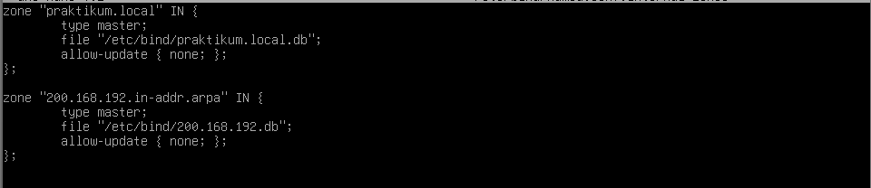

<div align="center">
  <h1 style="text-align: center;font-weight: bold">Laporan Resmi<br>Workshop Admnistrasi Jaringan</h1>
  <h4 style="text-align: center;">Dosen Pengampu : Dr. Ferry Astika Saputra, S.T., M.Sc.</h4>
</div>
<br />
<div align="center">
  
  <h3 style="text-align: center;">Disusun Oleh : </h3>
  <p style="text-align: center;">
    <strong>Muhammad Rafi Dhiyaulhaq (3123500004) </strong><br>
  </p>
<h3 style="text-align: center;line-height: 1.5">Politeknik Elektronika Negeri Surabaya<br>Departemen Teknik Informatika Dan Komputer<br>Program Studi Teknik Informatika<br>2024/2025</h3>
  <hr><hr>
</div>

# Laporan Konfigurasi NAT dan Firewall pada VM1
Percobaan ini mengonfigurasi VM1 sebagai **gateway NAT** dan penerapan **firewall** menggunakan `iptables`, agar komputer dalam jaringan privat dapat mengakses internet melalui VM1 dengan aman. 
Selain itu, dilakukan instalasi layanan tambahan **NTP** untuk sinkronisasi waktu, serta **Samba** untuk berbagi file di jaringan lokal.
Tujuannya, yaitu
- Mengaktifkan NAT (Network Address Translation) pada VM1.
- Menerapkan dan menyimpan aturan firewall secara permanen.
- Membatasi akses ke VM1 hanya untuk koneksi tertentu (misalnya SSH).
- Menyediakan layanan waktu (NTP) agar sistem selalu sinkron.
- Menyediakan layanan file sharing lokal (Samba) antar perangkat.

---

## Daftar Isi

1. [Konfigurasi Gateway & Firewall pada VM1](#1-konfigurasi-gateway--firewall-pada-vm1)
2. [Instalasi dan Konfigurasi NTP](#2-instalasi-dan-konfigurasi-ntp)
3. [Instalasi dan Konfigurasi Samba](#3-instalasi-dan-konfigurasi-samba)
4. [Instalasi dan Konfigurasi BIND9](#4-instalasi-dan-konfigurasi-bind9)

## 1. Konfigurasi Gateway & Firewall pada VM1

### Buka dan sesuaikan file interface jaringan:

```bash
nano -l -w /etc/network/interfaces
```


Buat IP statis untuk jaringan lokal, misalnya
Contoh konfigurasi:
```bash
iface enp0s8 inet static
    address 192.168.200.1
    network 192.168.200.0
    netmask 255.255.255.0
    broadcast 192.168.200.255
    dns-nameservers 1.1.1.1
```


---

### Aktifkan IP Forwarding

Edit file konfigurasi sistem:

```bash
nano -l -w /etc/sysctl.conf
```


Uncomment bagian
```conf
net.ipv4.ip_forward=1
```


Simpan dan jalankan:

```bash
sysctl -p
```


---

### Atur NAT dengan iptables

Tambahkan aturan NAT dengan:
```bash
nano -l -w /etc/iptables/rules.v4
```


```bash
sudo nano -l -w /etc/iptables/rules.v4
```


Ubah isinya menjadi seperti berikut:


---

### Instal iptables-persistent

Untuk menyimpan aturan iptables secara permanen:

```bash

apt-get install iptables-persistent
apt-get install iptables iptables-persistent
```


Jawab `Yes` saat diminta menyimpan aturan saat ini.
Untuk saya, karena sudah saya kerjakan maka outputnya sudah terinstal


---

### Restore iptables dari File

Untuk menerapkan kembali aturan dari file:

```bash
iptables-restore < /etc/iptables/rules.v4
```


---

### Reboot dan Verifikasi

Reboot sistem agar semua pengaturan aktif saat boot:

```bash
reboot
```


Setelah reboot, verifikasi bahwa iptables masih aktif:

```bash
iptables -L
```


---

Pengaturan di VM 2

Di VM 2, set '/etc/network/interfaces' menjadi:


---

Ping dari masing-masing VM


Tambahkan konfigurasi di bawah di dalam VM 2  untuk menghubungkan internet dari VM 1


---

## 2. Instalasi dan Konfigurasi NTP

### Untuk sinkronisasi waktu otomatis, install `ntp`:

```bash
sudo apt update
sudo apt install ntp -y
```


### Cek status layanan:
```bash
sudo systemctl status ntp
```


### Verifikasi sinkronisasi:
```bash
ntpq -p
```


---

## 3. Instalasi dan Konfigurasi Samba

### Instalasi Samba di VM1 (Server)

```bash
apt update
apt install samba samba-client smbclient -y
```


###  Membuat Folder Share dan File Baru

```bash
mkdir /home/share
chmod 777 /home/share
```


###  Edit Konfigurasi Samba

Edit file konfigurasi utama:

```bash
nano /etc/samba/smb.conf
```

Tambahkan/ubah bagian-bagian berikut:

```conf

unix charset = UTF-8
dos charset = CP932

map to guest = Bad User

# Di akhir, buat direktori baru, yaitu:
[Share]
    path = /home/share
    writable = yes
    guest ok = yes
    guest only = yes
    create mode = 0777
    directory mode = 0777
```


### Jalankan dan Aktifkan Samba

```bash
systemctl restart smbd nmbd
systemctl enable smbd nmbd
```


---

###  Pengujian Akses dari VM2 (Client)

#### Instalasi Tools 

```bash
apt install smbclient cifs-utils -y
```


---

#### Cek direktori Share

```bash
smbclient -L //192.168.200.1 -N
```


#### Akses Folder Share

```bash
smbclient //192.168.200.1/Share -N
```


Masukkan sebuah file, misalnya:


#### Akses File dari VM 1

Cek file `Dhiya.txt` yang sebelumnya sudah di-`put` dari VM 2


## 4. Instalasi dan Konfigurasi BIND9 (DNS Server)

### Instalasi BIND di VM1 (Server DNS)

```bash
apt update
apt -y install bind9 bind9utils
```


### Konfigurasi Dasar BIND

#### Buat file

```bash
nano /etc/bind/named.conf

```
Tambahkan:
```conf
include "/etc/bind/named.conf.internal-zones";
```


#### Edit opsi konfigurasi:
```bash
nano /etc/bind/named.conf.options
```
Tambahkan ACL dan pengaturan:
```conf
acl internal-network {
    192.168.200.0/24;
};
```


#### Buat file zona internal:
```bash
nano /etc/bind/named.conf.internal-zones
```
Isi dengan:
```conf
zone "praktikum.local" IN {
    type master;
    file "/etc/bind/praktikum.local.db";
    allow-update { none; };
};

zone "200.168.192.in-addr.arpa" IN {
    type master;
    file "/etc/bind/200.168.192.db";
    allow-update { none; };
};
```



---

#### Gunakan hanya IPv4:
```bash
nano /etc/default/named
```
Tambahkan:
```conf
OPTIONS="-u bind -4"
```


---

### Konfigurasi Zona DNS

#### File zona langsung (A record):
```bash
nano /etc/bind/praktikum.local.db
```
Isi:
```dns
$TTL 86400
@   IN  SOA     ns1.praktikum.local. root.praktikum.local. (
        2025041501  ; Serial
        3600        ; Refresh
        1800        ; Retry
        604800      ; Expire
        86400       ; Minimum TTL
)

    IN  NS      ns1.praktikum.local.
    IN  A       192.168.200.1
    IN  MX 10   ns1.praktikum.local.

ns1 IN  A       192.168.200.1
www IN  A       192.168.200.2
```


#### File zona reverse (PTR record):
```bash
nano /etc/bind/200.168.192.db
```
Isi:
```dns
$TTL 86400
@   IN  SOA     ns1.praktikum.local. root.praktikum.local. (
        2025041501  ; Serial
        3600        ; Refresh
        1800        ; Retry
        604800      ; Expire
        86400       ; Minimum TTL
)

    IN  NS      ns1.praktikum.local.

1   IN  PTR     ns1.praktikum.local.
2   IN  PTR     www.praktikum.local.
```


---

### Jalankan dan Verifikasi

```bash
systemctl restart named
systemctl enable named
```


### Pengujian DNS

#### Atur VM2 agar menggunakan DNS dari VM1
```bash
nano /etc/network/interfaces
```
Edit bagian:


#### Cek Resolusi Nama
```bash
dig ns1.praktikum.local
```


---

## Kesimpulan

Dengan langkah-langkah di atas:
- VM1 digunakan untuk gateway antara VM2 dengan internat melalui Internal Network, tanpa VM 2 menggunakan bridged adapter ataupun NAT
- Koneksi keluar dari jaringan privat diizinkan melalui `MASQUERADE`.
- Aturan iptables berhasil diamankan dengan `iptables-persistent`.
- Firewall membatasi koneksi hanya pada port yang dibutuhkan (SSH), dan melindungi dari akses luar yang tidak sah.

---

