   <div align="center">
  <h1 style="text-align: center;font-weight: bold">Laporan Resmi<br>Workshop Admnistrasi Jaringan</h1>
  <h4 style="text-align: center;">Dosen Pengampu : Dr. Ferry Astika Saputra, S.T., M.Sc.</h4>
</div>
<br />
<div align="center">
  
  <h3 style="text-align: center;">Disusun Oleh : </h3>
  <p style="text-align: center;">
    <strong>Muhammad Rafi Dhiyaulhaq (3123500004) </strong><br>
  </p>
<h3 style="text-align: center;line-height: 1.5">Politeknik Elektronika Negeri Surabaya<br>Departemen Teknik Informatika Dan Komputer<br>Program Studi Teknik Informatika<br>2024/2025</h3>
  <hr><hr>
</div>

# Laporan Instalasi dan Konfigurasi DNS Server (BIND9) dan Web Server (Apache2)

Percobaan ini bertujuan untuk menginstal dan mengonfigurasi dua layanan utama pada sistem berbasis Linux:

- **BIND9** sebagai DNS server yang mengelola pemetaan nama domain ke alamat IP.
- **Apache2** sebagai web server untuk menyajikan halaman web.

---

## Daftar Isi

1) [Instalasi dan Konfigurasi BIND9 (DNS Server)](#1-instalasi-dan-konfigurasi-bind9-dns-server)  
2) [Instalasi dan Konfigurasi Apache2 (Web Server)](#2-instalasi-dan-konfigurasi-apache2-web-server)

---

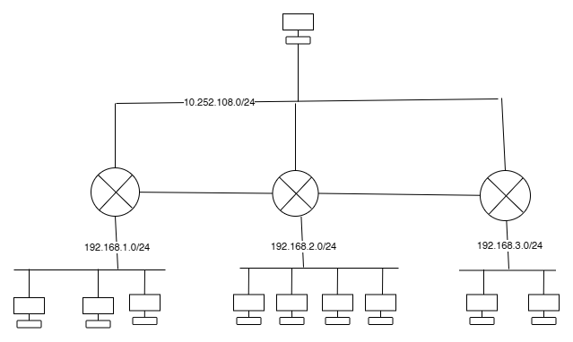
## 1) Instalasi dan Konfigurasi BIND9 (DNS Server)

### a) Instalasi BIND9

```bash
apt update
apt -y install bind9 bind9utils
```

---

### b) Tambahkan include zona internal

```bash
nano /etc/bind/named.conf
```

Tambahkan:
```conf
include "/etc/bind/named.conf.internal-zones";
```

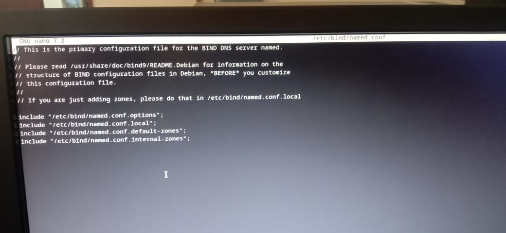

---

### c) Tambahkan ACL dan konfigurasi opsi

```bash
nano /etc/bind/named.conf.options
```

Tambahkan:
```conf
acl internal-network {
    192.168.2.0/24;
};

options {
        directory "/var/cache/bind";
        allow-query { localhost; internal-network; };
        allow-transfer { localhost; };
        recursion yes;
        dnssec-validation auto;
        listen-on-v6 { any; };
};
```

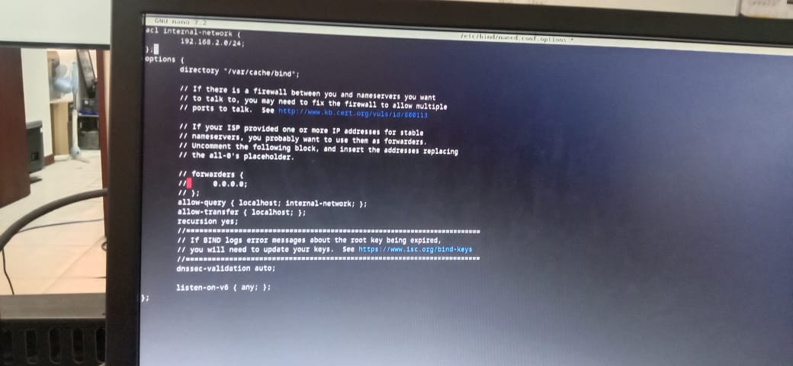

---

### d) Buat file zona internal

```bash
nano /etc/bind/named.conf.internal-zones
```

Isi dengan:
```conf
zone "kelompok2.home" IN {
    type master;
    file "/etc/bind/kelompok2.home.lan";
    allow-update { none; };
};

zone "2.168.192.in-addr.arpa" IN {
    type master;
    file "/etc/bind/2.168.192.db";
    allow-update { none; };
};
```

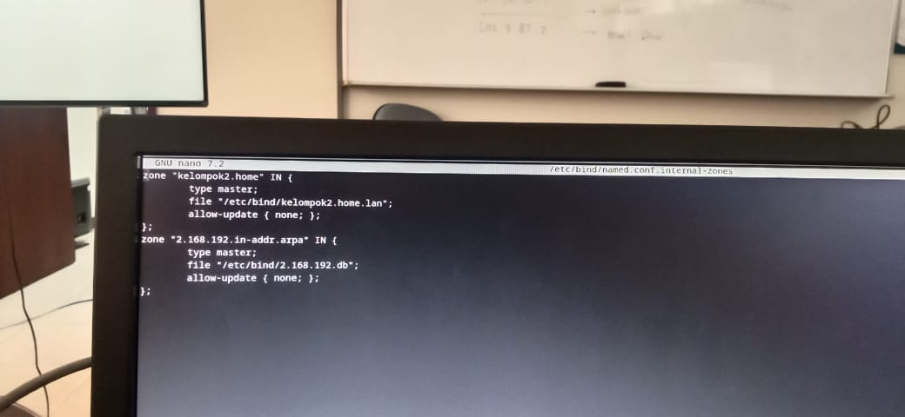

---

### e) Gunakan hanya IPv4

```bash
nano /etc/default/named
```

Tambahkan:
```conf
OPTIONS="-u bind -4"
```

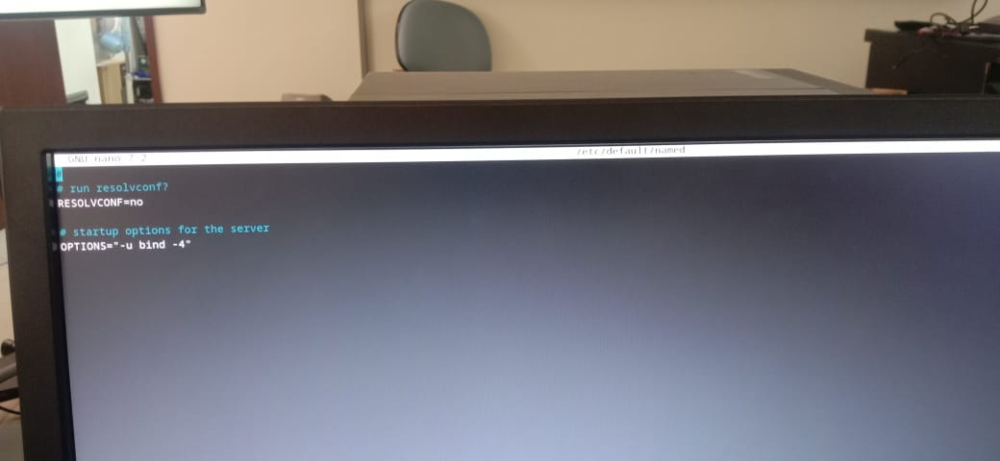

---

### f) Konfigurasi zona forward (A Record)

```bash
nano /etc/bind/kelompok2.home.lan
```

Isi:
```
$TTL 86400
@   IN  SOA     kelompok2.home. root.kelompok2.home. (
        2025042401  ; Serial
        3600        ; Refresh
        1800        ; Retry
        604800      ; Expire
        86400       ; Minimum TTL
)

    IN  NS      ns1.kelompok2.home.
    IN  A       192.168.2.1
    IN  MX 10   ns1.kelompok2.home.

ns1 IN  A       192.168.2.10
www IN  CNAME ns
```

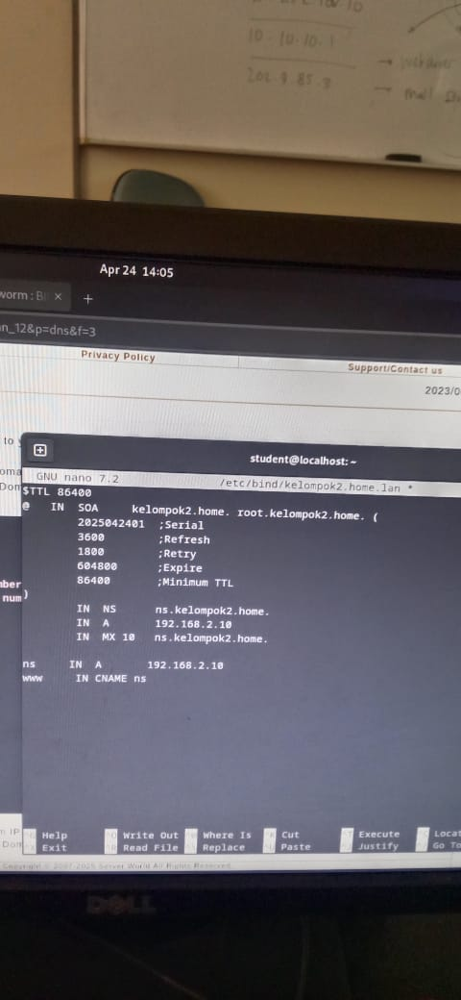

---

### g) Konfigurasi zona reverse (PTR Record)

```bash
nano /etc/bind/2.168.192.db
```

Isi:
```dns
$TTL 86400
@   IN  SOA     kelompok2.home. root.kelompok2.home. (
        2025042401  ; Serial
        3600        ; Refresh
        1800        ; Retry
        604800      ; Expire
        86400       ; Minimum TTL
)

    IN  NS      ns.kelompok2.home.

10   IN  PTR     ns.kelompok2.home.
10   IN  PTR     www.kelompok2.home.
```

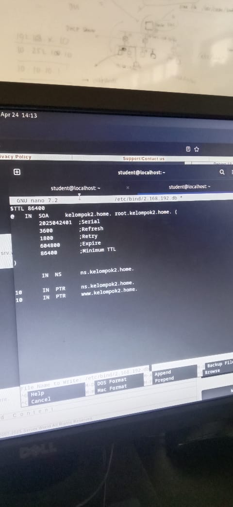

---

### h) Jalankan dan aktifkan layanan

```bash
systemctl restart named
systemctl enable named
```

---

### i) Menambah nameserver

1. Atur `nameserver` pada VM client:
```bash
nano /etc/resolv.conf
```

Tambahkan:
```conf
dns-nameserver 192.168.2.1
```

!(screenshot)[assets/bind-7.jpg]

2. Uji dengan `dig`:
```bash
dig ns.kelompok2.home.
```

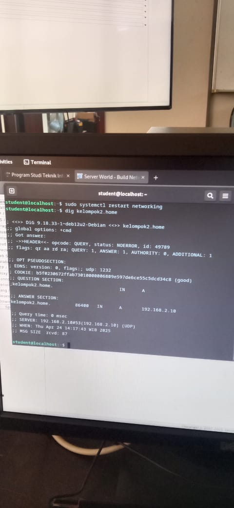

---

## 2) Instalasi dan Konfigurasi Apache2 (Web Server)

### a) Instalasi Apache2

```bash
apt -y install apache2
```

---

### b) Ubah informasi header (security.conf)

```bash
nano /etc/apache2/conf-enabled/security.conf
```

Ubah baris:
```conf
ServerTokens Prod
```

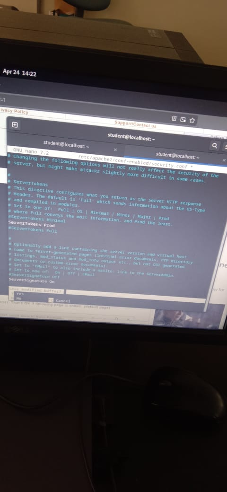

---

### c) Atur file index default

```bash
nano /etc/apache2/mods-enabled/dir.conf
```

Tambahkan:
```conf
DirectoryIndex index.html index.htm
```

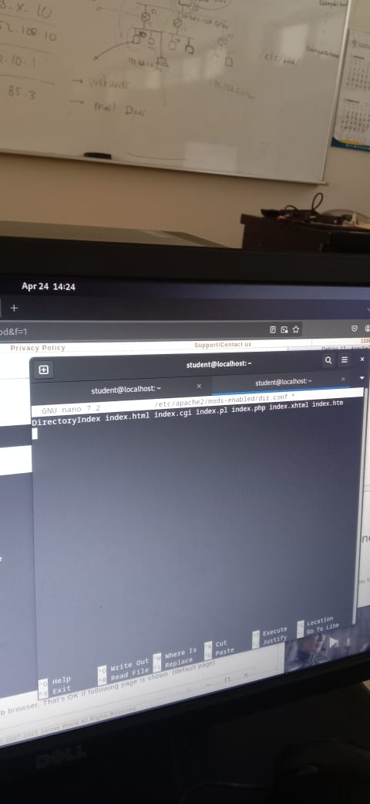

---

### d) Tentukan nama server

```bash
nano /etc/apache2/apache2.conf
```

Tambahkan:
```conf
ServerName www.kelompok2.home.
```

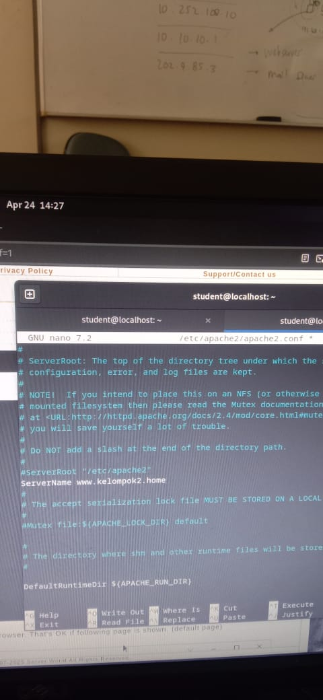

---

### e) Ubah email admin virtual host

```bash
nano /etc/apache2/sites-enabled/000-default.conf
```

Ubah baris:
```conf
ServerAdmin webmaster@srv.world
```
Ubah sesuai dengan keinginan

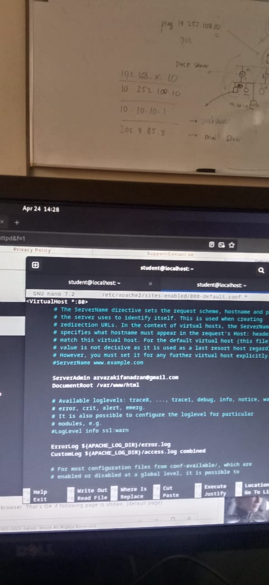

---

### f) Reload Apache

```bash
systemctl reload apache2
```

---

### g) Pengujian Web Server

1. Akses dari browser:
```
http://192.168.2.254
```


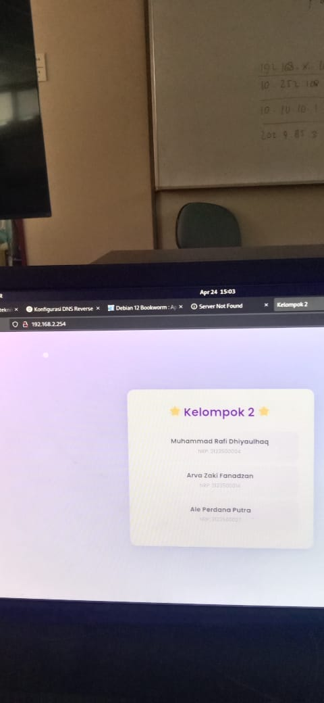

---

**Selesai.**
```
