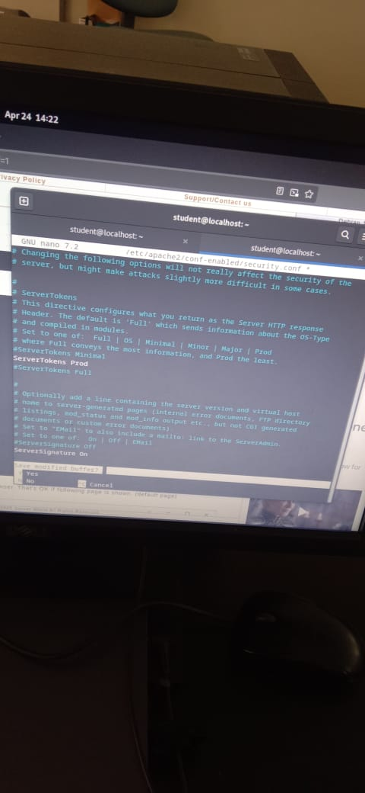
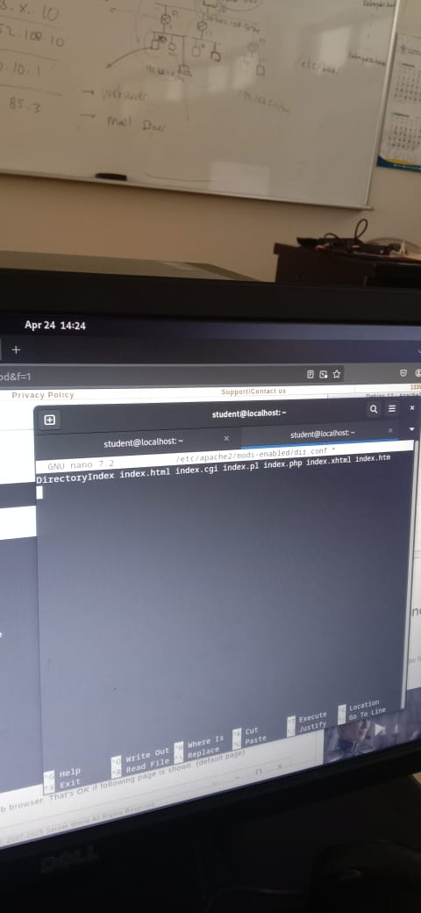
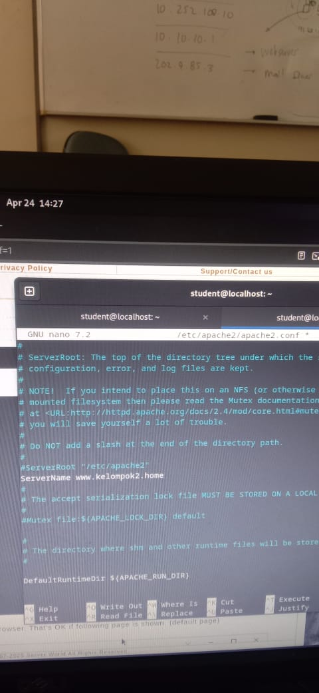
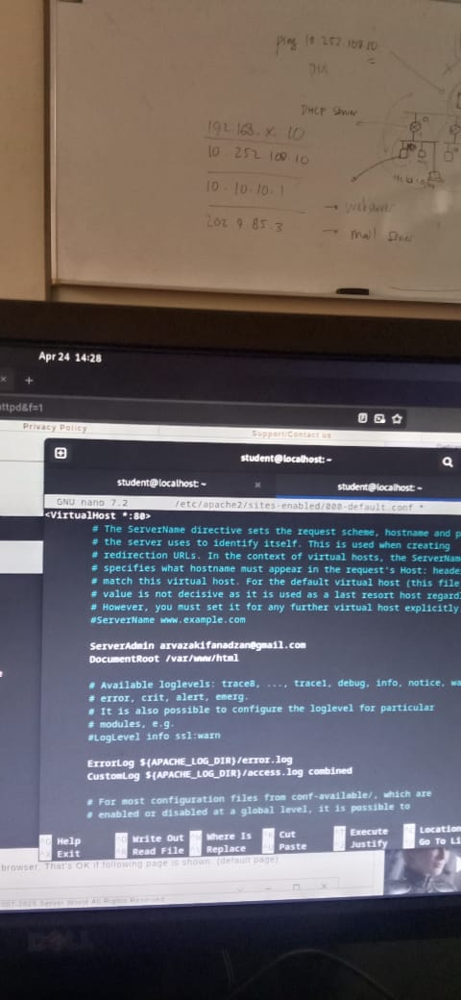

   <div align="center">
  <h1 style="text-align: center;font-weight: bold">Laporan Resmi<br>Workshop Admnistrasi Jaringan</h1>
  <h4 style="text-align: center;">Dosen Pengampu : Dr. Ferry Astika Saputra, S.T., M.Sc.</h4>
</div>
<br />
<div align="center">
  
  <h3 style="text-align: center;">Disusun Oleh : </h3>
  <p style="text-align: center;">
    <strong>Muhammad Rafi Dhiyaulhaq (3123500004) </strong><br>
  </p>
<h3 style="text-align: center;line-height: 1.5">Politeknik Elektronika Negeri Surabaya<br>Departemen Teknik Informatika Dan Komputer<br>Program Studi Teknik Informatika<br>2024/2025</h3>
  <hr><hr>
</div>

# Laporan Instalasi dan Konfigurasi Web Server (Apache2)

Percobaan ini bertujuan untuk menginstal dan mengonfigurasi **Apache2** sebagai web server untuk menyajikan halaman web.

---

## Daftar Isi

1) [Apa itu Apache?](#1-definisi-apache)  
2) [Instalasi dan Konfigurasi Apache2 (Web Server)](#2-instalasi-dan-konfigurasi-apache2-web-server)

---

## 1) Apa itu Apache?

### **Apa itu Apache2 dan Bagaimana Cara Kerjanya**

**Apache2** adalah perangkat lunak **web server open-source** yang banyak digunakan untuk menyajikan situs web melalui internet. Apache2 terkenal karena **keandalan, skalabilitas**, dan **fleksibilitasnya**, sehingga menjadi pilihan utama untuk hosting berbagai jenis website.

#### **Cara Kerja Apache2**

Apache2 bekerja dengan **mendengarkan permintaan dari klien**, seperti browser. Ketika klien meminta halaman web, Apache2 menerima permintaan tersebut, memprosesnya, dan mengirimkan halaman yang diminta kembali ke klien.

#### **Fitur Utama Apache2**

* **Open-source**: Gratis digunakan dan dapat dimodifikasi sesuai kebutuhan.
* **Skalabel**: Dapat menangani banyak koneksi secara bersamaan tanpa penurunan performa.
* **Handal**: Terbukti stabil dan banyak digunakan untuk website penting.
* **Fleksibel**: Dapat dikonfigurasi dengan mudah untuk berbagai kebutuhan, seperti keamanan atau performa.

#### **Konfigurasi Apache2**

Apache2 dikonfigurasi melalui file konfigurasi, seperti `httpd.conf` atau file yang berada di `/etc/apache2/`. Konfigurasi ini memungkinkan pengguna mengatur berbagai fitur seperti:

* **Virtual Host**: Menjalankan beberapa website berbeda dalam satu server.
* **SSL**: Mengaktifkan koneksi aman menggunakan HTTPS.
* **Keamanan**: Membatasi akses, mengatur otentikasi, dan lainnya.

#### **Kesimpulan**

Apache2 adalah **web server yang kuat dan serbaguna**, digunakan oleh jutaan situs di seluruh dunia. Dengan memahami cara kerjanya dan cara mengaturnya, pengguna bisa memaksimalkan fitur Apache2 untuk membuat website yang cepat dan aman.

---

## 2) Instalasi dan Konfigurasi Apache2 (Web Server)

### a) Instalasi Apache2

```bash
apt -y install apache2
```

---

### b) Ubah informasi header (security.conf)

```bash
nano /etc/apache2/conf-enabled/security.conf
```

Ubah baris:
```conf
ServerTokens Prod
```



---

### c) Atur file index default

```bash
nano /etc/apache2/mods-enabled/dir.conf
```

Tambahkan:
```conf
DirectoryIndex index.html index.htm
```



---

### d) Tentukan nama server

```bash
nano /etc/apache2/apache2.conf
```

Tambahkan:
```conf
ServerName www.kelompok2.home.
```



---

### e) Ubah email admin virtual host

```bash
nano /etc/apache2/sites-enabled/000-default.conf
```

Ubah baris:
```conf
ServerAdmin webmaster@srv.world
```
Ubah sesuai dengan keinginan



---

### f) Reload Apache

```bash
systemctl reload apache2
```

---

### g) Pengujian Web Server

1. Akses dari browser:
```
http://192.168.2.254
```


---

**Selesai.**
```
